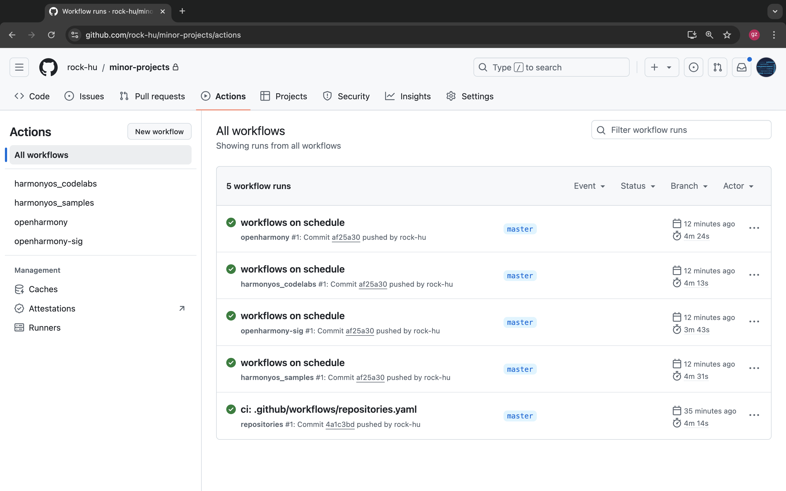

# minor-projects

[Importing an external Git repository using the command line](https://docs.github.com/en/migrations/importing-source-code/using-the-command-line-to-import-source-code/importing-an-external-git-repository-using-the-command-line) 

```
gitee.com,harmonyos_codelabs,network-boost-kit-codelab-arkts
gitee.com,harmonyos_samples,scan-kit_-sample-code_-clientdemo_-arkts
```

```bash
git clone --bare https://external-host.com/EXTUSER/REPO.git
```

```bash
cd REPO.git
git push --mirror https://github.com/USER/REPO.git
```

```bash
cd ..
rm -rf REPO.git
```

```bash
#!/bin/bash
while IFS="," read -r host organization repository
do
   echo $host $organization $repository
   mkdir $organization
   cd $organization
   rm -rf ${repository}
   git clone git@$host:$organization/$repository.git
   # git clone https://${host}/${organization}/${repository}.git
   rm -rf ${repository}/.git 
   cd ..
done < harmonyos_samples.csv
```


[Accessing contextual information about workflow runs](https://docs.github.com/en/actions/writing-workflows/choosing-what-your-workflow-does/accessing-contextual-information-about-workflow-runs)

