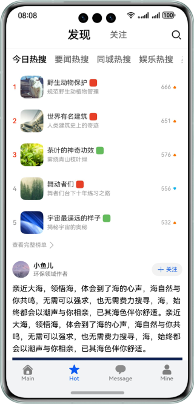
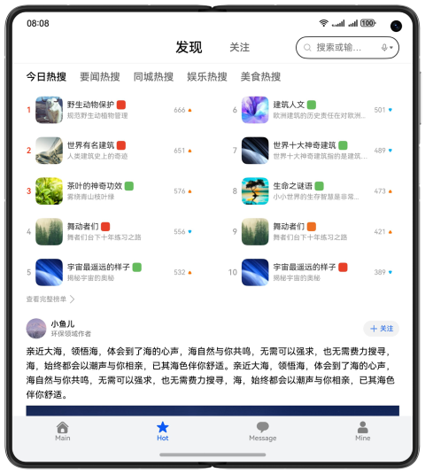

# Community Comments

### Introduction

Based on the adaptive and responsive layout, implement community comment pages with one-time development for multi-device deployment.

The figure shows the effect on the mobile phone:

The figure shows the effect on the foldable phone:

The figure shows the effect on the tablet:

### Concepts

- One-time development for multi-device deployment: It enables you to develop and release one set of project code for deployment on multiple devices as demanded. This feature enables you to efficiently develop applications that are compatible with multiple devices while providing distributed user experiences for cross-device transferring, migration, and collaboration.
- Adaptive layout: When the size of an external container changes, elements can automatically change based on the relative relationship to adapt to the external container. Relative relationships include the proportion, fixed aspect ratio, and display priority.
- Responsive layout: When the size of an external container changes, elements can automatically change based on the breakpoints, grids, or specific features (such as the screen direction and window width and height) to adapt to the external container.
- GridRow: It is a container that is used in a grid layout, together with its child component **<GridCol>**.
- GridCol: It is a container that must be used as a child component of the **<GridRow>** container.

### Permissions

N/A.

### How to Use

1. Install and open an app on a mobile phone, foldable phone, or tablet. The responsive layout and adaptive layout are used to display different effects on the app pages over different devices.
2. Tap home, hot topics, message, or mine tab at the bottom to switch to the corresponding tab page. By default, the message tab page is displayed.
3. Tap a category of hot searches to switch to the corresponding list.
4. Tap the button for viewing complete rankings. The hot search rankings page is displayed. You can swipe up, down, left, or right on the hot search rankings page and tap the back button to return to the hot topics page.
5. Tap an image on the hot topics page to go to the image details page. Only images are displayed on mobile phones, while the content and comments are displayed with images on foldable phones and tablets. Tap the image or the back button to return to the hot topics page.
6. Tap the widget body on the hot topics page to go to the details page. The text area on the details page can be zoomed in or out with two fingers. You can tap the button in the upper right corner of the foldable phone to switch between the left-right layout and top-down layout. Tap the back button to return to the hot topics page.

### Constraints

1. The sample app is supported only on Huawei phones running the standard system.
2. HarmonyOS: HarmonyOS 5.0.0 Release or later
3. DevEco Studio: DevEco Studio 5.0.0 Release or later
4. HarmonyOS SDK: HarmonyOS 5.0.0 Release SDK or later
