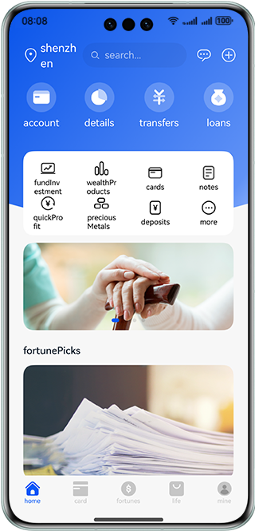
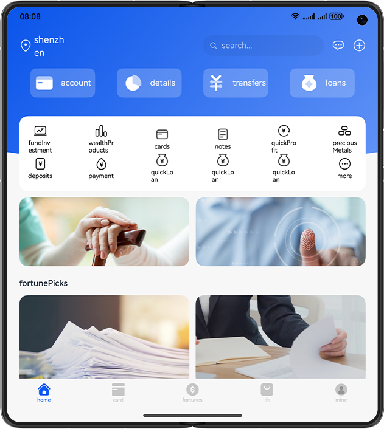
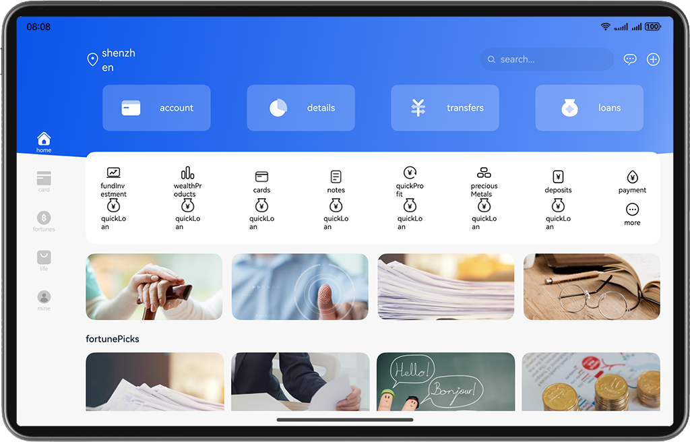

# Bank Wealth Management

## Introduction

This codelab implements a bank wealth management app based on the adaptive layout and responsive layout, achieving one-time development for multi-device deployment.

The figure shows the effect on the Bar phone:

The figure shows the effect on the Bi-fold phone:

The figure shows the effect on the Tablet:

## Permissions

N/A

## How to Use

1. Install and open an app on a Bar phone, Bi-fold phone, or Tablet. The responsive layout and adaptive layout are used to display different effects on the app pages over different devices.
2. Tap the image under featured fortune to go to the product details page.
3. Tap the steady growth content on the page to go to the fund details page.
4. Tap Compare button at the bottom of the fund details page to go to the fund comparison page.
5. Select a fund and tap Start Comparison on the fund details page to go to the fund comparison page.

## Constraints

1. The sample app is supported only on Bar phone, Bi-fold phone (Mate X series), and Tablet running the standard system.
2. HarmonyOS: HarmonyOS 5.0.5 Release or later
3. DevEco Studio: DevEco Studio 6.0.2 Release or later
4. HarmonyOS SDK: HarmonyOS 6.0.2 Release SDK or later
