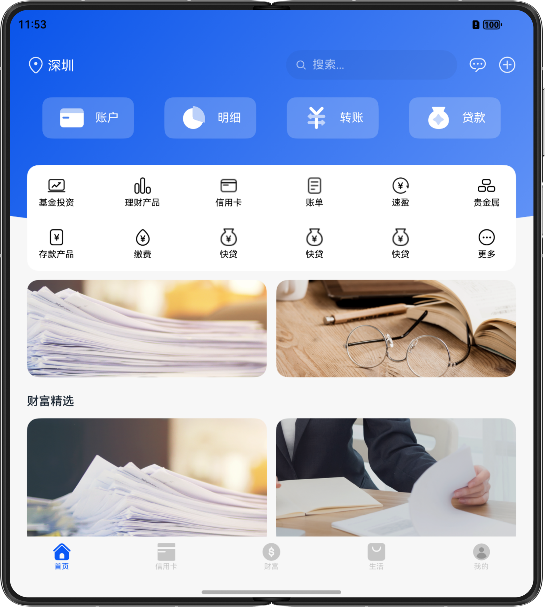

# 一次开发，多端部署-银行理财

### 简介

基于自适应和响应式布局，实现一次开发、多端部署银行理财。

手机效果图如下：

折叠屏效果图如下：

平板效果图如下：

### 相关权限

不涉及

### 使用说明

1. 分别在手机、折叠屏、平板安装并打开应用，不同设备的应用页面通过响应式布局和自适应布局呈现不同的效果。
2. 点击界面内财富精选下的图片跳转到产品详情页。
3. 点击界面内稳健增长内容跳转到基金详情页。
4. 点击基金详情页下方对比跳转至基金比较页。
5. 基金详情页勾选基金后点击开始对比跳转至基金比较页。

### 约束与限制

1. 本示例仅支持标准系统上运行，支持设备：华为手机。
2. HarmonyOS系统：HarmonyOS 5.0.0 Release及以上。
3. DevEco Studio版本：DevEco Studio 5.0.0 Release及以上。
4. HarmonyOS SDK版本：HarmonyOS 5.0.0 Release SDK及以上。