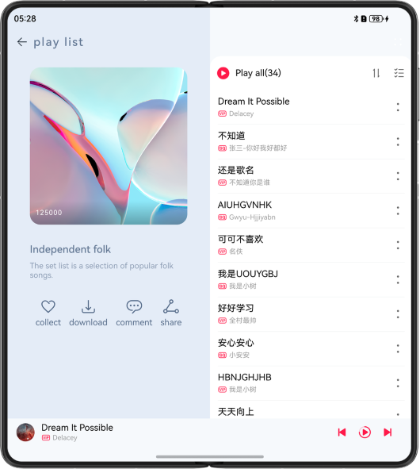

# Music Album

## Project Introduction

This codelab implements music album pages based on the adaptive layout and responsive layout, achieving one-time development for multi-device deployment.

## Effect Preview
The figure shows the effect on the mobile phone.


The figure shows the effect on the foldable phone.



The figure shows the effect on the tablet.


The figure shows the effect on the wearable.


## Engineering catalogue
```
├──commons                                    // Public Competency Layer
│  ├──constantsCommon/src/main/ets            // Public Constants
│  │  └──constants
│  └──mediaCommon/src/main/ets                // Public media approach
│     ├──utils
│     └──viewmodel
├──features                                   // Basic Feature Layer
│  ├──live/src/main/ets                       // Live Stream Page
│  │  ├──constants
│  │  ├──view
│  │  └──viewmodel
│  ├──live/src/main/resources                 // Resource file directory
│  ├──musicComment/src/main/ets               // Music Review Page
│  │  ├──constants
│  │  ├──view
│  │  └──viewmodel
│  ├──musicComment/src/main/resources         // Resource file directory
│  ├──musicList/src/main/ets                  // Song List Page
│  │  ├──components
│  │  ├──constants
│  │  ├──lyric
│  │  ├──view
│  │  └──viewmodel
│  └──musicList/src/main/resources            // Resource file directory
└──products                                   // Product Customization Layer
   ├──phone/src/main/ets                      // Supports Huawei phones, tablets
   │  ├──common
   │  ├──entryability
   │  ├──pages
   │  ├──phonebackupextability
   │  └──viewmodel
   ├──phone/src/main/resources                // Resource file directory
   ├──watch/src/main/ets                      // Support for smart wearables
   │  ├──constants                      
   │  ├──pages
   │  ├──view
   │  ├──watchability
   │  └──watchbackupability
   └──watch/src/main/resources                // Resource file directory
```

## How to Use

1. Install and open an app on a mobile phone, foldable phone, or tablet. The responsive layout and adaptive layout are used to display different effects on the app pages over different devices.
2. Touch the Play/Pause, Previous, or Next icon on the screen to control music playback.
3. Tap the blank area in the playback control area or a song in the list to go to the playback screen.
4. Tap the comment button on the page to go to the corresponding comment page.
5. Other buttons do not have actual tap events or functions.

### Permissions

N/A

### Constraints

1. The sample is only supported on Huawei phones, tablets and smart wearables with standard systems.
2. HarmonyOS: HarmonyOS 5.1.0 Release or later.
3. DevEco Studio: DevEco Studio 6.0.0 Release or later.
4. HarmonyOS SDK: HarmonyOS 6.0.0 Release SDK or later.
