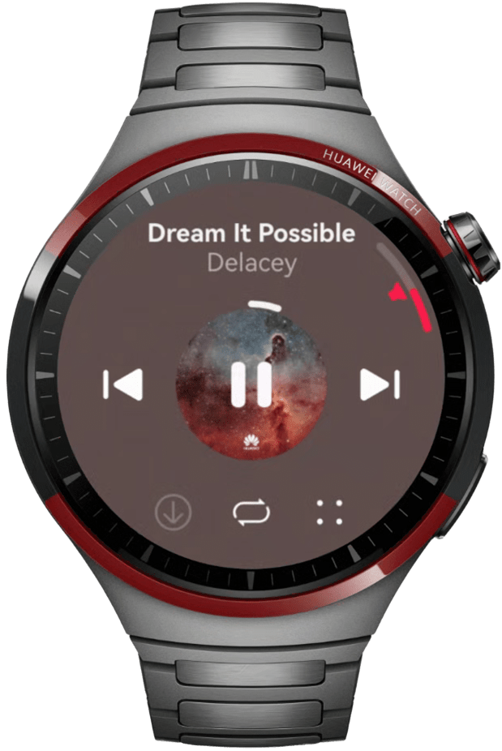

# 多设备音乐界面

## 项目简介

基于自适应和响应式布局，实现一次开发、多端部署音乐专辑。

## 效果预览
直板机效果图如下：


双折叠效果图如下：


平板效果图如下：


智能穿戴效果图如下：



## 工程目录
```
├──commons                                    // 公共能力层
│  ├──constantsCommon/src/main/ets            // 公共常量
│  │  └──constants
│  └──mediaCommon/src/main/ets                // 公共媒体方法
│     ├──utils
│     └──viewmodel
├──features                                   // 基础特性层
│  ├──live/src/main/ets                       // 直播页
│  │  ├──constants
│  │  ├──view
│  │  └──viewmodel
│  ├──live/src/main/resources                 // 资源文件目录
│  ├──musicComment/src/main/ets               // 音乐评论页
│  │  ├──constants
│  │  ├──view
│  │  └──viewmodel
│  ├──musicComment/src/main/resources         // 资源文件目录
│  ├──musicList/src/main/ets                  // 歌曲列表页
│  │  ├──components
│  │  ├──constants
│  │  ├──lyric
│  │  ├──view
│  │  └──viewmodel
│  └──musicList/src/main/resources            // 资源文件目录
└──products                                   // 产品定制层
   ├──phone/src/main/ets                      // 支持直板机、双折叠、平板
   │  ├──common
   │  ├──entryability
   │  ├──pages
   │  ├──phonebackupextability
   │  └──viewmodel
   ├──phone/src/main/resources                // 资源文件目录
   ├──watch/src/main/ets                      // 支持智能穿戴
   │  ├──constants                      
   │  ├──pages
   │  ├──view
   │  ├──watchability
   │  └──watchbackupability
   └──watch/src/main/resources                // 资源文件目录
```

## 使用说明

1. 根据连接的设备设置，智能穿戴选择“watch”，其他设备选择“phone”。
  
    
2. 分别在直板机、双折叠、平板、智能穿戴安装并打开应用，不同设备的应用页面通过响应式布局和自适应布局呈现不同的效果。
3. 点击界面上播放/暂停、上一首、下一首图标控制音乐播放功能。
4. 点击界面上播放控制区空白处或列表歌曲跳转到播放页面。
5. 点击界面上评论按钮跳转到对应的评论页面。
6. 其他按钮无实际点击事件或功能。

## 具体实现
1. 使用栅格布局监听断点变化，实现不同断点下的差异显示。
2. 通过Tabs组件或Swiper组件进行区域的切换。
3. 使用Blank组件实现中间空格自适应拉伸。
4. 智能穿戴设备设置borderRadius实现圆形表盘。

## 相关权限

不涉及

## 约束与限制

1. 本示例仅支持标准系统上运行，支持设备：直板机、双折叠（Mate X系列）、平板、智能穿戴。
2. HarmonyOS系统：HarmonyOS 5.1.0 Release及以上。
3. DevEco Studio版本：DevEco Studio 6.0.2 Release及以上。
4. HarmonyOS SDK版本：HarmonyOS 6.0.2 Release SDK及以上。