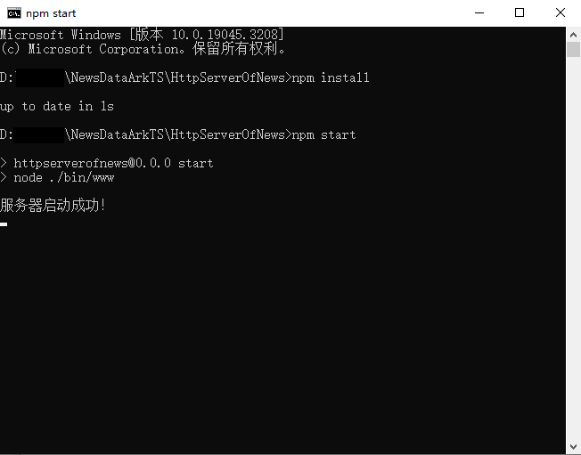

# News Data Loading

### Introduction

This codelab gives an example of ArkTS declarative development, introducing how to use the data request and **touch** event.


### Concepts

- List: a component that provides a series of list items with the same width.
- Tabs: a container that allows users to switch between content views through tabs.
- TabContent: a component used only in the **Tabs** component and corresponding to the content view of a switched tab page.
- Data request: provides the HTTP data request capability.
- onTouch: a method triggered by a touch action.

### Project Directory

```
├──entry/src/main/ets                   // ArkTS代码区
│  ├──common
│  │  ├──constant
│  │  │  └──CommonConstant.ets          // Common constants
│  │  └──utils
│  │     ├──HttpUtil.ets                // Http util
│  │     ├──Logger.ets                  // Logger
│  │     ├──PullDownRefresh.ets         // Pull down refresh method
│  │     └──PullUpLoadMore.ets          // Pull upload to refresh for more methods
│  ├──entryability
│  │  └──EntryAbility.ets               // Entry ability
│  ├──pages
│  │  └──Index.ets                      // Home page
│  ├──view
│  │  ├──CustomRefreshLoadLayout.ets    // Pull down and pull upload 
│  │  ├──LoadMoreLayout.ets             // Pull upload to refresh
│  │  ├──NewsItem.ets                   // News data
│  │  ├──NewsList.ets                   // News data list
│  │  ├──NoMoreLayout.ets               // No more data avilable
│  │  ├──RefreshLayout.ets              // Pull down refresh
│  │  └──TabBar.ets                     // News type tab
│  └──viewmodel
│     ├──NewsData.ets                   // News data
│     ├──NewsModel.ets                  // News data model
│     ├──NewsTypeModel.ets              // News type
│     ├──NewsViewModel.ets              // News data response
│     └──ResponseResult.ets             // Response result
└──entry/src/main/resources             // Static resources of the app
├──entry/src/main/ets/
│  ├──constants
│  │  └──Constants.ets                  // Common constants
│  ├──entryability
│  │  └──EntryAbility.ets               // Entry ability
│  ├──pages                 
│  │  └──Index.ets                      // Home page
│  └──view     
│     ├──FileDownloadItem.ets           // List item            
│     └──ProgressButton.ets             // Progress button
└──entry/src/main/resources             // Static resources of the app
```

### Permissions

Add the network permission **ohos.permission.INTERNET**.

### How to Use

#### Server Setup Process

1. Set up the Node.js environment. The server in this codelab is implemented based on Node.js. You need to install Node.js. If you already have a Node.js environment, skip this step.
   1. Check whether Node.js is installed on the local PC. Open the command line tool (for example, **cmd** in Windows or **Terminal** in the macOS. Windows is used here). Enter the **node -v** command. If the version information is displayed, Node.js has been successfully installed.
   
      
   
   2. If you do not have the Node.js environment on your local PC, download the required version from the Node.js official website and install it.
   3. After the environment variables are configured, open the command line tool again and enter **node -v**. If the version information is displayed, the installation is successful.
2. Build a LAN environment: When testing this codelab, ensure that the PCs for running the server code and testing are connected to the same LAN. You can enable your personal hotspot on your mobile phone, and connect both PCs to your mobile phone hotspot for testing.
3. Run the server code. Open the command line tool in the **HttpServerOfNews** directory of the project, enter **npm install** to install the server dependency package. After the installation is successful, enter **npm start** and press Enter. If you see the message "The server is started successfully", the server is running properly.

   

4. Connect to the server address: Open the command line tool, run the **ipconfig** command to view the local IP address, and copy the local IP address to line 22 in the **CommonConstant.ets** file in **src/main/ets/common/constant**. Replace only the IP address and do not change the port number. After saving the IP address, run the codelab to perform the test.

#### Frontend Instructions

1. Tap the app to go to the home page. The **tabBar** component is used to display the news category, and the **tabContent** component is used to display the news list. The news category and news list are obtained from the Node.js server.
2. Tap a tab or swipe left or right on the page to switch between tabs and display the data of the corresponding news category.
3. On the news list page, swipe down from the first item. The pull-down refresh is triggered and the first four pieces of news are updated. Swipe up from the last item. The pull-up loading is triggered and the four pieces of news are loaded at the bottom.

### Constraints

1. The sample app is supported only on Huawei phones running the standard system.
2. HarmonyOS: HarmonyOS 5.0.5 Release or later
3. DevEco Studio: DevEco Studio 5.0.5 Release or later
4. HarmonyOS SDK: HarmonyOS 5.0.5 Release SDK or later
