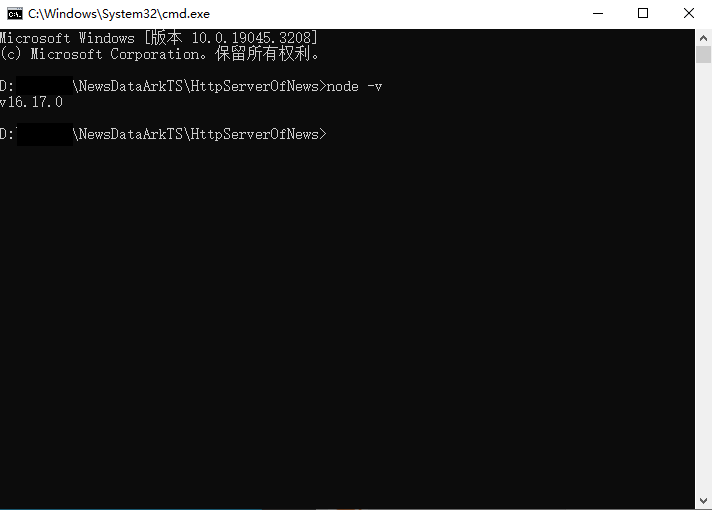
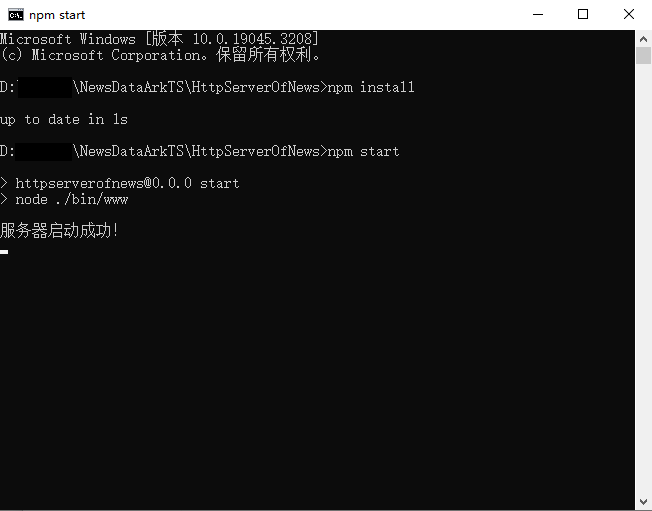

# 实现新闻数据加载功能

### 简介

本篇Codelab通过HTTP数据请求能力实现新闻分类和新闻列表数据获取，通过OnTouch触摸事件实现上拉加载下拉刷新能力。帮助开发者在新闻类场景开发中，实现数据的加载及刷新等功能。


### 相关概念

- List：列表包含一系列相同宽度的列表项。
- Tabs：通过页签进行内容视图切换的容器组件。
- TabContent组件：仅在Tabs中使用，对应一个切换页签的内容视图。
- 数据请求：提供HTTP数据请求能力。
- 触摸事件onTouch：触摸动作触发调用该方法。

### 工程目录

```
├──entry/src/main/ets                   // ArkTS代码区
│  ├──common
│  │  ├──constant
│  │  │  └──CommonConstant.ets          // 公共常量类
│  │  └──utils
│  │     ├──HttpUtil.ets                // 网络请求方法
│  │     ├──Logger.ets                  // 日志打印工具
│  │     ├──PullDownRefresh.ets         // 下拉刷新方法
│  │     └──PullUpLoadMore.ets          // 上拉加载更多方法
│  ├──entryability
│  │  └──EntryAbility.ets               // 程序入口类
│  ├──pages
│  │  └──Index.ets                      // 入口文件
│  ├──view
│  │  ├──CustomRefreshLoadLayout.ets    // 下拉刷新、上拉加载布局文件
│  │  ├──LoadMoreLayout.ets             // 上拉加载布局封装
│  │  ├──NewsItem.ets                   // 新闻数据
│  │  ├──NewsList.ets                   // 新闻列表
│  │  ├──NoMoreLayout.ets               // 没有更多数据封装
│  │  ├──RefreshLayout.ets              // 下拉刷新布局封装
│  │  └──TabBar.ets                     // 新闻类型页签
│  └──viewmodel
│     ├──NewsData.ets                   // 新闻数据实体类
│     ├──NewsModel.ets                  // 新闻数据模块信息
│     ├──NewsTypeModel.ets              // 新闻类型实体类
│     ├──NewsViewModel.ets              // 新闻数据获取模块
│     └──ResponseResult.ets             // 请求结果实体类
└──entry/src/main/resources             // 资源文件目录
```

### 相关权限

添加网络权限：ohos.permission.INTERNET。

### 使用说明

#### 服务端搭建流程

1. 搭建nodejs环境：本篇Codelab的服务端是基于nodejs实现的，需要安装nodejs，如果您本地已有nodejs环境可以跳过此步骤。
   1. 检查本地是否安装nodejs：打开命令行工具（如Windows系统的cmd和Mac电脑的Terminal，这里以Windows为例），输入node -v，如果可以看到版本信息，说明已经安装nodejs。
   
      
   
   2. 如果本地没有nodejs环境，您可以去nodejs官网上下载所需版本进行安装配置。
   3. 配置完环境变量后，重新打开命令行工具，输入node -v，如果可以看到版本信息，说明已安装成功。
2. 构建局域网环境：测试本Codelab时要确保运行服务端代码的电脑和测试机连接的是同一局域网下的网络，您可以用您的手机开一个个人热点，然后将测试机和运行服务端代码的电脑都连接您的手机热点进行测试。
3. 运行服务端代码：在本项目的HttpServerOfNews目录下打开命令行工具，输入npm install 安装服务端依赖包，安装成功后输入npm start点击回车。看到“服务器启动成功！”则表示服务端已经在正常运行。

   

4. 连接服务器地址：打开命令行工具，输入ipconfig命令查看本地ip，将本地ip地址复制到src/main/ets/common/constant/CommonConstant.ets文件下的22行，注意只替换ip地址部分，不要修改端口号，保存好ip之后即可运行Codelab进行测试。

#### 前端使用说明

1. 点击应用进入主页面，页面使用tabBar展示新闻分类，tabContent展示新闻列表，新闻分类和新闻列表通过请求nodejs服务端获取。
2. 点击页签或左右滑动页面，切换标签并展示对应新闻类型的数据。
3. 新闻列表页面，滑动到新闻列表首项数据，接着往下滑动会触发下拉刷新操作，页面更新初始4条新闻数据，滑动到新闻列表最后一项数据，往上拉会触发上拉加载操作，新闻列表会在后面加载4条新闻数据。

### 约束与限制

1. 本示例仅支持标准系统上运行，支持设备：华为手机。
2. HarmonyOS系统：HarmonyOS 5.0.5 Release及以上。
3. DevEco Studio版本：DevEco Studio 6.0.2 Release及以上。
4. HarmonyOS SDK版本：HarmonyOS 6.0.2 Release SDK及以上。
