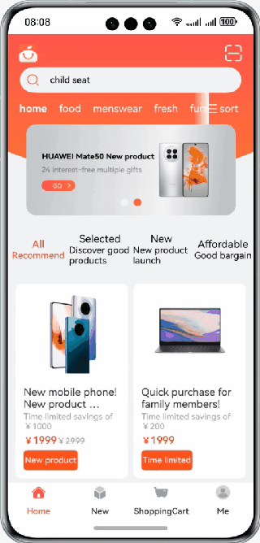

# Creating and Using an Ability in the Stage Model

### Introduction

This codelab introduces how to create and use an ability based on the stage model, with the shopping app as an example. The following figure shows the effect.

### Concepts

- UIAbility: functions as the basic unit scheduled by the system and provides a window for applications to draw UIs. A UIAbility component can implement a functional module through multiple pages. Each UIAbility component instance corresponds to a task in Recents.
- UIAbilityContext: provides APIs for accessing ability-specific resources. You can use the APIs to start and terminate an ability, obtain the caller interface, and request permissions from users by displaying a dialog box.
- Want: a carrier for information transfer between objects (application components). Want can be used as a parameter of **startAbility** to specify a startup target and information that needs to be carried during startup.
- HiLog: provides the HiLog capability for your applications to output logs based on the specified type, level, and format string. Such logs help you learn the running status of applications and better debug programs.

### Permissions

N/A

### How to Use

1. Tap a product in the product list to go to the details page.
2. Tap the navigation button in the navigation bar at the bottom to switch between pages.
3. Tap the Back button on the top of the details page to close the current page.

### Constraints

1. The sample is only supported on Huawei phones with standard systems.
2. HarmonyOS: HarmonyOS 5.0.5 Release or later.
3. DevEco Studio: DevEco Studio 5.0.5 Release or later.
4. HarmonyOS SDK: HarmonyOS 5.0.5 Release SDK or later.
