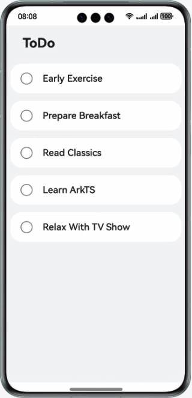

# To-Do List

## Introduction

This codelab introduces how to implement a simple to-do list based on the ArkTS declarative syntax and basic components. Example:

## Concepts

- ArkTS: the most popular programming language for HarmonyOS apps. ArkTS is a superset of TypeScript (TS).

- Text: a component that is used to display a piece of text.

- Column: a container that arranges components vertically.

- Row: a container that arranges components horizontally.

## Permissions

N/A

## How to Use

1. Open the app home page, tap an item in the to-do list, and mark the item as completed.

## Constraints

1. The sample app is supported only on Huawei phones running the standard system.
2. HarmonyOS: HarmonyOS 5.0.0 Release or later
3. DevEco Studio: DevEco Studio 5.0.0 Release or later
4. HarmonyOS SDK: HarmonyOS 5.0.0 Release SDK or later
