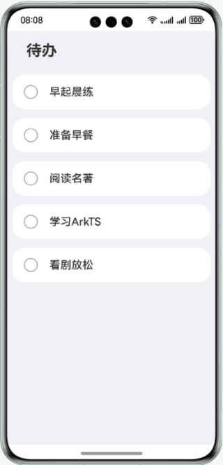

# 实现待办事项列表

## 简介

本篇Codelab将介绍如何使用ArkTS声明式语法和基础组件，实现简易待办列表。效果为点击某一事项，替换标签图片、虚化文字。

## 相关概念

- ArkTS语言: ArkTS是HarmonyOS的主要应用开发语言。ArkTS基于TypeScript（简称TS）语言扩展而来，是TS的超集。

- Text组件: 显示一段文本的组件。

- Column组件: 沿垂直方向布局的容器。

- Row组件: 沿水平方向布局的容器。

## 相关权限

不涉及

## 使用说明

1. 打开应用首页，点击列表中的待办事项，标记完成此待办事项。

## 约束与限制

1. 本示例仅支持标准系统上运行，支持设备：华为手机。
2. HarmonyOS系统：HarmonyOS 5.0.5 Release及以上。
3. DevEco Studio版本：DevEco Studio 6.0.0 Release及以上。
4. HarmonyOS SDK版本：HarmonyOS 6.0.0 Release SDK及以上。
