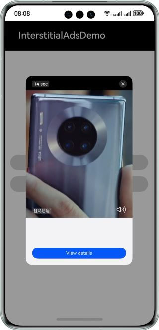

# Ads Kit Sample Code (HarmonyOS ArkTS)
## Contents

* [Overview](#Overview)
* [How to Use](#How-to-Use)
* [Preview](#Preview)
* [Project Directory](#Project-Directory)
* [Sample Code](#Sample-Code)
* [Required Permissions](#Required-Permissions)
* [Constraints](#Constraints)


## Overview
The sample code of Ads Kit for HarmonyOS ArkTS describes how to use APIs of Ads Kit in your app to display ads.

## How to Use

Before running this demo, you need to [configure app signing information](https://developer.huawei.com/consumer/en/doc/harmonyos-guides/application-dev-overview#section42841246144813).

## Preview
| **Interstitial video ad page**                            | **Interstitial image ad page**                                             |
|--------------------------------------------|-----------------------------------------------------------|
|  |  |

## Project Directory
```
├─entry/src/main/ets                  // Code area. 
│ ├─entryability
│ │ └─EntryAbility.ets                // Entry point class.
│ ├─event   
│ │ └─InterstitialAdStatusHandler.ets // Interstitial ad status listener.
│ ├─pages                             // Directory for storing app UI files.               
│ │ └─Index.ets                       // Interstitial ad page.
└─entry/src/main/resources            // Directory for storing resource files.
```

## Sample Code
### Petal Ads Publisher Service
The sample code is used to implement a UI to display interstitial ads.
The sample code includes the following file for you to request and display ads:

* Index.ets
Demo UI of Petal Ads Publisher Service, where you can tap the button to request and display interstitial ads.
<br>Code location: **entry\src\main\ets\pages\Index.ets**<br>

## Required Permissions

* To obtain the OAID, you need to request the activity tracking permission [ohos.permission.APP_TRACKING_CONSENT](https://developer.huawei.com/consumer/en/doc/harmonyos-guides/permissions-for-all-user#ohospermissionapp_tracking_consent).

## Constraints

1. The sample app is only supported on Huawei phones and tablets with standard systems.
2. The HarmonyOS version must be HarmonyOS NEXT Developer Beta1 or later.
3. The DevEco Studio version must be DevEco Studio NEXT Developer Beta1 or later.
4. The HarmonyOS SDK version must be HarmonyOS NEXT Developer Beta1 SDK or later.
