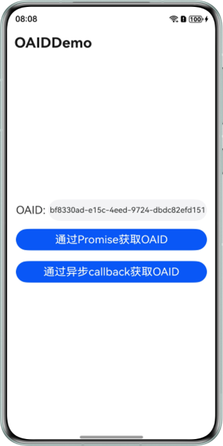

# 广告标识服务HarmonyOS ArkTs示例代码
## 目录

* [简介](#简介)
* [使用说明](#使用说明)
* [效果预览](#效果预览)
* [工程目录](#工程目录)
* [示例代码](#示例代码)
* [相关权限](#相关权限)
* [约束与限制](#约束与限制)


## 简介
本示例展示了如何通过广告标识服务部件提供的接口获取开放匿名设备标识符以及重置开放匿名设备标识符。

## 相关概念
* 开放匿名设备标识符

  开放匿名设备标识符（Open Anonymous Device Identifier, OAID，以下简称OAID）：是一种非永久性设备标识符，基于开放匿名设备标识符，可在保护用户个人数据隐私安全的前提下，向用户提供个性化广告，同时三方监测平台也可以向广告主提供转化归因分析。

## 使用说明

1. 运行本示例前需要参考指导进行：
    * [配置应用签名信息](https://developer.huawei.com/consumer/cn/doc/harmonyos-guides-V5/application-dev-overview-V5#section42841246144813)

2. 打开应用进入首页，首次进入应用默认可以获取到OAID；如果“跨应用关联访问权限”设置为“禁止”，则获取为全0的空串。

3. 点击“通过Promise获取OAID”，上方文本框显示OAID。

4. 点击“通过异步callback获取OAID”，上方文本框显示OAID。

## 效果预览
| **获取OAID页面**                             |
|------------------------------------------|
|  |

## 工程目录
```
├─entry/src/main/ets       // 代码区  
│ ├─entryability
│ │ └─EntryAbility.ets     // 主程序入口类
│ ├─pages                  // 存放页面文件目录                
│ │ └─Index.ets            // OAID广告页面
└─entry/src/main/resources // 资源文件目录
```

## 示例代码
### 广告标识服务示例代码
本示例代码包括以下文件，便于您获取OAID：

* Index.ets
广告标识服务演示界面，可以获取OAID。
<br>代码位置： entry\src\main\ets\pages\Index.ets</br>

### 相关权限

* 获取OAID功能需要申请广告跨应用关联访问权限：[ohos.permission.APP_TRACKING_CONSENT](https://developer.huawei.com/consumer/cn/doc/harmonyos-guides-V5/permissions-for-all-V5#ohospermissionapp_tracking_consent)。


## 约束与限制

1. 本示例仅支持标准系统上运行，支持设备：华为手机、平板设备、2in1设备。
2. HarmonyOS系统：HarmonyOS NEXT Developer Beta1及以上。
3. DevEco Studio版本：DevEco Studio NEXT Developer Beta1及以上。
4. HarmonyOS SDK版本：HarmonyOS NEXT Developer Beta1及以上。