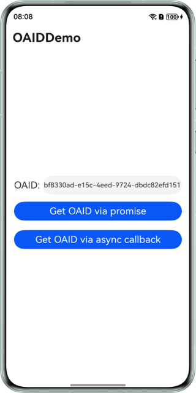

# OAID Service Sample Code (HarmonyOS ArkTS)

## Contents

- [Overview](#Overview)
- [How to Use](#How-to-Use)
- [Preview](#Preview)
- [Project Directory](#Project-Directory)
- [Sample Code](#Sample-Code)
- [Required Permissions](#Required-Permissions)
- [Constraints](#Constraints)

## Overview

This demo shows how to obtain Open Anonymous Device Identifiers (OAIDs) through APIs provided by the OAID service.

## Concepts

An Open Anonymous Device Identifier (OAID) is a non-permanent device identifier. It allows personalized ads to be provided to users while ensuring the protection of their personal data privacy. Additionally, it allows third-party tracking platforms to offer conversion attribution analysis to advertisers.

## How to Use

1. Before running this demo, you need to [configure app signing information](https://developer.huawei.com/consumer/en/doc/harmonyos-guides/application-dev-overview#section42841246144813).
2. Access the app home screen. The OAID can be obtained by default during the first access to the app. If **Activity tracking for this app** is set to **Deny**, the obtained OAID will be an empty string that consists of all zeros.
3. Tap **Get OAID via promise**. The OAID is displayed in the text box.
4. Tap **Get OAID via async callback**. The OAID is displayed in the text box.

## Preview

| Page for obtaining the OAID                    |
| ---------------------------------------------- |
|  |

## Project Directory

```
├─entry/src/main/ets       // Code area. 
│ ├─entryability
│ │ └─EntryAbility.ets     // Entry point class.
│ ├─pages                  // Directory for storing app UI files.               
│ │ └─Index.ets            // OAID ad page.
└─entry/src/main/resources // Directory for storing resource files.
```

## Sample Code

### OAID Service

The sample code includes the following file for you to obtain the OAID:

1. Index.ets
   Demo UI of the OAID service, which can be used to obtain the OAID.
   <br>Code location: **entry\src\main\ets\pages\Index.ets**<br>

### Required Permissions

- To obtain the OAID, you need to request the activity tracking permission [ohos.permission.APP_TRACKING_CONSENT](https://developer.huawei.com/consumer/en/doc/harmonyos-guides/permissions-for-all-user#ohospermissionapp_tracking_consent).

## Constraints

1. This sample is only supported on Huawei phones, tablets, 2-in-1 devices, and Vision devices with standard systems.
2. The HarmonyOS version must be HarmonyOS 5.0.5 Release or later.
3. The DevEco Studio version must be DevEco Studio 6.0.0 Release or later.
4. The HarmonyOS SDK version must be HarmonyOS 6.0.0 Release SDK or later.

