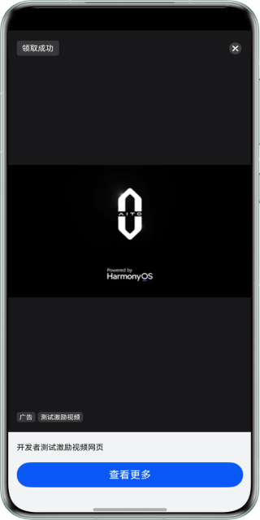

# 鲸鸿动能广告服务HarmonyOS ArkTs示例代码

## 目录

- [简介](#简介)
- [使用说明](#使用说明)
- [效果预览](#效果预览)
- [工程目录](#工程目录)
- [示例代码](#示例代码)
- [相关权限](#相关权限)
- [约束与限制](#约束与限制)

## 简介

鲸鸿动能广告服务HarmonyOS ArkTs示例代码向您介绍如何在应用中使用将鲸鸿动能API并实现广告展示。

## 使用说明

运行本示例前需要参考指导[配置应用签名信息](https://developer.huawei.com/consumer/cn/doc/harmonyos-guides/application-dev-overview#section42841246144813)。

## 效果预览

| 激励广告页面                                     |
|--------------------------------------------|
|  |

## 工程目录

```
├─entry/src/main/ets            // 代码区  
│ ├─entryability
│ │ └─EntryAbility.ets          // 主程序入口类
│ ├─event   
│ │ └─RewardAdStatusHandler.ets // 激励广告状态监听
│ ├─pages                       // 存放页面文件目录                
│ │ └─Index.ets                 // 应用主页面
│ ├─viewmodel                   // 存放ViewModel文件目录
│ │ └─AdsViewModel.ets          // 广告ViewModel
└─entry/src/main/resources      // 资源文件目录
```

## 示例代码

### 流量变现服务示例代码

鲸鸿动能广告服务HarmonyOS-ArkTs示例代码为您提供激励广告的展示页面。
本示例代码包括以下文件，便于您进行广告请求、广告展示：

1. Index.ets
   流量变现服务演示界面，可以请求并展示激励广告，点击对应按钮可以展示相应的广告内容。
   <br>代码位置：entry\src\main\ets\pages\Index.ets</br>
2. RewardAdStatusHandler.ets
   用于订阅com.huawei.hms.pps.action.PPS_REWARD_STATUS_CHANGED事件来监听激励广告页面变化并接收奖励信息。
   <br>代码位置：entry\src\main\ets\event\RewardAdStatusHandler.ets</br>
3. AdsViewModel.ets
   用于管理广告UI状态和业务逻辑。
   <br>代码位置：entry\src\main\ets\viewmodel\AdsViewModel.ets</br>

## 相关权限

- 获取开放匿名设备标识符需要申请跨应用关联权限：[ohos.permission.APP_TRACKING_CONSENT](https://developer.huawei.com/consumer/cn/doc/harmonyos-guides/permissions-for-all-user#ohospermissionapp_tracking_consent)。
- 请求展示广告需要申请Internet网络权限：[ohos.permission.INTERNET](https://developer.huawei.com/consumer/cn/doc/harmonyos-guides/permissions-for-all#ohospermissioninternet)。

## 约束与限制

1. 本示例仅支持标准系统上运行，支持设备：华为手机、平板设备。
2. HarmonyOS系统：HarmonyOS NEXT Developer Beta1及以上。
3. DevEco Studio版本：DevEco Studio NEXT Developer Beta1及以上。
4. HarmonyOS SDK版本：HarmonyOS NEXT Developer Beta1及以上。