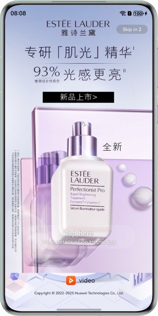

# Ads Kit Sample Code (HarmonyOS ArkTS)
## Contents

* [Overview](#Overview)
* [How to Use](#How-to-Use)
* [Preview](#Preview)
* [Project Directory](#Project-Directory)
* [Sample Code](#Sample-Code)
* [Required Permissions](#Required-Permissions)
* [Constraints](#Constraints)


## Overview
The sample code of Ads Kit for HarmonyOS ArkTS describes how to use APIs of Ads Kit in your app to display ads.

## How to Use

Before running this demo, you need to: [Configure app signing information.](https://developer.huawei.com/consumer/en/doc/harmonyos-guides-V5/application-dev-guide-V5#section42841246144813)

## Preview
| **Page of the full-screen splash video ad**                                    | **Page of the half-screen splash image ad**                                       |
|--------------------------------------------------|-----------------------------------------------------|
|  |  |

## Project Directory
```
├─entry/src/main/ets               // Code area. 
│ ├─entryability
│ │ └─EntryAbility.ets             // Entry point class.
│ ├─pages                          // Directory for storing app UI files.               
│ │ ├─AdsServicePage.ets           // App home screen.
│ │ ├─SplashFullScreenAdPage.ets   // Page of the full-screen splash ad.               
│ │ └─SplashHalfScreenAdPage.ets   // Page of the half-screen splash ad.
└─entry/src/main/resources         // Directory for storing resource files.
```

## Sample Code
### Petal Ads Publisher Service
The sample code is used to implement a UI to display splash ads.
The sample code includes the following files for you to request and display ads:

1. AdsServicePage.ets
Demo UI of Petal Ads Publisher Service, where you can tap the button to request and display splash ads.
<br>Code location: **entry\src\main\ets\pages\AdsServicePage.ets**<br>

2. SplashFullScreenAdPage.ets
Used to display full-screen splash ads.
<br>Code location: **entry\src\main\ets\pages\SplashFullScreenAdPage.ets**<br>

3. SplashHalfScreenAdPage.ets
Used to display half-screen splash ads.
<br>Code location: **entry\src\main\ets\pages\SplashHalfScreenAdPage.ets**<br>

## Required Permissions

* To obtain the OAID, you need to request the activity tracking permission [ohos.permission.APP_TRACKING_CONSENT](https://developer.huawei.com/consumer/en/doc/harmonyos-guides-V5/permissions-for-all-V5#ohospermissionapp_tracking_consent).

## Constraints

1. The sample app is only supported on Huawei phones and tablets with standard systems.
2. The HarmonyOS version must be HarmonyOS NEXT Developer Beta1 or later.
3. The DevEco Studio version must be DevEco Studio NEXT Developer Beta1 or later.
4. The HarmonyOS SDK version must be HarmonyOS NEXT Developer Beta1 or later.
