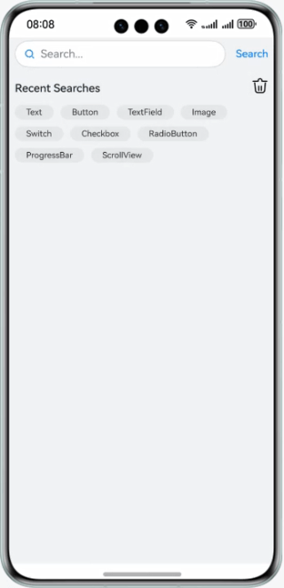

# Flexible Layout

### Introduction

Based on the Flex container features, learn how to implement flexible layout. Example:

### Concepts

- Flex: a component that allows for flexible layout of child components.
- Search: a component that provides an area for you to enter search queries.
- Text: a component that is used to display a piece of text.
- Image: a component that is used to display images in applications.
- Scroll: a component that is used to scroll the content when a component layout exceeds the viewport of its parent component.
- Conditional rendering: supports rendering of UI content based on the application state by using the **if**, **else**, and **else if** statements.
- Loop rendering: performed by **ForEach** based on array data.

### Permissions

N/A

### How to Use

1. Enter the content in the search text box, and tap the Search button. The entered content is displayed in the recent search history.
2. Touch the Delete icon to clear all recent searches, after which the text and image for "no searches" are displayed.

### Constraints

1. The sample is only supported on Huawei phones with standard systems.
2. The HarmonyOS version must be HarmonyOS 5.0.5 Release or later.
3. The DevEco Studio version must be DevEco Studio 6.0.2 Release or later.
4. The HarmonyOS SDK version must be HarmonyOS 6.0.2 Release SDK or later.