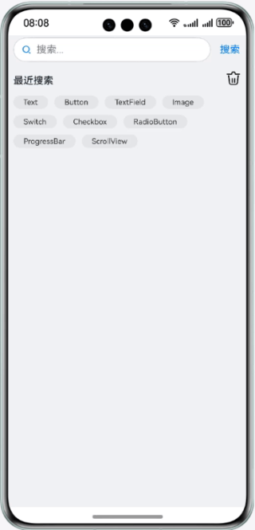

# 基于Flex容器组件实现弹性布局效果

### 简介

基于Flex容器组件特性，实现弹性布局效果。效果如图所示：

### 相关概念

- Flex组件：以弹性方式布局子组件的容器组件。
- Search组件：搜索框组件，适用于浏览器的搜索内容输入框等应用场景。
- Text组件：显示一段文本的组件。
- Image组件：Image为图片组件，常用于在应用中显示图片。
- Scroll：可滑动的容器组件，当子组件的布局尺寸超过父组件的视口时，内容可以滑动。
- 条件渲染：条件渲染可根据应用的不同状态，使用if、else和else if渲染对应状态下的UI内容。
- 循环渲染：ForEach基于数组类型数据执行循环渲染。

### 相关权限

不涉及

### 使用说明

1. 在页面的搜索输入框中输入搜索的文本内容，点击**搜索**文本按钮，最近搜索内容中展示刚输入搜索的文本内容。
2. 点击**删除**图标，所有最近搜索内容清空，并展示没有搜索内容文本和相关图片。

### 约束与限制

1. 本示例仅支持标准系统上运行，支持设备：华为手机。
2. HarmonyOS系统：HarmonyOS 5.0.5 Release及以上。
3. DevEco Studio版本：DevEco Studio 6.0.2 Release及以上。
4. HarmonyOS SDK版本：HarmonyOS 6.0.2 Release SDK及以上。