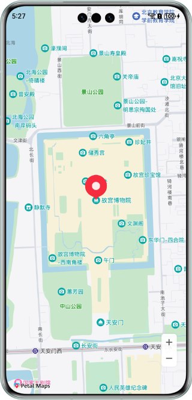

华为地图服务示例代码
===============================

## 目录

* [简介](#简介)
* [开发准备](#开发准备)
* [工程目录](#工程目录)
* [相关权限](#相关权限)
* [环境要求](#环境要求)
* [结果](#结果)


简介
------------

华为地图服务（Map Kit）是鸿蒙生态下的一个地图服务，为开发者提供强大而便捷的地图能力，助力全球开发者实现个性化地图呈现、地图搜索和路线规划等功能，轻松完成地图构建工作。您可以轻松地在HarmonyOS应用中集成地图相关的功能，全方位提升用户体验。

开发准备
---------------

您需要先在[AppGallery Connect](https://developer.huawei.com/consumer/cn/doc/harmonyos-guides-V5/map-config-agc-V5)网站上开通地图服务并配置应用签名证书指纹。

## 工程目录
```
├─entry/src/main/ets                    // 代码区域
│  ├─entryability                       
│  │   └─EntryAbility.ets               // 本地启动ability
│  └─pages                              // 代码目录
│     └─BasicMapDemo.ets                // 基础地图界面
└─entry/src/main/resources              // 项目资源目录
````

## 相关权限

1. 允许使用Internet网络：ohos.permission.INTERNET。
2. 允许应用获取数据网络信息：ohos.permission.GET_NETWORK_INFO。

环境要求
-------

DevEco Studio版本：DevEco Studio NEXT Developer Beta1及以上版本。

HarmonyOS SDK版本：HarmonyOS NEXT Developer Beta1及以上版本。

## 结果

  
