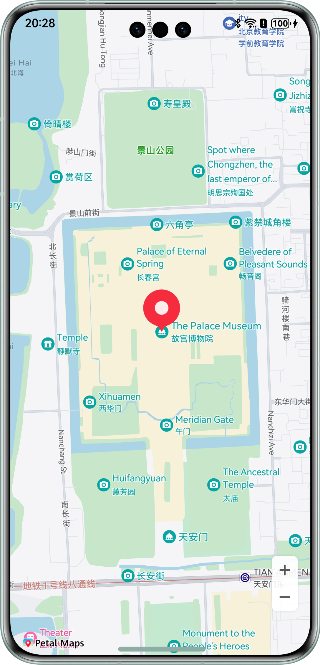

Map Kit Sample Code
===============================

## Contents

* [Overview](#Overview)
* [Preparations](#Preparations)
* [Project_Directory](#Project_Directory)
* [Required_Permissions](#Required_Permissions)
* [Environment_Requirements](#Environment_Requirements)
* [Result](#Result)


Overview
------------

Map Kit is a powerful service within the HarmonyOS ecosystem. It empowers developers to effortlessly create customized map experiences by offering robust capabilities such as personalized map display, map search, and route planning. You can easily integrate map functions into HarmonyOS apps to improve user experience.

Preparations
---------------

You need to enable Map Kit and configure the app signing certificate fingerprint in [AppGallery Connect](https://developer.huawei.com/consumer/en/doc/harmonyos-guides/map-config-agc).

## Project_Directory
```
├─entry/src/main/ets                    // Code area.
│  ├─entryability                       
│  │   └─EntryAbility.ets               // Ability for local startup.
│  └─pages                              // Code directory.
│     └─BasicMapDemo.ets                // Basic map page.
└─entry/src/main/resources              // Project resource directory.
````

## Required_Permissions

1. **ohos.permission.INTERNET**: allows an app to access the Internet.
2. **ohos.permission.GET_NETWORK_INFO**: allows an app to obtain network information.

Environment_Requirements
-------

The DevEco Studio version must be DevEco Studio NEXT Developer Beta1 or later.

The HarmonyOS SDK version must be HarmonyOS NEXT Developer Beta1 or later.

## Result

  
