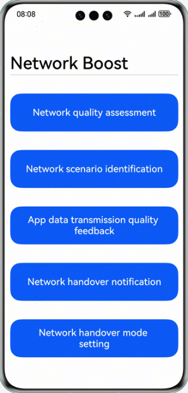
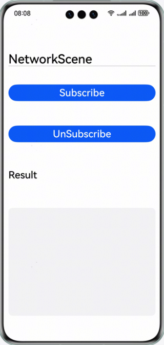
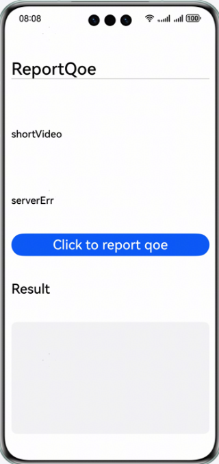
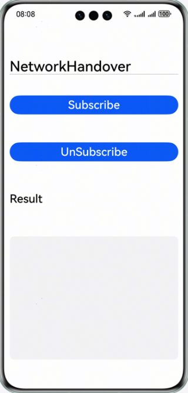
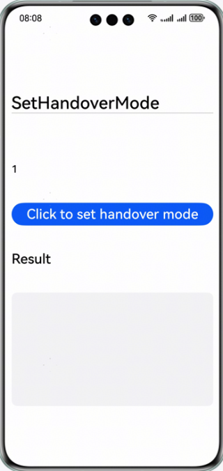

# Network Boost Kit demo code

## Overview

Network Boost Kit offers a comprehensive solution that enhances network performance through acceleration, awareness, and prediction capabilities. By coordinating software, hardware, chips, devices, pipes, and cloud resources, it optimizes network resource allocation for a more reliable, smoother, and faster Internet experience.

## Preparing for the Development

- Install and debug the required development environment before developing a HarmonyOS app.
- Understand the code structure of Network Boost Kit.

## Effect Preview

| Main page renderings                    | Network quality assessment              | Network scenario identification                                    |
|--------------------------------------|--------------------------------------|----------------------------------------|
|  |  |  |

| Transmission quality feedback       | Network handover notification       | Network handover mode setting                   |
|--------------------------------------|--------------------------------------|----------------------------------------|
|  |  |  |
## Project Directory

```
├──entry/src/main/ets/
│  ├──entryability
│  │  └──EntryAbility.ets             // Entry point ability
│  └──pages
│     ├──MainPage.ets                 // Main UI
│     ├──NetworkQos.ets               // Network quality assessment test page
│     ├──NetworkScene.ets             // Network scenario identification test page
│     ├──ReportQoe.ets                // Transmission quality feedback test page
│     ├──NetworkHandover.ets          // Network handover notification test page
│     └──SetHandoverMode.ets          // Network handover mode setting test page
└──entry/src/main/resources           // App static resource directory
```

## How to Implement

The APIs that you need to use for network quality assessment, network scenario identification, and app data transmission quality feedback are packaged into @hms.networkboost.netquality.d.ts, network handover notification, set network handover mode are packaged into @hms.networkboost.handover.d.ts:

- Your app can call netQuality.on(type: 'netQosChange', callback: Callback<Array<NetworkQos>>) to subscribe to the network quality assessment data. Then the system will periodically send updates or notify your app when QoS changes.
- Your app can call netQuality.on(type: 'netSceneChange', callback: Callback<Array<NetworkScene>>) to subscribe to network scenario identification data. When the real-time or predicted scenario changes, system will send information to your app.
- Your app can call netQuality.reportQoe(appQoe: AppQoe) to send the transmission quality and service type data to system via the API.
- Your app can call netHandover.on(type: 'handoverChange', callback: Callback<HandoverInfo>) to subscribe to network handover notification. When the device initiates a network handover (such as from Wi-Fi to cellular or between primary and secondary SIM cards), the system will notify your app upon the start and end of the handover.
- Your app can call netHandover.setHandoverMode(mode: HandoverMode) to change the network handover mode between delegation mode and discretion mode.

You need to import @kit.NetworkBoostKit first and then call APIs based on your needs. For details, please refer to the API implementation under entry/src/main/pages in this sample code.

## Required Permissions

This sample code requires permissions to obtain device network information. Add the following permissions to the module.json5 file:

1. ohos.permission.GET_NETWORK_INFO: Allows your app to obtain device network information.
2. ohos.permission.INTERNET: Allows your app to access the Internet.


## How to Use

If the sample code cannot be run, choose Build > Clean Project in DevEco Studio to clear the project.

## Restrictions

1. The sample app is supported only on Huawei phones and Huawei tablet running the standard system.
2. HarmonyOS: HarmonyOS NEXT Beta1 or later.
3. DevEco Studio: DevEco Studio NEXT Beta1 or later.
4. HarmonyOS SDK: HarmonyOS NEXT Beta1 SDK or later.