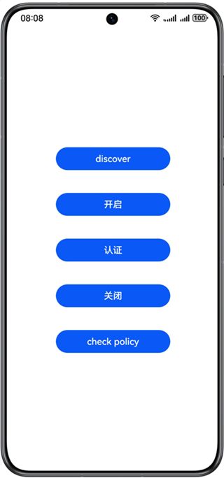
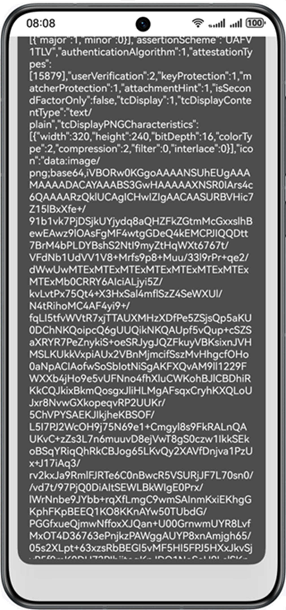

# FIDO

## 介绍

本示例展示了FIDO免密身份认证接口的使用方法

通过从 @kit.OnlineAuthenticationKit 导入FIDO API接口，可实现基于FIDO协议提供的端侧免密开通，认证和注销功能。

## 效果预览

| 应用入口 | 应用主页| 接口使用按钮 |
| --------------- | --------------- | -------------- |
| 点击图标打开应用 | 应用主页显示在设备屏幕   | 点击接口测试按钮调用接口  |
|  |  |  |

## 工程目录
```
├── entry/src/main/ets
│    ├── bean
│    │    ├── FidoAuth.ets        // 认证数据结构
│    │    ├── FidoDereg.ets       // 注销数据结构
│    │    └── FidoReg.ets         // 注册数据结构
│    ├── ConnectService.ets       // 连接FIDO服务器，获取注册、认证、注销报文
│    ├── entryability
│    │    └── EntryAbility.ets    // 程序入口类
│    ├── pages
│    │    └── Index.ets           // 注册、认证、注销接口调用示例
│    └── util
│         └── Util.ets            // 工具类
```


## 使用说明

1. 运行前需修改并指定服务器地址(entry/src/main/ets/ConnectService.ets)；
2. 在主界面，每次使用FIDO功能之前，需要首先点击discover初始化认证器数据；
3. 在设备录入指纹/人脸后，点击开启按钮，页面弹出弹窗进行生物特征认证，提示开启成功；
4. 点击check policy可查询FIDO服务开通状态；
5. 在开启后点击认证按钮，页面弹出弹窗进行认证，提示认证成功；
6. 点击关闭按钮，提示关闭成功。


## 具体实现（接口参考@hms.security.fido）
以FIDO开启功能为例，业务使用时，需要先进行import导入如下fido API:
* function discover(context: common.Context): Promise<DiscoveryData>;
* function processUAFOperation(context: common.Context, uafRequest: UAFMessage, channelBindings: ChannelBinding):Promise<UAFMessage>;
* function notifyUAFResult(context: common.Context, uafResponse: UAFMessage): Promise<void>;

业务使用时，首先需要调用discover()接口初始化认证器；processUAFOperation()提供统一接口，通过构造开启uafRequest数据选择开启功能；调用notifyUAFResult()接口进行注册结果通知。
具体用例请参考Index.ets。


## 相关权限

1. 获取振动权限：ohos.permission.INTERNET。
2. 获取生物识别权限：ohos.permission.ACCESS_BIOMETRIC。

## 依赖

不涉及

## 约束与限制

1. 本示例仅支持标准系统上运行，支持设备：华为手机、平板、2in1；
2. 本示例需要使用DevEco Studio NEXT Developer Beta1才可编译运行；
3. 若使用人脸认证功能，设备须支持3D人脸；
4. FIDO客户端接口仅提供端侧能力，无法独立进行开启/认证服务；ConnectService.ets提供连云服务模板，如需连云请通过修改服务器url地址接入云端服务器。
