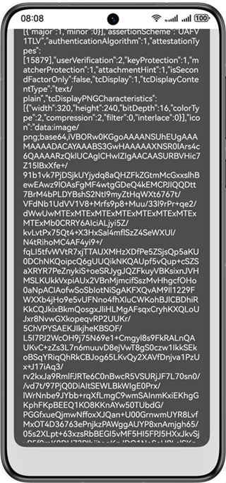

# FIDO

## Overview

This sample code illustrates how to use the APIs for FIDO password-free identity verification.

You can import FIDO APIs through **@kit.OnlineAuthenticationKit** to enable, perform, and disable on-device FIDO password-free identity verification.

## Preview

| App entry| App home page| API call buttons |
| --------------- | --------------- | -------------- |
| App icon for opening the app| App home page displayed on the device screen  | Tapping a button to call the corresponding API |
|  |  |  |

## Project Directory
```
├── entry/src/main/ets
│    ├── bean
│    │    ├── FidoAuth.ets        // Authentication data structure
│    │    ├── FidoDereg.ets       // Deregistration data structure
│    │    └── FidoReg.ets         // Registration data structure
│    ├── ConnectService.ets       // Connecting to the FIDO server to obtain registration, authentication, and deregistration packets
│    ├── entryability
│    │    └── EntryAbility.ets    // Entry point class
│    ├── pages
│    │    └── Index.ets           // API call examples of enabling, performing, and disabling FIDO password-free identity verification
│    └── util
│         └── Util.ets            // Utility class
```


## How to Use

1. Modify and specify the server address (entry/src/main/ets/ConnectService.ets) before running.
2. On the app home page, tap **Discover** to initialize authenticators before using the FIDO function.
3. After the fingerprint/face information is recorded onto the device, tap the **Enable** button to enable FIDO password-free identity verification. Biometric authentication is required then.
4. Tap **Check Policy** to check whether FIDO password-free identity verification is enabled.
5. After FIDO password-free identity verification is enabled, tap the **Authenticate** button to perform FIDO password-free identity verification.
6. Tap the **Disable** button to disable FIDO password-free identity verification. A message is displayed, indicating that the operation is successful.


## How to Implement (See @hms.security.fido)
The following uses enabling FIDO password-free identity verification as an example. You need to import the following FIDO APIs first:

* function discover(context: common.Context): Promise&lt;DiscoveryData&gt;;
* function processUAFOperation(context: common.Context, uafRequest: UAFMessage, channelBindings: ?ChannelBinding):Promise&lt;UAFMessage&gt;;
* function notifyUAFResult(context: common.Context, uafResponse: UAFMessage): Promise&lt;void&gt;;

Call the **discover()** API to initialize authenticators first. To enable FIDO password-free identity verification, call the **processUAFOperation()** API for FIDO registration by constructing **uafRequest** data. Then, call the **notifyUAFResult()** API to send the registration result notification.
For details about the code, see **Index.ets**.


## Required Permissions

1. **ohos.permission.VIBRATE**: permission to vibrate.
2. **ohos.permission.ACCESS_BIOMETRIC**: permission for biometric recognition.

## Dependencies

N/A

## Constraints

1. The sample app is only supported on devices with standard systems.Supported devices: Huawei phones, tablets, and 2in1.
2. The DevEco Studio version used in this sample must be DevEco Studio NEXT Developer Beta1.
3. The HarmonyOS version must be HarmonyOS NEXT Beta1 or later.
4. The HarmonyOS SDK version must be HarmonyOS NEXT Beta1 SDK or later.
5. To use the facial authentication function, the devices must support 3D faces.
6. The FIDO client APIs provide only on-device capabilities and cannot enable or perform authentication independently. The **ConnectService.ets** file provides a cloud connection template. You can modify the server URL in this file to connect to the cloud server.
