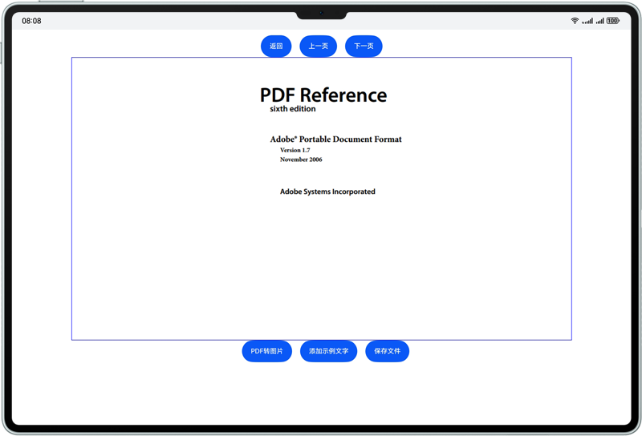
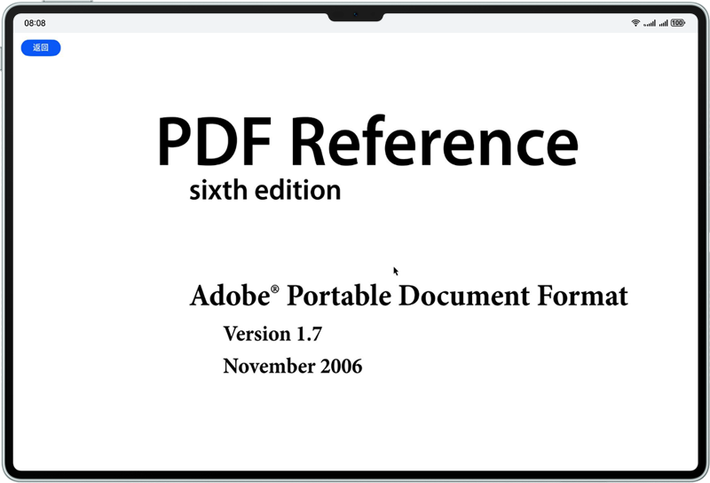

# PDFKit
## 介绍
本示例展示了如何使用PDFKit提供的能力进行PDF文件内容查看与编辑等相关操作，相关能力通过PDFKit服务接口@kit.PDFKit引入。
## 使用说明
将示例代码用DevEco打开，点击运行按钮，选择相应的PDF资源文件打开即可。<br />



## 工程目录
```
entry
  |——src
     |——main
     |   |——ets
     |   |   ├──entryability
     |   │   |  |── EntryAbility.ets // 本地启动ability
     |   |   ├──pages
     |   |   |  |── Index.ets // 文件选择界面
     |   |   |  |── PDFPreview.ets // PDF示例界面
     |   |   |  |── PDFView.ets // PdfView组件预览界面
```


## 具体实现
在@kit.PDFKit中定义了PDF服务的接口API，示例接口如下：


```
    /**
     * Load a file with a specified file path or uri.
     * @param { string } path - file path.
     * @param { string } password - File encryption password.
     * @param { (progress: number) => number } onProgress - Progress bar callback function.
     * @returns { ParseResult } ParseResult enum type.
     * @throws { BusinessError } 401 - invalid input parameter.
     * @syscap SystemCapability.OfficeService.PDFService.Core
     * @since 5.0.0(12)
     */
    loadDocument(path: string, password?: string, onProgress?: (progress: number) => number): ParseResult;

    /**
     * Release PDF documents.
     * @syscap SystemCapability.OfficeService.PDFService.Core
     * @since 5.0.0(12)
     */
    releaseDocument(): void;
    
    /**
     * Save document to specified file path.
     * @param { string } path - file path.
     * @param { (progress: number) => number } onProgress - Progress bar callback function
     * @returns { boolean } Whether the document was saved successfully.
     * @throws { BusinessError } 401 - invalid input parameter.
     * @syscap SystemCapability.OfficeService.PDFService.Core
     * @since 5.0.0(12)
     */
    saveDocument(path: string, onProgress?: (progress: number) => number): boolean;
    
    /**
     * Get the object of the specified page.
     * @param { number } index - Get the page object.
     * @returns { PdfPage } Specify the page object.
     * @throws { BusinessError } 401 - invalid input parameter.
     * @syscap SystemCapability.OfficeService.PDFService.Core
     * @since 5.0.0(12)
     */
    getPage(index: number): PdfPage;
    
    /**
     * Add text content to the page.
     * This method can only add text line by line instead of multiple lines.
     * @param { string } text - text content.
     * @param { number } x - the x coordinate(distance to the left edge) of the location to add text.
     * @param { number } y - the y coordinate(distance to the bottom edge) of the location to add text.
     * @param { TextStyle } style - TextStyle.
     * @throws { BusinessError } 401 - invalid input parameter.
     * @syscap SystemCapability.OfficeService.PDFService.Core
     * @since 5.0.0(12)
     */
    addTextObject(text: string, x: number, y: number, style: TextStyle): void;
```

业务使用时，需要导入相应模块，使用 import { pdfService, pdfViewManager, PdfView } from '@kit.PDFKit' 引入。<br />
具体可参考 entry\src\main\ets\pages\PDFPreview.ets 和 entry\src\main\ets\pages\PDFView.ets 文件。

## 相关权限
无

## 依赖
依赖于@kit.PDFKit模块

## 约束与限制
1. 设备类型：华为Phone、Tablet和2in1。
2. HarmonyOS系统：HarmonyOS NEXT Developer Beta3及以上。
3. DevEco Studio版本：DevEco Studio NEXT Developer Beta3及以上。
4. HarmonyOS SDK版本：HarmonyOS NEXT Developer Beta3 SDK及以上。