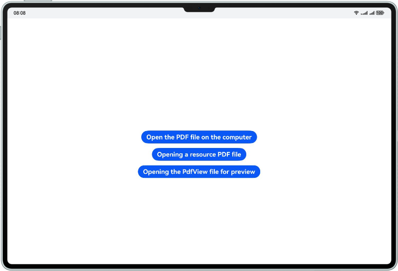
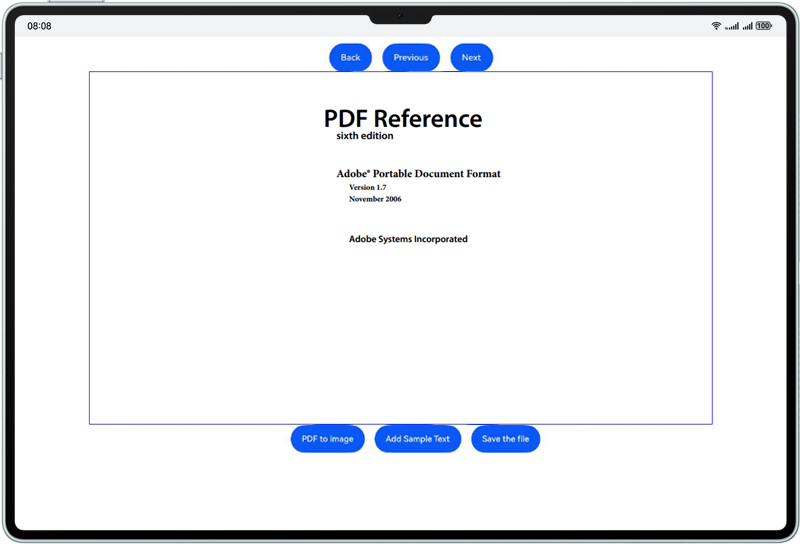
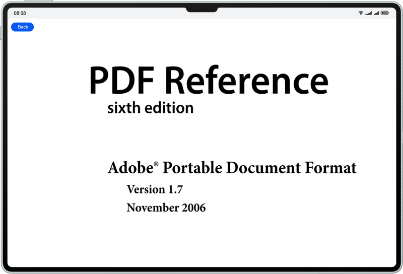

# PDFKit
## About This Codelab
This sample shows how to use the capabilities provided by PDF Kit to view and edit PDF files. The capabilities are introduced through the @kit.PDFKit API.
## Instruction
Use DevEco to open the sample code, click the run button, and select a PDF file to open it.<br />



## Project Directory
```
entry
  |——src
     |——main
     |   |——ets
     |   |   ├──entryability
     |   │   |  |── EntryAbility.ets // Ability for local startup
     |   |   ├──pages
     |   |   |  |── Index.ets // File selection page
     |   |   |  |── PDFPreview.ets // PDF example page
     |   |   |  |── PDFView.ets // PdfView component preview page
```

## Implementation Details
The APIs of PDF Kit are defined in @kit.PDFKit. The following is an example:


```
    /**
     * Load a file with a specified file path or uri.
     * @param { string } path - file path.
     * @param { string } password - File encryption password.
     * @param { (progress: number) => number } onProgress - Progress bar callback function.
     * @returns { ParseResult } ParseResult enum type.
     * @throws { BusinessError } 401 - invalid input parameter.
     * @syscap SystemCapability.OfficeService.PDFService.Core
     * @since 5.0.0(12)
     */
    loadDocument(path: string, password?: string, onProgress?: (progress: number) => number): ParseResult;

    /**
     * Release PDF documents.
     * @syscap SystemCapability.OfficeService.PDFService.Core
     * @since 5.0.0(12)
     */
    releaseDocument(): void;
    
    /**
     * Save document to specified file path.
     * @param { string } path - file path.
     * @param { (progress: number) => number } onProgress - Progress bar callback function
     * @returns { boolean } Whether the document was saved successfully.
     * @throws { BusinessError } 401 - invalid input parameter.
     * @syscap SystemCapability.OfficeService.PDFService.Core
     * @since 5.0.0(12)
     */
    saveDocument(path: string, onProgress?: (progress: number) => number): boolean;
    
    /**
     * Get the object of the specified page.
     * @param { number } index - Get the page object.
     * @returns { PdfPage } Specify the page object.
     * @throws { BusinessError } 401 - invalid input parameter.
     * @syscap SystemCapability.OfficeService.PDFService.Core
     * @since 5.0.0(12)
     */
    getPage(index: number): PdfPage;
    
    /**
     * Add text content to the page.
     * This method can only add text line by line instead of multiple lines.
     * @param { string } text - text content.
     * @param { number } x - the x coordinate(distance to the left edge) of the location to add text.
     * @param { number } y - the y coordinate(distance to the bottom edge) of the location to add text.
     * @param { TextStyle } style - TextStyle.
     * @throws { BusinessError } 401 - invalid input parameter.
     * @syscap SystemCapability.OfficeService.PDFService.Core
     * @since 5.0.0(12)
     */
    addTextObject(text: string, x: number, y: number, style: TextStyle): void;
```

When a service is used, the corresponding module needs to be imported using import { pdfService, pdfViewManager, PdfView} from @kit.PDFKit.<br />
For details, see the entry\src\main\ets\pages\PDFPreview.ets and entry\src\main\ets\pages\PDFView.ets file.

## Required Permissions
N/A

## Dependency
Depends on the @kit.PDFKit module.

## Restrictions
1. Device types: Huawei phones, tablets, and 2-in-1 devices
2. HarmonyOS: HarmonyOS NEXT Developer Beta3 or later
3. DevEco Studio: DevEco Studio NEXT Developer Beta3 or later
4. HarmonyOS SDK: HarmonyOS NEXT Developer Beta3 SDK or later