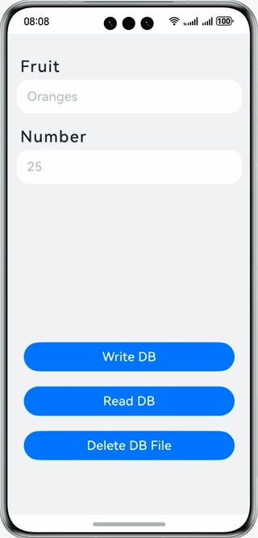

# Preferences

### Introduction

Learn to access and operate local application data based on preferences. The display effect is as follows:

### Concepts

- Preferences: a module that provides APIs for processing data in the form of key-value (KV) pairs, including querying, modifying, and persisting KV pairs. The key is a string, and the value can be a number, a string, a Boolean value, or an array of them.
- TextInput: a component that provides single-line text input.
- Button: a component used to quickly create buttons of different styles.

### Permissions

N/A

### How to Use

1. In the Fruit and Number text boxes, enter the corresponding fruit name and quantity, and tap the **Write DB** button to save the entered data to the preferences.
2. Exit the app and open it again. The data saved last time is displayed in the Fruit and Number text boxes.
3. Tap the **Read DB** button. The data saved last time is displayed in the Fruit and Number text boxes.
4. Tap the **Delete DB File** button. The data in the Fruit and Number text boxes is cleared, and the data in the preferences and the corresponding database file is deleted.

### Constraints

1. The sample app is supported only on Huawei phones running the standard system.
2. HarmonyOS: HarmonyOS 5.0.5 Release or later
3. DevEco Studio: DevEco Studio 6.0.2 Release or later
4. HarmonyOS SDK: HarmonyOS 6.0.2 Release SDK or later