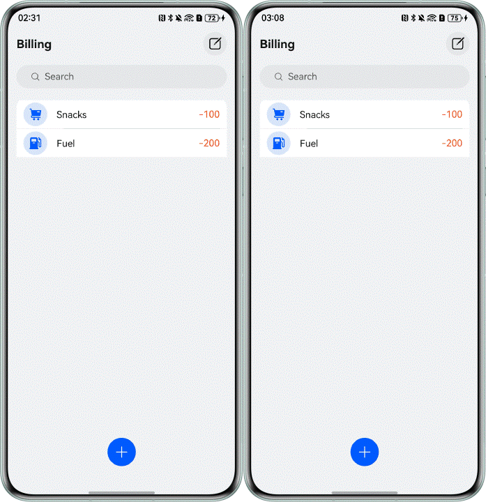
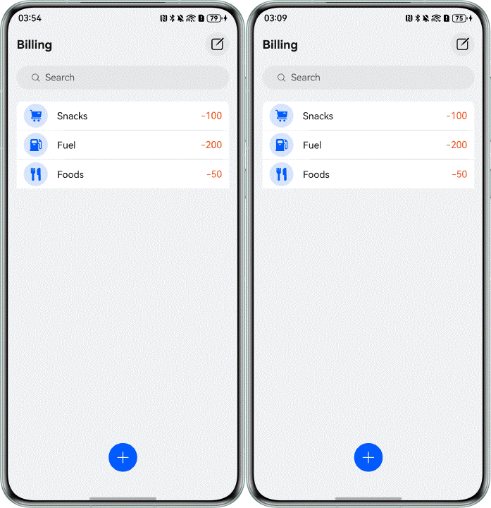
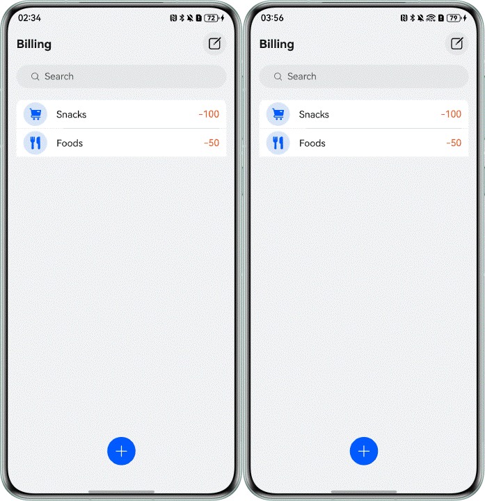
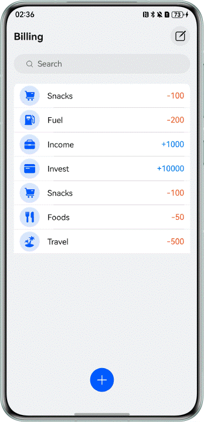

# Billing Functionality Based on an RDB Store

## Overview

This sample demonstrates how to use RDB store APIs to add, delete, update, query, and synchronize bills. The display
effect is as follows.

## Effect

|                              Add                              |                            Delete                             |                              Edit                              |                              Query                              |
|:-------------------------------------------------------------:|:-------------------------------------------------------------:|:--------------------------------------------------------------:|:---------------------------------------------------------------:|
|  |  |  |  |

## How to Use

1. On the application home page, tap the Add button. In the displayed dialog box, select an account item type, enter the
   amount, and tap confirm to add an account item.
2. On the application home page, tap the Edit button in the upper-right corner, select the account item to be deleted,
   and tap the Delete button at the bottom to delete the selected account item.
3. On the application home page, tap the account item to be edited. In the displayed dialog box, change the account item
   type or amount, and tap confirm to modify the account item.
4. On the application home page, tap the search bar, input the amount of the account item to be queried, and tap the
   Search button. The account item with the queried amount is displayed. When the search bar is empty, all account items
   are displayed.

## Project Directory

```
├──entry/src/main/ets 
│  ├──common 
│  │  └──CommonConstants.ets           // Common constants 
│  ├──components 
│  │  └──BillDialog.ets                // Bill dialog component 
│  ├──entryability 
│  │  └──EntryAbility.ets              // Entry ability 
│  ├──pages 
│  │  └──BillHomePage.ets              // Bill home page 
│  ├──utils 
│  │  └──RdbManager.ets                // RDB store management class 
│  └──viewmodel 
│     └──BillViewModel.ets             // Bill model 
└──entry/src/main/resources            // Resource files
```

## How to Implement

1. Upon the application's first launch, dynamically request necessary authorization from the user by calling
   [requestPermissionsFromUser()](https://developer.huawei.com/consumer/en/doc/harmonyos-references/js-apis-abilityaccessctrl#requestpermissionsfromuser9).
2. Create an RDB store by
   calling [relationalStore.getRdbStore()](https://developer.huawei.com/consumer/en/doc/harmonyos-references/arkts-apis-data-relationalstore-f#relationalstoregetrdbstore),
   and set distributed database tables
   via [setDistributedTables()](https://developer.huawei.com/consumer/en/doc/harmonyos-references/arkts-apis-data-relationalstore-rdbstore#setdistributedtables).
3. Call
   the [on('dataChange')](https://developer.huawei.com/consumer/en/doc/harmonyos-references/arkts-apis-data-relationalstore-rdbstore#ondatachange)
   API to subscribe to data changes on other devices within the network and register a data change callback function.
4. Encapsulate methods for
   adding ([insert()](https://developer.huawei.com/consumer/en/doc/harmonyos-references/js-apis-data-rdb#insert-1)),
   deleting ([delete()](https://developer.huawei.com/consumer/en/doc/harmonyos-references/js-apis-data-rdb#delete-1)),
   updating ([update()](https://developer.huawei.com/consumer/en/doc/harmonyos-references/js-apis-data-rdb#update-1)),
   and querying ([query()](https://developer.huawei.com/consumer/en/doc/harmonyos-references/js-apis-data-rdb#query-1))
   data.
5. Call the data synchronization
   API [sync()](https://developer.huawei.com/consumer/en/doc/harmonyos-references/arkts-apis-data-relationalstore-rdbstore#sync-1)
   to push current device data changes to other devices within the network.
6. Obtain the list of changed data and update the local data.

## Required Permissions

* ohos.permission.DISTRIBUTED_DATASYNC: allows an application to exchange data across devices.

## Constraints

1. This sample is only supported on Bar phones running standard systems.
2. The HarmonyOS version must be HarmonyOS 5.0.5 Release or later.
3. The DevEco Studio version must be DevEco Studio 6.0.2 Release or later.
4. The HarmonyOS SDK version must be HarmonyOS 6.0.2 Release SDK or later.
5. Both devices must be logged in with the same HUAWEI ID. You are advised to enable Find Device.
6. Wi-Fi and Bluetooth must be enabled on both devices. If possible, both devices should be connected to the same LAN.
7. Both devices must have the application installed.
