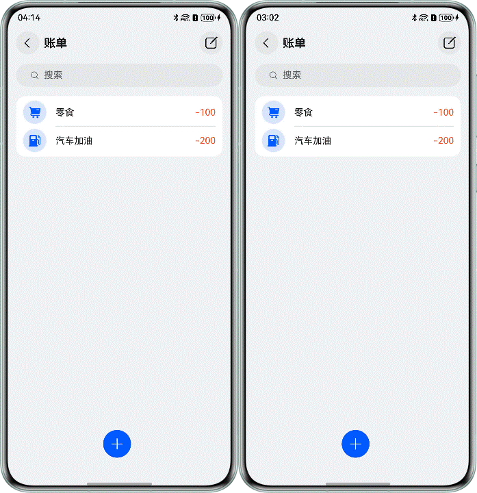
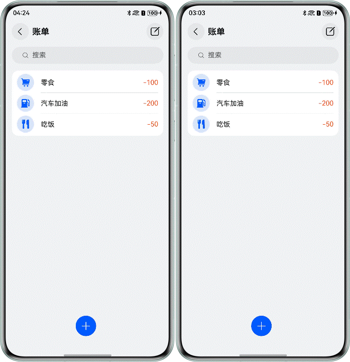
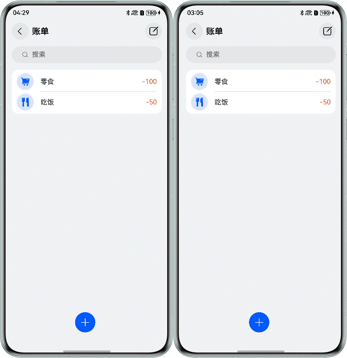
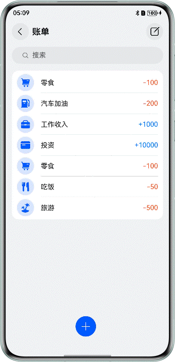

# 基于分布式关系型数据库实现账单功能

## 项目简介

本Codelab以分布式账单为例，使用关系型数据库的相关接口实现了对账单的增、删、改、查和同步操作。效果图如下：

## 效果预览

|                              新增                              |                             删除                             |                             编辑                              |                              查询                              |
|:------------------------------------------------------------:|:----------------------------------------------------------:|:-----------------------------------------------------------:|:------------------------------------------------------------:|
|    |  |  |  |

## 使用说明

1. 在应用首页，点击右下角“添加”图标，在弹出的窗口中选择账目类型并填写金额，点击“确定”按钮添加一条账目。
2. 在应用首页，点击右上角“编辑”图标，选中想要删除的账目，点击下方“删除”图标，删除选择的账目。
3. 在应用首页，点击想要编辑的账目，在弹出的窗口中更改账目类型或金额，点击“确定”按钮修改一条账目。
4. 在应用首页，点击搜索栏，填写想要查找的账目金额，点击“搜索”图标后下方刷新为金额为查找金额的账目，搜索栏为空时显示全部账目。

## 工程目录

```
├──entry/src/main/ets
│  ├──common
│  │  └──CommonConstants.ets           // 常量集合
│  ├──components
│  │  └──BillDialog.ets                // 账单弹窗组件
│  ├──entryability
│  │  └──EntryAbility.ets              // 入口文件
│  ├──pages
│  │  └──BillHomePage.ets              // 账单首页
│  ├──utils
│  │  └──RdbManager.ets                // 关系型数据库管理类
│  └──viewmodel
│     └──BillViewModel.ets             // 账单model
└──entry/src/main/resources            // 资源文件
```

## 具体实现

1. 应用首次启动时，调用[requestPermissionsFromUser()](https://developer.huawei.com/consumer/cn/doc/harmonyos-references/js-apis-abilityaccessctrl#requestpermissionsfromuser9)方法动态弹窗获取授权。
2. 创建关系型数据库，通过[relationalStore.getRdbStore()](https://developer.huawei.com/consumer/cn/doc/harmonyos-references/arkts-apis-data-relationalstore-f#relationalstoregetrdbstore)创建关系型数据库，并通过[setDistributedTables()](https://developer.huawei.com/consumer/cn/doc/harmonyos-references/arkts-apis-data-relationalstore-rdbstore#setdistributedtables)方法设置分布式数据库表。
3. 调用[on('dataChange')](https://developer.huawei.com/consumer/cn/doc/harmonyos-references/arkts-apis-data-relationalstore-rdbstore#ondatachange)接口订阅组网内其他设备的数据变化，并注册数据变化回调函数。
4. 封装操作数据库的增([insert()](https://developer.huawei.com/consumer/cn/doc/harmonyos-references/js-apis-data-rdb#insert-1))、删([delete()](https://developer.huawei.com/consumer/cn/doc/harmonyos-references/js-apis-data-rdb#delete-1))、改([update()](https://developer.huawei.com/consumer/cn/doc/harmonyos-references/js-apis-data-rdb#update-1))、查([query()](https://developer.huawei.com/consumer/cn/doc/harmonyos-references/js-apis-data-rdb#query-1))四个方法。
5. 调用同步数据的接口[sync()](https://developer.huawei.com/consumer/cn/doc/harmonyos-references/arkts-apis-data-relationalstore-rdbstore#sync-1)推送当前设备数据变化至组网内其他设备。
6. 获取到变化的数据列表，更新本地数据。

## 相关权限

* ohos.permission.DISTRIBUTED_DATASYNC：允许不同设备间的数据交换。

## 约束与限制

1. 本示例仅支持标准系统上运行，支持设备：直板机。
2. HarmonyOS系统：HarmonyOS 5.0.5 Release及以上。
3. DevEco Studio版本：DevEco Studio 6.0.2 Release及以上。
4. HarmonyOS SDK版本：HarmonyOS 6.0.2 Release SDK及以上。
5. 双端设备需要登录同一华为账号，建议打开查找设备功能。
6. 双端设备需要打开Wi-Fi和蓝牙开关，条件允许时最好连接同一局域网。
7. 双端设备都需要有该应用。
