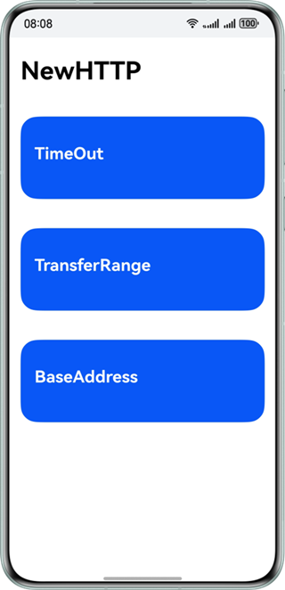
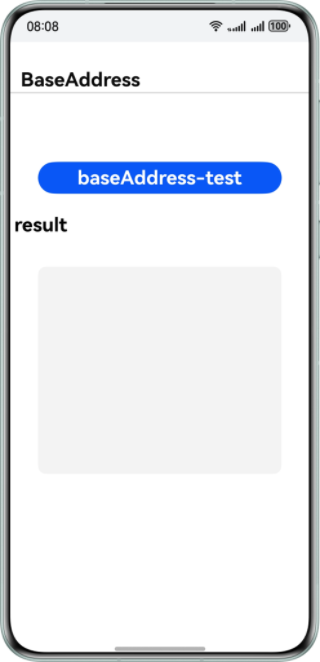
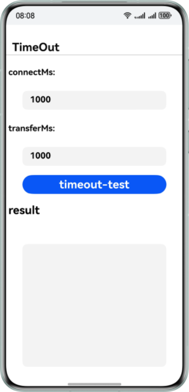
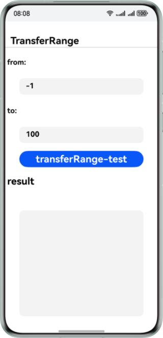

# 远场通信服务示例代码

## 简介

Remote Communication Kit（远场通信服务）是华为提供的HTTP发起数据请求的C封装。应用通过Remote Communication Kit可便捷快速地向服务器发起数据请求。

## 开发前准备

- 在开发HarmonyOS应用前，先进行对应的开发环境安装与调试。
- 了解远场通信服务代码结构。

## 效果预览






## 工程目录

```
├── entry/src/main
│ ├── cpp
│ │ ├── CMakeLists.txt			// C文件编译脚本
│ │ ├── napi_init.cpp			// C接口封装为ArkTs
│ │ └── types 
│ │     └── libentry
│ │         ├── Index.d.ts		// 导出封装的ArkTs接口
│ │         └── oh-package.json5	// ArkTs与动态库映射
│ ├── ets
│ │ ├── entryability
│ │ │ ├── FormAbility.ets               //表单
│ │ │ ├── MainAbility.ets               //UI Ability
│ │ │ └── TestClickActionAbility.ets	//系统测试
│ │ └── pages
│ │     ├── BaseAddress.ets		// 基础URL测试页面
│ │     ├── MainPage.ets		// 主界面
│ │     ├── TimeOut.ets			// 超时测试页面
│ │     └── TransferRange.ets   	// 断点续传页面
```

## 具体实现

本示例主要展示的基础URL测试、超时测试、断点续传功能对应的接口均在rcp.h中，在napi_init.cpp中调用：

- 断点续传(TransferRange)：通过Rcp_TransferRange的from和to设置。
- 超时测试(TimeOut)：通过Rcp_Timeout的connectMs和transferMs设置连接超时及传输超时。
- 基础URL(BaseAddress)：通过Rcp_Request中的url设置。

以上业务使用时，需先 #include "RemoteCommunicationKit/rcp.h"，再根据自身需求对接口进行扩展使用，详细情况可以参考本用例中entry/src/main/pages下三个接口的实现。

## 相关权限

本Demo需要使用Internet和查询指定应用信息的权限，请在配置文件module.json5中添加以下权限：

1. 允许使用Internet网络权限：ohos.permission.INTERNET

2. 查询指定应用信息权限：ohos.permission.GET_BUNDLE_INFO(可选)

## 使用说明

如果在运行该示例代码时，出现运行不了的情况，可尝试选择DevEco Studio菜单栏Build里面的Clean Project选项，来清理工程。

## 约束与限制

1. 本示例仅支持标准系统上运行，支持设备：华为手机。

2. HarmonyOS系统：HarmonyOS NEXT Developer Beta1及以上。

3. DevEco Studio版本：DevEco Studio NEXT Developer Beta1及以上。

4. HarmonyOS SDK版本：HarmonyOS NEXT Developer Beta1 SDK及以上。