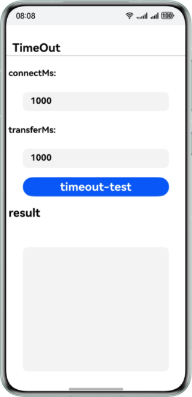

# 远场通信服务示例代码

## 简介

Remote Communication Kit是华为推出的一款专业的网络通信SDK，它通过对HTTP/HTTPS协议的封装实现了高效的数据请求功能。该服务为开发者提供了标准化的接口，支持应用系统快速、稳定、安全地与服务器进行数据交互。

## 开发前准备

- 开发HarmonyOS应用前，需先安装并配置开发环境。
- 了解远场通信服务代码结构。

## 效果预览





## 工程目录

```
├── entry/src/main
    ├── cpp
    │   ├── CMakeLists.txt			// C文件编译脚本
    │   ├── napi_init.cpp			// C接口封装为ArkTs
    │   └── types 
    │       └── libentry
    │           ├── Index.d.ts		// 导出封装的ArkTs接口
    │           └── oh-package.json5	// ArkTs与动态库映射
    └── ets
        ├── entryability
        │   └── MainAbility.ets               //UI Ability
        └── pages
            ├── BaseAddress.ets		// 基础URL测试页面
            ├── MainPage.ets		// 主界面
            ├── TimeOut.ets			// 超时测试页面
            └── TransferRange.ets   	// 断点续传页面
```

## 具体实现

本示例主要演示了基础URL测试、超时测试和断点续传功能，相关接口均定义在 **rcp.h** 文件中，并在 **napi_init.cpp** 中进行调用。

- 基础URL(BaseAddress)：先配置基础URL，然后在Rcp_Request中将URL设置为相对地址。
- 超时测试(TimeOut)：通过Rcp_Timeout的connectMs和transferMs参数来设置连接超时和传输超时。
- 断点续传(TransferRange)：使用Rcp_TransferRange的from和to参数为请求设置数据传输范围。

在使用以上功能时，请确保先包含头文件 **#include "RemoteCommunicationKit/rcp.h"**，然后根据实际需求扩展使用相关接口。详细实现可以参考本用例中 **“entry/src/main/pages”** 下的三个接口实现。

## 相关权限

This example requires Internet access permissions. Please add the following permissions in the configuration file **module.json5**:

1. 允许使用Internet网络权限：ohos.permission.INTERNET

## 使用说明

如果在运行示例代码时遇到问题，请尝试在DevEco Studio中选择菜单栏的 **Build > Clean Project** 选项，清理工程。

## 约束与限制

1. 本示例仅支持标准系统上运行，支持设备：华为手机。
2. HarmonyOS系统：HarmonyOS NEXT Developer Beta1及以上。
3. DevEco Studio版本：DevEco Studio NEXT Developer Beta1及以上。
4. HarmonyOS SDK版本：HarmonyOS NEXT Developer Beta1 SDK及以上。