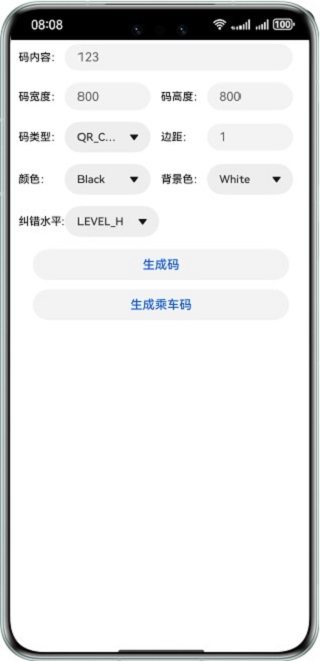
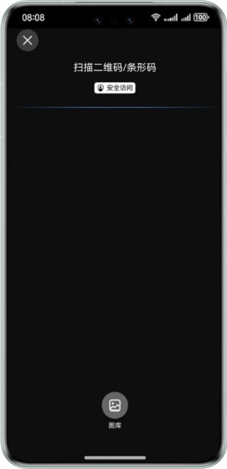
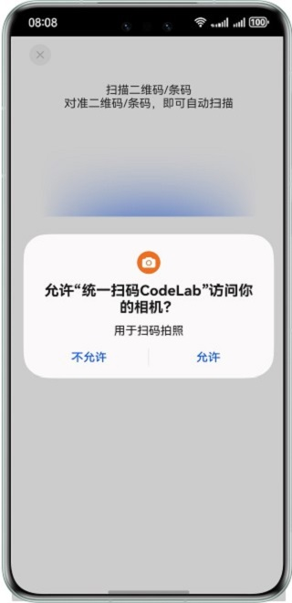
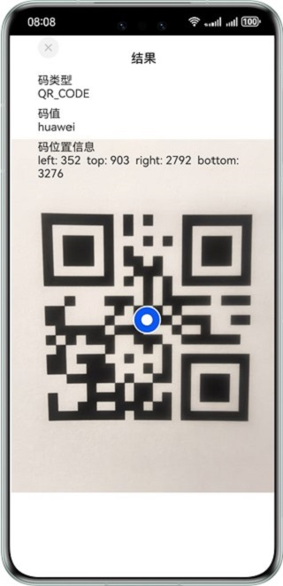

# CodeLab示例代码Demo项目

# 简介

Scan Kit（统一扫码服务）是HarmonyOS SDK的基础能力，提供了“扫码直达”服务、码图生成、默认界面扫码、自定义界面扫码、图像识码的功能。

|              **应用首页**               |               **码图生成页面**                |              **默认界面扫码页面**              |              **自定义扫码页面**              |             **本地图片识码页面**              |              **扫码直达页面**               |
|:-----------------------------------:|:---------------------------------------:|:--------------------------------------:|:-------------------------------------:|:-------------------------------------:|:-------------------------------------:|
|  |  |  |  |  |  |

## 相关权限

自定义扫码功能获取相机权限: ohos.permission.CAMERA。

# 使用说明

打开扫码Demo时进入一级菜单页，显示为各个功能导航按钮。

- 参考[App Linking集成指导](https://developer.huawei.com/consumer/cn/doc/harmonyos-guides-V5/app-linking-startup-V5)完成域名注册，将配置好域名映射关系的测试应用安装到本地，打开HarmonyOS扫码入口（控制中心扫码入口），扫描应用发行的二维码，实现扫码跳转（Demo的一级菜单页未提供“扫码直达”导航按钮）。
- 点击“码图生成”按钮进入界面，调用码图生成接口，生成不同类型的码图。
- 点击“默认界面扫码”按钮，开启默认界面扫码功能。
- 点击“自定义界面扫码”按钮，开启自定义界面扫码和预览流(YUV)功能。
- 点击“图像识码”按钮，进入二级页面点击“识别本地图片”按钮，选择一张图片即可识别码图信息。

# 约束与限制

1. 本实例仅支持标准系统上运行，支持设备：华为手机、华为平板。
2. HarmonyOS系统：HarmonyOS NEXT Developer Beta3及以上。
3. DevEco Studio版本：DevEco Studio NEXT Developer Beta3及以上。
4. HarmonyOS SDK版本：HarmonyOS NEXT Developer Beta3 SDK及以上。