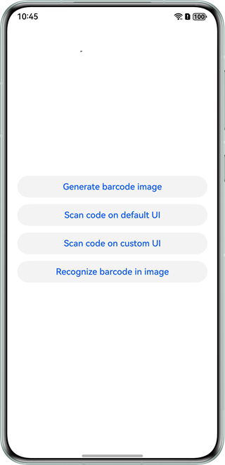
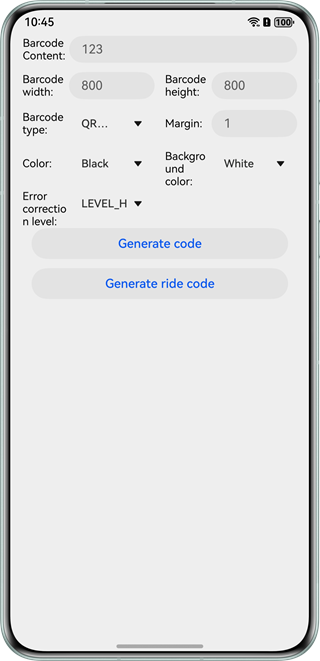
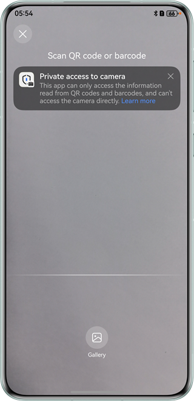
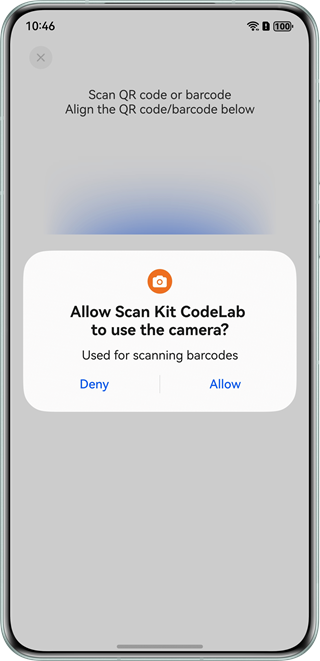
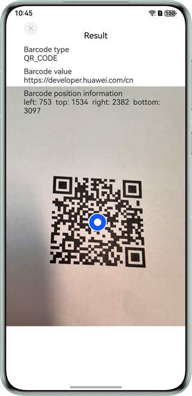
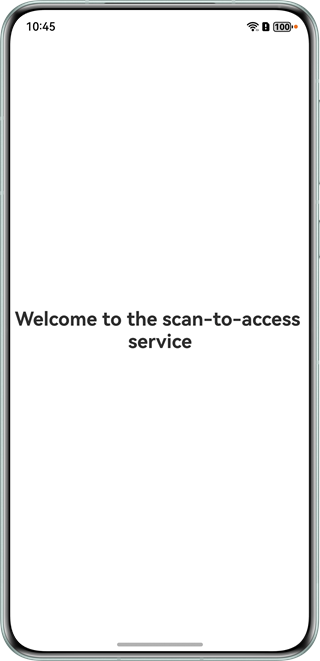

# CodeLab Sample Code Demo

# Overview

Scan Kit is a basic capability provided by the HarmonyOS SDK. It provides functions including directly accessing content through scanning, generating barcode images, scanning barcodes using the default UI, scanning barcodes using a custom UI, and recognizing barcodes based on images.

<table>
  <tr>
    <th width=16.5%>App Home Page</th>
    <th width=16.5%>Barcode Image Generation UI</th>
    <th width=16.5%>Default Barcode Scan UI</th>
    <th width=16.5%>Custom Barcode Scan UI</th>
    <th width=16.5%>Saved Image-Based Barcode Recognition UI</th>
    <th width=16.5%>Scan-to-Access UI</th>
  </tr>
  <tr>
    <td></td>
    <td></td>
    <td></td>
    <td></td>
    <td></td>
    <td></td>
  </tr>
</table>

## Project Directory
├──entry/src/main/ets  
│  ├──entryability  
│  │  └──EntryAbility.ets       // Ability for local startup  
│  ├──pages  
│  │  ├──BarcodePage.ets       // Default barcode scanning UI  
│  │  ├──CreateBarcode.ets     // Barcode image generation UI  
│  │  ├──CustomPage.ets        // Custom barcode scanning UI  
│  │  ├──CustomResultPage.ets  // Result page for barcode scanning using the custom UI  
│  │  ├──DetectBarcode.ets     // Page for recognizing barcodes in an image  
│  │  ├──Index.ets             // Entry for selecting functions  
│  │  ├──ResultPage.ets        // Result page for image-based barcode recognition  
│  │  └──ScanAccess.ets        // Scan-to-access page  
│  └──utils  
│  │  ├──Common.ets            // Method for obtaining the XComponent layout of the preview stream  
│  │  ├──PermissionsUtil.ets   // Request camera permission from the user  
│  │  └──UIContextSelf.ets     // UIContext management class  
└──entry/src/main/resources    // Directory of resource files

## Required Permissions

**ohos.permission.CAMERA**: camera permission required by barcode scanning customization.

# How to Use

Open the demo app. The level-1 menu screen will be displayed, showing buttons for using functions of Scan Kit.

- Follow the [App Linking integration guide](https://developer.huawei.com/consumer/en/doc/harmonyos-guides/app-linking-startup) to register a domain name. After setting up the domain name mapping, install the test app locally. Then, launch the barcode scanner in HarmonyOS (found in the control panel) and scan the barcode provided by the app to go to the **Scan to Access** page. Please note that the **Scan to Access** button is not provided on the level-1 menu page of the demo.
- Tap **Generate barcode image** to call the barcode image generation API to generate different types of barcode images.
- Tap **Scan code on default UI** to scan a barcode using the default UI.
- Tap **Scan code on custom UI** to scan a barcode using the custom UI.
- Tap **Recognize barcode in image**. On the level-2 page, tap **Saved image** and select an image.

# Constraints

1. This sample can only be run on standard-system Huawei phones and tablets.
2. The HarmonyOS version must be HarmonyOS 5.0.5 Release or later.
3. The DevEco Studio version must be DevEco Studio 6.0.0 Release or later.
4. The HarmonyOS SDK version must be HarmonyOS 6.0.0 Release SDK or later.
