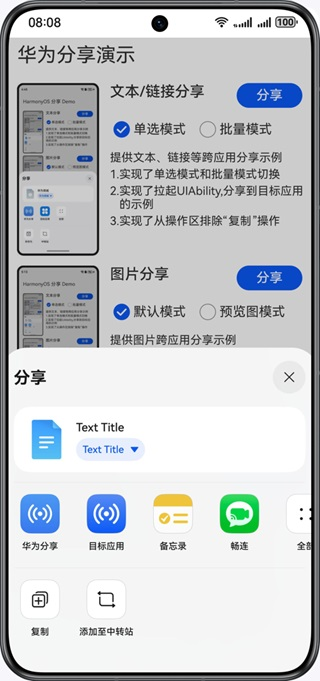

# 分享服务
## 简介
系统分享服务为应用提供文本、图片、视频等内容跨应用分享能力，用于将内容发送到其他应用甚至其他应用的用户。应用把需要分享的内容和预览样式配置给系统分享服务，系统分享服务将根据分享的数据类型、数量等信息构建分享面板，为用户提供内容预览、推荐分享联系人、关联应用及操作界面，便于用户快速选择分享应用或操作，将内容分发到目标应用。

## 效果图





## 相关概念
- [Stage模型](https://developer.huawei.com/consumer/cn/doc/harmonyos-guides/stage-model-development-overview)：Stage模型的设计，主要是为了解决[FA模型](https://developer.huawei.com/consumer/cn/doc/harmonyos-guides/fa-model-development-overview)无法解决的开发场景问题，方便开发者更加方便地开发出分布式环境下的复杂应用。从API Version 9开始支持。
- [UIAbility](https://developer.huawei.com/consumer/cn/doc/harmonyos-guides/uiability-overview)概述：UIAbility组件是一种包含UI的应用组件，主要用于和用户交互。UIAbility组件是系统调度的基本单元，为应用提供绘制界面的窗口。一个应用可以包含一个或多个UIAbility组件。
- [UIAbilityContext](https://developer.huawei.com/consumer/cn/doc/harmonyos-references/js-apis-inner-application-uiabilitycontext)：UIAbilityContext是需要保存状态的UIAbility所对应的context，继承自Context。提供UIAbility的相关配置信息以及操作UIAbility和ServiceExtensionAbility的方法。

## 工程目录

```c
├─entry/src/main/ets                         // 代码区
│  ├─components
│  │  ├─modules                              // 公共模块
│  │  ├─AccessModel.ets                      // 接入模式
│  │  ├─BasicUse.ets                         // 基础使用
│  │  ├─FunctionExample.ets                  // 功能示例
│  │  ├─KnockShare.ets                       // 一碰分享
│  │  ├─ReferralContact.ets                  // 推荐联系人
│  │  └─TypicalScenarios.ets                 // 典型场景
│  ├─entryability
│  │  ├─EntryAbility.ets                     // 入口组件
│  │  └─ShareUIAbility.ets                   // 应用处理分享内容组件
│  ├─extensionAbility
│  │  └─ShareExtAbility.ets                  // 二级面板处理分享内容组件
│  ├─pages
│  │  ├─Index.ets                            // 主页界面
│  │  ├─ShareExtDialog.ets                   // 二级面板处理分享内容界面
│  │  └─ShareUIPage.ets                      // 应用处理分享内容界面
│  ├─scenario                                // 场景示例
│  │  ├─AppLinkingScenario.ets               // AppLinking分享
│  │  ├─ImageScenario.ets                    // 图片分享
│  │  ├─LinkScenario.ets                     // 链接分享
│  │  ├─PostersScenario.ets                  // 海报+链接分享
│  │  ├─TextScenario.ets                     // 纯文本分享
│  │  ├─VideoScenario.ets                    // 视频分享
│  │  └─ZipScenario.ets                      // 压缩包分享
│  └─utils                                   // 工具类
├─entry/src/main/resources                   // 应用资源目录
│  ├─base
│  │  ├─media                                // 示例图片存放目录
│  │  └─profile                              
│  │     └─main_pages.json                   // 页面路径定义
│  └─module.json5                            // 配置文件
```

## 相关权限
不涉及。

## 依赖
不涉及。

## 使用说明：
1. demo应用安装：准备一台手机，连接DevEco后，点击IDE的Run 'entry' 绿色箭头按钮。
2. 在手机上此时就打开了demo应用，点击链接分享按钮就可以拉起系统分享框进行分享。
3. 可以尝试使用应用分享、使用操作区操作和使用华为分享（体验跨端的分享直达）。

## 代码片段：
1. 支持自定义utd类型
   + 路径：entry/src/main/resources/rawfile/arkdata/utd/utd.json5
2. 共享联系人信息到分享推荐区
   + 路径：entry/src/main/ets/components/ReferralContact.ets

## 约束与限制
1. 本示例仅支持标准系统上运行，支持设备：华为手机、华为平板、2in1。
2. HarmonyOS系统：HarmonyOS 5.0.3 Release及以上。
3. DevEco Studio版本：DevEco Studio 5.0.3 Release及以上。
4. HarmonyOS SDK版本：HarmonyOS 5.0.3 Release SDK及以上。

需同时满足以下条件，才能使用该功能：
- 宿主应用和目标应用定义数据类型须遵照[UDMF](https://developer.huawei.com/consumer/cn/doc/harmonyos-references/js-apis-data-unifieddatachannel)（统一数据管理框架）定义的[UTD](https://developer.huawei.com/consumer/cn/doc/harmonyos-references/js-apis-data-uniformtypedescriptor)（统一类型描述符）规范。目标应用需要在应用配置文件中，配置支持的类型。如支持全部图片类型，可声明为：general.image。
- 宿主应用配置分享数据描述信息总量不能超过200KB，且分享条目总量不能超过500条。