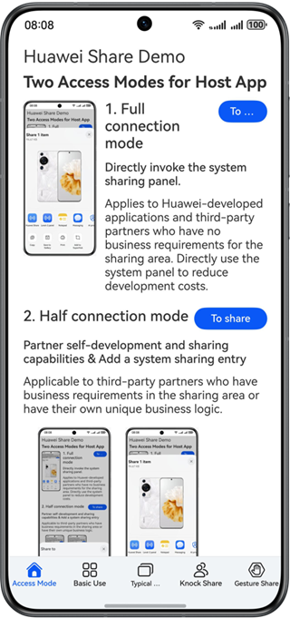
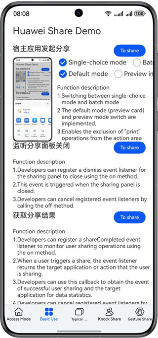
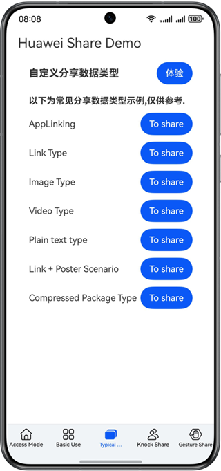
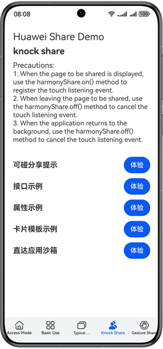
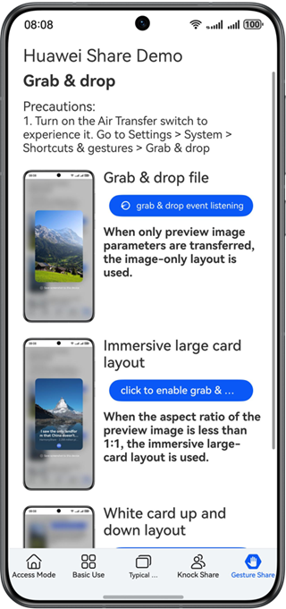
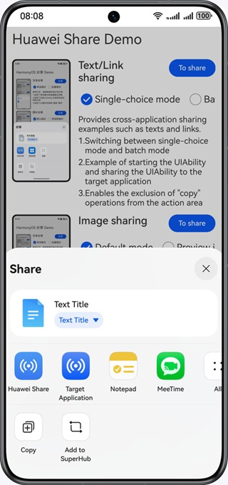
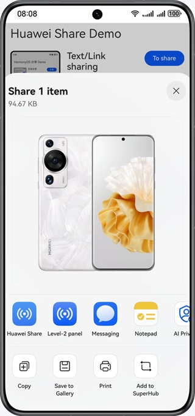
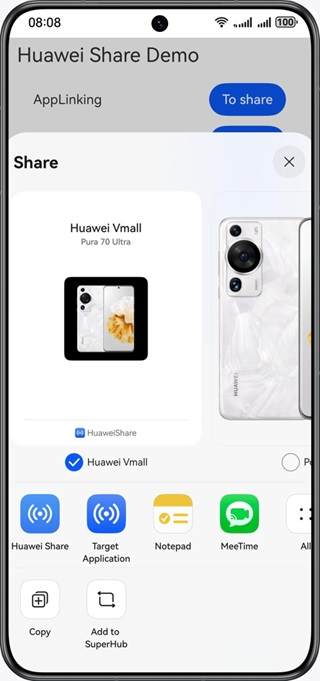

# Share Kit
## Overview
Share Kit enables content such as text, images, and videos to be shared across apps. To share content to other apps through Share Kit, an app needs to send configuration about the content to be shared and the preview style to Share Kit. Share Kit then constructs a sharing panel based on the shared data type and quantity of shared items to provide users with content preview, recommended sharing contacts, associated apps, and relevant operations. Users can quickly select the target app to share content or choose the desired operation.

## Preview









## Concepts
- [Stage model](https://developer.huawei.com/consumer/en/doc/harmonyos-guides/stage-model-development-overview): It is designed to solve development issues that cannot be solved in the [FA model](https://developer.huawei.com/consumer/en/doc/harmonyos-guides/fa-model-development-overview), making it easier to develop complex apps in the distributed environment. The stage model is supported since API version 9.
- [UIAbility](https://developer.huawei.com/consumer/en/doc/harmonyos-guides/uiability-overview): It is a type of app component that provides the UI for user interactions. UIAbility is the basic unit of scheduling in OpenHarmony and provides a window for apps to draw the UI. An app can contain one or more UIAbility components.
- [UIAbilityContext](https://developer.huawei.com/consumer/en/doc/harmonyos-references/js-apis-inner-application-uiabilitycontext): Inherited from **Context**, **UIAbilityContext** provides the context environment for **UIAbility** that needs to store its status, including the **UIAbility** configuration and methods for operating **UIAbility** and **ServiceExtensionAbility**.
- [UIServiceExtensionAbility](https://developer.huawei.com/consumer/en/doc/harmonyos-guides/uiserviceextension)：UIServiceExtensionAbility is an ExtensionAbility component of the UIService type. It provides UI pages (such as preview pages) and background service capabilities. This component internally holds a UIServiceExtensionContext, which provides a variety of APIs for external systems.
- [UIExtensionContext](https://developer.huawei.com/consumer/en/doc/harmonyos-references/js-apis-inner-application-uiextensioncontext)：**UIExtensionContext**, inherited from ExtensionContext, provides the context environment for the UIExtensionAbility. It provides UIExtensionAbility-related configurations and APIs for operating the UIExtensionAbility. For example, you can use the APIs to start a UIExtensionAbility.

## Project Directory

```c
├─entry/src/main/ets                         // Code area.
│  ├─components
│  │  ├─modules                              // Common modules.
│  │  ├─subpages                             // subpages
│  │  │  ├─FunctionExample.ets               // System sharing example
│  │  │  ├─KnockShareApi.ets                 // Tap to share API
│  │  │  ├─KnockShareCard.ets                // Tap to Share Card Template
│  │  │  └─KnockShareSandbox.ets             // Sandbox reception
│  │  ├─AccessModel.ets                      // Access Mode.
│  │  ├─BasicUse.ets                         // Basic use.
│  │  ├─FunctionExample.ets                  // Function example.
│  │  ├─KnockShare.ets                       // tap-to-share.
│  │  ├─ReferralContact.ets                  // Recommended contacts.
│  │  └─TypicalScenarios.ets                 // Typical scenarios.
│  ├─entryability
│  │  ├─EntryAbility.ets                     // Entry component.
│  │  └─ShareUIAbility.ets                   // Component for an app to process the shared content.
│  ├─extensionAbility
│  │  └─ShareExtAbility.ets                  // Component for the level-2 panel to process the shared content.
│  ├─pages
│  │  ├─Index.ets                            // Home page.
│     ├─ShareExtDialog.ets                   // Page for the level-2 panel to process the shared content.
│     └─ShareUIPage.ets                      // Page for an app to process the shared content.
│  ├─scenario                                // Scenario examples.
│  │  ├─AppLinkingScenario.ets               // Sharing a link of App Linking.
│  │  ├─ImageScenario.ets                    // Image sharing.
│  │  ├─LinkScenario.ets                     // Link sharing.
│  │  ├─PostersScenario.ets                  // Poster and link sharing.
│  │  ├─TextScenario.ets                     // Text sharing.
│  │  ├─VideoScenario.ets                    // Video sharing.
│  │  └─ZipScenario.ets                      // Zip sharing.
│  └─utils                                   // Utility class.
├─entry/src/main/resources                   // App resource directory.
│  ├─base
│  │  ├─media                                // Directory for storing sample images.
│  │  └─profile                              
│  │     └─main_pages.json                   // Page path definition.
│  └─module.json5                            // Configuration file.
```

## Required Permissions
None

## Dependencies
None

## How to Use
1. Install the sample app: Prepare a phone, connect the phone to DevEco, and tap the green arrow next to **entry** in DevEco.
2. When the sample app is started, tap the share button to display the sharing panel.
3. Share data to a target app, choose a desired operation, or share data to another device through Huawei Share.

## Code Snippets:
1. Customize a UTD.
    + Code path: **entry/src/main/resources/rawfile/arkdata/utd/utd.json5**
2. Share contact information to the recommendation area on the sharing panel.
    + Code path: **entry/src/main/ets/components/ReferralContact.ets**

## Constraints
1. The sample app is only supported on Huawei phones, tablets, and 2-in-1 devices with standard systems.
2. The HarmonyOS version must be HarmonyOS 6.0.0 Beta2 or later.
3. The DevEco Studio version must be DevEco Studio 6.0.0 Beta2 or later.
4. The HarmonyOS SDK version must be HarmonyOS 6.0.0 Beta2 SDK or later.

This function is available only when both of the following conditions are met:
- The data types defined by the host app and target app must comply with the [UTD](https://developer.huawei.com/consumer/en/doc/harmonyos-references/js-apis-data-unifieddatachannel) specifications provided by the [UDMF](https://developer.huawei.com/consumer/en/doc/harmonyos-references/js-apis-data-uniformtypedescriptor). The supported content types must be configured in the target app configuration file. If all image types are supported, declare **general.image**.
- The total size of the description about shared data configured in the host app cannot exceed 200 KB, and the total number of shared items cannot exceed 500.
