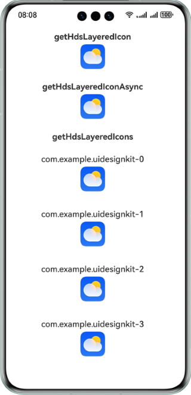
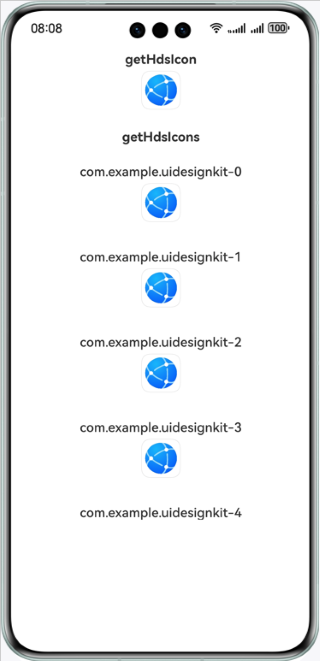

# UI Design Kit

### Overview
This sample code illustrates functions of UI Design Kit.
You can call APIs of ArkUI, Localization Kit, and Image Kit to perform operations such as combine the foreground and background images of icons, and crop, scale, and stroke icons.

### Related Concepts
UI Design Kit is a Huawei-provided UI development toolkit that adheres to the HarmonyOS Design System. It offers a comprehensive set of UI components, styles, and lighting effects to create sophisticated and visually appealing user interfaces. By utilizing this kit, your app can seamlessly integrate with the HarmonyOS ecosystem, delivering a consistent and premium user experience across all devices.

### Required Permissions
None

### How to Configure and Use
This sample code illustrates the processing effect of layered and single-layer icons.

### Preview

<span style="border: 3px solid #ddd; padding: 10px 30px 10px 30px; margin: 10px 0;">
&emsp;&emsp;&emsp;&emsp;&emsp;&nbsp;&nbsp;Layered Icon&emsp;&emsp;&emsp;&emsp;&emsp;&nbsp;&nbsp;&nbsp;
</span>

<span style="border: 3px solid #ddd; padding: 10px 30px 10px 30px; margin: 10px 0;">
&emsp;&emsp;&emsp;&emsp;&emsp;&nbsp;Single-Layer Icon&emsp;&emsp;&emsp;&emsp;&emsp;
</span>



### Project directory
```
├─entry/src/main/ets                         // Code area
│  ├─entryability
│  │  └─EntryAbility.ets       
│  └─pages
│     ├─GetHdsIcon.ets                       // Single-layer icon processing page
│     ├─GetHdsLayeredIcon.ets                // Layered icon processing page
│     └─Index.ets                            // Main UI
├─entry/src/main/resources                   // Directory for storing app resources
└─screenshots                                // Screenshot
```

### How to Implement
The APIs that you need to use for icon processing are packaged into **@kit.UIDesignKit**. An example is as follows:

```
  /**
   * Returns processed layered icon.
   *
   * @param { string } bundleName - Indicates the bundle name of the application.
   * @param { LayeredDrawableDescriptor } layeredDrawableDescriptor - Icon drawable descriptor.
   * @param { number } size - Icon size. The unit is vp.
   * @param { boolean } hasBorder - Icon set border or not. The default value is false.
   * @returns { image.PixelMap } The processed layered icon returned by the function.
   * @throws { BusinessError } 401 - Parameter error.
   * @syscap SystemCapability.UIDesign.Core
   * @atomicservice
   * @since 5.0.0(12)
   */
  function getHdsLayeredIcon(bundleName: string, layeredDrawableDescriptor: LayeredDrawableDescriptor, size: number, hasBorder?: boolean): image.PixelMap;

  /**
   * Returns processed icon.
   *
   * @param { string } bundleName - Indicates the bundle name of the application.
   * @param { image.PixelMap } pixelMap - Icon pixelMap.
   * @param { number } size - Icon size. The unit is vp.
   * @param { image.PixelMap } mask - Mask pixelMap.
   * @param { boolean } hasBorder - Icon set border or not. The default value is false.
   * @returns { image.PixelMap } The processed icon returned by the function.
   * @throws { BusinessError } 401 - Parameter error.
   * @syscap SystemCapability.UIDesign.Core
   * @atomicservice
   * @since 5.0.0(12)
   */
  function getHdsIcon(bundleName: string, pixelMap: image.PixelMap, size: number, mask: image.PixelMap, hasBorder?: boolean): image.PixelMap;

  /**
   * Returns processed icons.
   *
   * @param { Array<Icon> } icons - The icons pixelMap array. The maximum length of array is 500.
   * @param { image.PixelMap } mask - Mask pixelMap.
   * @param { Options } options - Icon options.
   * @returns { Promise<Array<ProcessedIcon>> } The promise of processed icons returned by the function.
   * @throws { BusinessError } 401 - Parameter error.
   * @throws { BusinessError } 1012600001 - Task is busy.
   * @syscap SystemCapability.UIDesign.Core
   * @atomicservice
   * @since 5.0.0(12)
   */
  function getHdsIcons(icons: Array<Icon>, mask: image.PixelMap, options: Options): Promise<Array<ProcessedIcon>>;

  /**
   * Returns processed layered icons.
   *
   * @param { Array<LayeredIcon> } icons - The layered icons pixelMap array. The maximum length of array is 500.
   * @param { Options } options - Icon options.
   * @returns { Promise<Array<ProcessedIcon>> } The promise of processed icons returned by the function.
   * @throws { BusinessError } 401 - Parameter error.
   * @throws { BusinessError } 1012600001 - Task is busy.
   * @syscap SystemCapability.UIDesign.Core
   * @atomicservice
   * @since 5.0.0(12)
   */
  function getHdsLayeredIcons(icons: Array<LayeredIcon>, options: Options): Promise<Array<ProcessedIcon>>;

  /**
   * Returns processed layered icon asynchronously.
   *
   * @param { string } bundleName - Indicates the bundle name of the application.
   * @param { LayeredDrawableDescriptor } layeredDrawableDescriptor - Icon drawable descriptor.
   * @param { number } size - Icon size. The unit is vp.
   * @param { boolean } hasBorder - Icon set border or not. The default value is false.
   * @returns { Promise<image.PixelMap> } The promise of processed layered icon returned by the function.
   * @throws { BusinessError } 401 - Parameter error.
   * @syscap SystemCapability.UIDesign.Core
   * @atomicservice
   * @since 5.0.0(12)
   */
  function getHdsLayeredIconAsync(bundleName: string, layeredDrawableDescriptor: LayeredDrawableDescriptor, size: number, hasBorder?: boolean): Promise<image.PixelMap>;

  /**
   * Returns processed icon asynchronously.
   *
   * @param { string } bundleName - Indicates the bundle name of the application.
   * @param { image.PixelMap } pixelMap - Icon pixelMap.
   * @param { number } size - Icon size. The unit is vp.
   * @param { image.PixelMap } mask - Mask pixelMap.
   * @param { boolean } hasBorder - Icon set border or not. The default value is false.
   * @returns { Promise<image.PixelMap> } The promise of processed icon returned by the function.
   * @throws { BusinessError } 401 - Parameter error.
   * @syscap SystemCapability.UIDesign.Core
   * @atomicservice
   * @since 5.0.0(12)
   */
  function getHdsIconAsync(bundleName: string, pixelMap: image.PixelMap, size: number, mask: image.PixelMap, hasBorder?: boolean): Promise<image.PixelMap>;
```

### Constraints
1. The sample app is only supported on Huawei phones, 2in1 devices, TV, and tablets with standard systems.
2. The sample app does not support large font mode, landscape mode, or any other languages other than Chinese and English.
3. The HarmonyOS version must be HarmonyOS NEXT Developer Beta2 or later.
4. The DevEco Studio version must be DevEco Studio NEXT Developer Beta2 or later.
5. The HarmonyOS SDK version must be HarmonyOS NEXT Developer Beta2 SDK or later.

