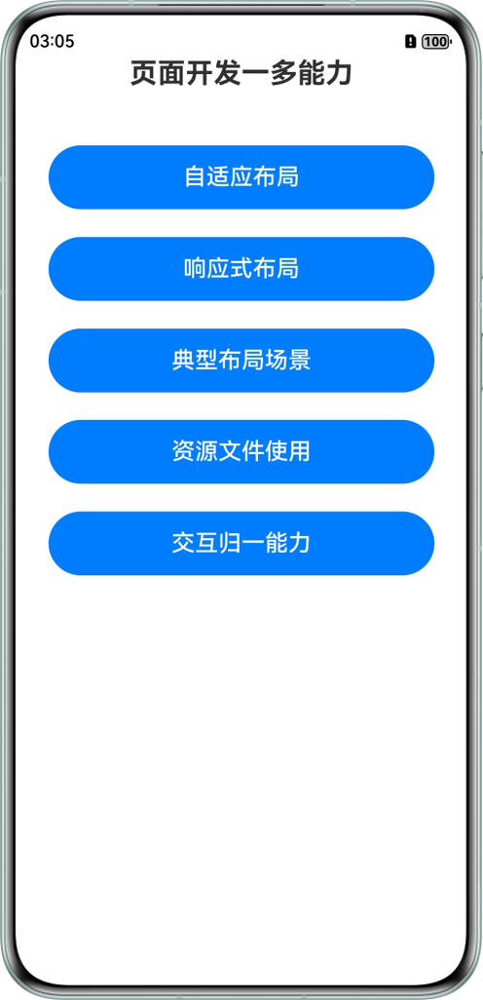
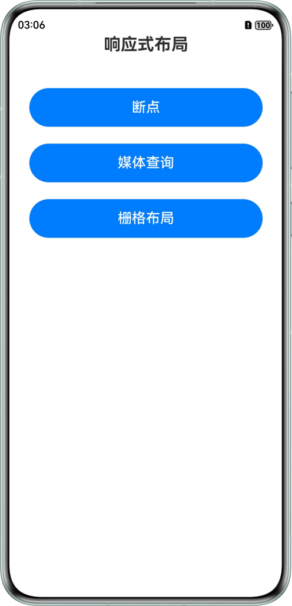
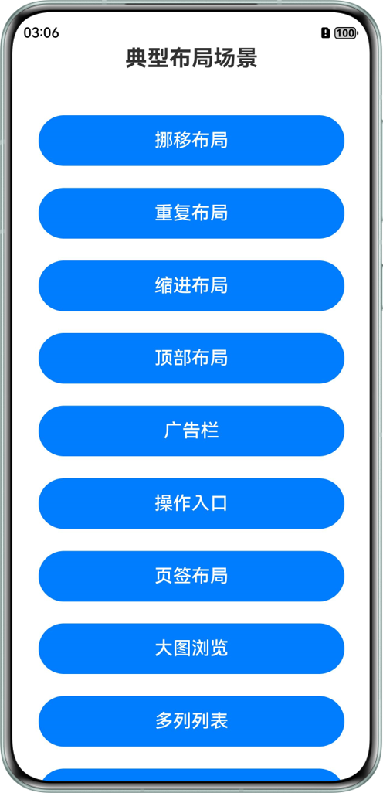

# 多设备自适应能力

### 介绍

本示例是[《一次开发，多端部署》中《自适应布局》与《多设备资源文件》](https://developer.huawei.com/consumer/cn/doc/best-practices/bpta-multi-device-adaptive-layout)的配套示例代码，展示了自适应布局、响应式布局、典型布局场景以及资源文件使用的能力。

| 名称         | 简介                                                         |
| ------------ | ------------------------------------------------------------ |
| 自适应布局   | 当外部容器大小发生变化时，元素可以**根据相对关系自动变化**以适应外部容器变化的布局能力。 |
| 响应式布局   | 当外部容器大小发生变化时，元素可以**根据断点或特定的媒体特征（如屏幕方向、窗口宽高等）自动变化**以适应外部容器变化的布局能力。 |
| 典型布局场景 | 应用开发中的典型场景，包括运行横幅、网格、侧边栏等。         |
| 资源文件使用 | 根据当前的设备特征（如设备类型、屏幕密度等）或应用场景（如语言、国家、地区等），从resources目录下不同的资源限定词目录中获取相应的资源值。 |

> 说明：
>
> * 自适应布局能力仅可以保证在外部容器大小在一定范围内变化时，容器内的元素布局合理。如果外部尺寸发生较大变化，需要借助响应式布局能力进一步适配（详见《一次开发，多端部署》中关于断点的介绍）。
> * 为简化代码、突出重点及方便读者理解，本示例中的自适应布局部分未做多设备适配。此部分建议在DevEco自带的MatePadPro预览器中运行及查看效果，以获得最佳的体验。
> * 响应式布局、典型布局场景、资源文件使用均做了多设备适配，推荐参考如下方式查看代码的运行效果：
>   * 将应用安装到不同类型的设备，查看运行效果。
>   * 通过创建不同屏幕尺寸多个预览器，或者通过拖拽的方式改变预览器的屏幕尺寸，查看不同情况下的运行效果。

### 效果预览：

| 首页                                | 自适应布局                             | 响应式布局                             | 典型场景                              |
|-----------------------------------|-----------------------------------|-----------------------------------|-----------------------------------|
|  |  |  |  |

使用说明

1. 启动应用，首页展示了自适应布局、响应式布局、典型布局场景和资源文件使用四个按钮。

2. 点击"自适应布局"进入新页面，分别展示拉伸能力、缩放能力、隐藏能力、折行能力、均分能力、占比能力和延伸能力共7种自适应布局能力。

3. 点击"响应式布局"进入新页面，分别展示断点、媒体查询和栅格布局3种响应式布局能力。

4. 点击"典型布局场景"进入新页面，展示了如何通过自适应布局能力和响应式布局能力，实现应用开发中的典型场景。

5. 点击"资源文件使用"进入新页面，展示字符串和图片资源的使用。

### 工程目录
```
entry/src/main/ets
|---common
|   |---BreakpointSystem.ets
|   |---ColorEntity.ets                 
|   |---DirectoryList.ets
|   |---GetValueOnBreakpoint.ets
|---MainAbility
|   |---MainAbility.ts
|---model
|   |---Logger.ts                                       // 日志工具
|---pages
|   |---Index.ets                                       // 首页
|   |---atomicLayoutCapability                          
|   |   |---equipartitionCapability
|   |   |   |---EquipartitionCapability.ets             // 均分能力
|   |   |---extensionCapability
|   |   |   |---ExtensionCapability1.ets                // 延伸能力1
|   |   |   |---ExtensionCapability2.ets                // 延伸能力2
|   |   |---flexibleCapability
|   |   |   |---FlexibleCapability1.ets                 // 拉伸能力2
|   |   |   |---FlexibleCapability2.ets                 // 拉伸能力2
|   |   |---hiddenCapability
|   |   |   |---HiddenCapability.ets                    // 隐藏能力
|   |   |---proportionCapability
|   |   |   |---ProportionCapability.ets                // 占比能力
|   |   |---scaleCapability
|   |   |   |---ScaleCapability.ets                     // 缩放能力
|   |   |---wrapCapability
|   |   |   |---WrapCapability.ets                      // 拆行能力
|   |   |---AtomicLayoutCapabilityIndex.ets             // 自适应布局
|   |---gridRow                       
|   |   |---gridRow
|   |   |   |---GridRowSample1.ets                      // 栅格断点1
|   |   |   |---GridRowSample2.ets                      // 栅格断点2
|   |   |   |---GridRowSample3.ets                      // 栅格columns和gutter
|   |   |   |---GridRowSample4.ets                      // 栅格margin
|   |   |   |---GridRowSample5.ets                      // 栅格span
|   |   |   |---GridRowSample6.ets                      // 栅格offset
|   |   |   |---GridRowSample7.ets                      // 栅格order
|   |   |   |---GridRowSample8.ets                      // 栅格span/offset/order继承性
|   |   |   |---GridRowSample9.ets                      // 栅格嵌套
|   |   |   |---GridRowSample10.ets                     // 栅格对齐
|   |   |---GridRowLayoutIndex.ets                      // 栅格布局
|   |---interactionNormCapability
|   |   |---InteractionNormCapability.ets                // 交互归一能力
|   |---resourceQualifier
|   |   |---ResourceQualifier.ets                        // 资源文件使用
|   |---responsiveLayout
|   |   |---ResponsiveLayoutIndex.ets                    
|   |   |---breakpoint
|   |   |   |---Breakpoint.ets                           // 断点类
|   |   |   |---BreakpointSample.ets                     // 断点
|   |   |---mediaQuery
|   |   |   |---MediaQuerySample.ets                     // 媒体查询
|   |---typicalScene
|   |   |---banner
|   |   |   |---BannerSample.ets                         // 广告栏
|   |   |---bigImage
|   |   |   |---BigImageSample.ets                       // 大图浏览
|   |   |---diversion
|   |   |   |---DiversionSample.ets                      // 挪移布局
|   |   |---header
|   |   |   |---HeaderSample.ets                         // 顶部布局
|   |   |---indentation
|   |   |   |---IndentationSample.ets                    // 缩进布局
|   |   |---multiLaneList
|   |   |   |---MultiLaneListSample.ets                  // 多列列表
|   |   |---multiScene                               
|   |   |   |---data	
|   |   |   |   |---apliications	
|   |   |   |   |   |---Apliications.ets		
|   |   |   |   |---home
|   |   |   |   |   |---Home.ets					
|   |   |   |---pages    
|   |   |   |   |---apliications
|   |   |   |   |   |---Apliications.ets	
|   |   |   |   |---home	
|   |   |   |   |   |---Home.ets
|   |   |   |   |---player	
|   |   |   |   |   |---Player.ets
|   |   |   |   |---MultiScene.ets	                     // 一多典型场景
|   |   |---operationEntries
|   |   |   |---OperationEntriesSample.ets               // 操作入口
|   |   |---repeat
|   |   |   |---RepeatSample.ets                         // 重复布局
|   |   |---responsiveGrid
|   |   |   |---ResponsiveGridSample.ets                 // 网格视图
|   |   |---sidebar
|   |   |   |---SidebarSample.ets                        // 侧边栏
|   |   |---tabs
|   |   |   |---TabsSample.ets                           // 页签布局
|   |   |---TypicalSceneIndex.ets                        // 典型布局场景
```

### 相关权限

不涉及。

### 依赖

不涉及。

### 约束与限制

1. 本示例仅支持标准系统上运行，支持设备：华为手机、平板。
2. HarmonyOS系统：HarmonyOS 5.0.5 Release及以上。
3. DevEco Studio版本：DevEco Studio 5.0.5 Release及以上。
4. HarmonyOS SDK版本：HarmonyOS 5.0.5 Release SDK及以上。