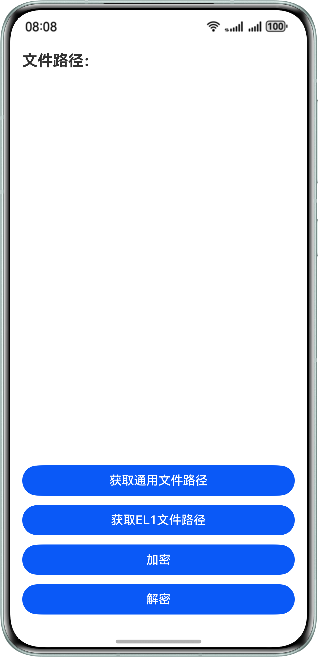

# 应用数据安全

### 简介
本示例实现了获取文件路径以及通用密钥库加解密算法。

### 效果图
| 首页                                                 |
|----------------------------------------------------|
|  |

### 工程目录
```
├──entry/src/main/ets/
│  ├──entryability
│  │  └──EntryAbility.ets          // 程序入口类
│  ├──entrybackupability
│  │  └──EntryBackupAbility.ets    // 程序入口类
│  └──pages
│     └──Index.ets                 // 首页
└──entry/src/main/resources        // 应用静态资源目录
```

### 相关权限

不涉及

### 依赖

不涉及。

### 约束与限制

1. 本示例仅支持标准系统上运行，支持设备：华为手机。

2. HarmonyOS系统：HarmonyOS NEXT Release及以上。

3. DevEco Studio版本：DevEco Studio NEXT Release及以上。

4. HarmonyOS SDK版本：HarmonyOS NEXT Release SDK及以上。