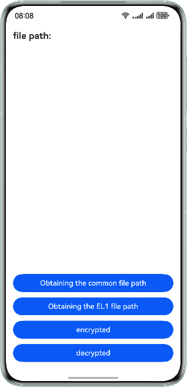

# Application Data Security

### Overview
This sample implements file paths and HUKS encryption/decryption algorithm.

### Effect
| Home Page                                             |
|-------------------------------------------------------|
|  |

### Project Directory
```
├──entry/src/main/ets/
│  ├──entryability
│  │  └──EntryAbility.ets          // Entry ability
│  ├──entrybackupability
│  │  └──EntryBackupAbility.ets    // Entry ability that provides backup and restore capabilities for the application
│  └──pages
│     └──Index.ets                 // Home page
└──entry/src/main/resources        // Static resources
```

### Required Permissions

N/A

### Dependencies

N/A

### Constraints

1. This sample is supported only on Huawei phones running the standard system.

2. The HarmonyOS version must be HarmonyOS NEXT Release or later.

3. The DevEco Studio version must be DevEco Studio NEXT Release or later.

4. The HarmonyOS SDK version must be HarmonyOS NEXT Release SDK or later.

### Download

To download this project separately, execute the following command:
```
git clone --filter=blob:none --no-checkout https://gitee.com/harmonyos_samples/BestPracticeSnippets.git
cd BestPracticeSnippets
git sparse-checkout init --cone
git sparse-checkout set AppDataSecurity
git checkout
```
