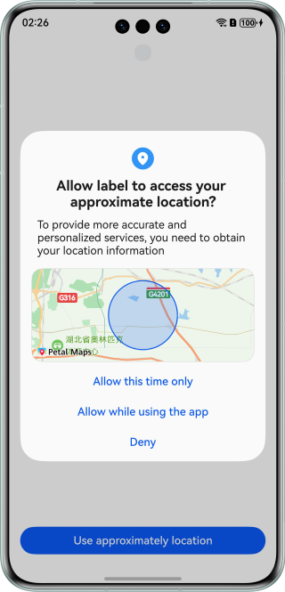
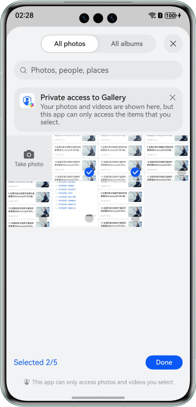
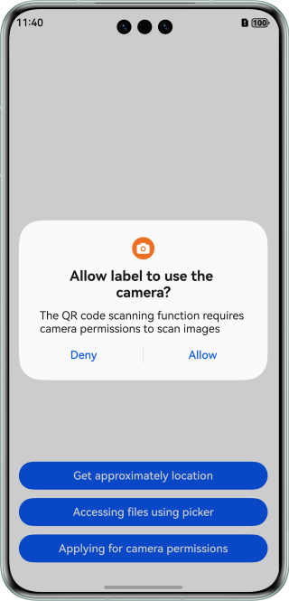

# Application Privacy Protection

### Overview

This sample implements functions such as requesting approximate application location, selecting gallery files, and requesting sensitive permissions.

### Preview

| Requesting the Approximate Location Permission | Using Picker to Obtain Photos                | Requesting the Camera Permission             |
|------------------------------------------------|----------------------------------------------|----------------------------------------------|
|    |  |  |


### Project Directory

```
├──entry/src/main/ets/
│  ├──entryability
│  │  └──EntryAbility.ets                 // Entry ability lifecycle callbacks
│  ├──pages
│  │  ├──ApproximatelyLocationDemo.ets    // Approximate location demo
│  │  ├──Index.ets                        // Application entry
│  │  ├──LocationButtonDemo.ets           // LocationButton demo
│  │  └──PickerDemo.ets                   // PhotoViewPicker demo
│  └──utils   
│     └──Logger.ets                       // Log utility
└──entry/src/main/resources              // Static resources
```

### How to Implement

* Call [getCurrentLocation](https://developer.huawei.com/consumer/en/doc/harmonyos-references/js-apis-geolocationmanager#geolocationmanagergetcurrentlocation) in the **geoLocationManager** module to obtain the location information.
* Use **PhotoViewPicker** to obtain the user photo. For details, see [Selecting User Files](https://developer.huawei.com/consumer/en/doc/harmonyos-guides/select-user-file).

### Required Permissions

**ohos.permission.APPROXIMATELY_LOCATION**: allows an application to obtain the approximate location information of a device.

**ohos.permission.CAMERA**: allows an application to use the camera.


### Dependencies

N/A

### Constraints

1. This sample is supported only on Huawei phones running the standard system.

2. The HarmonyOS version must be HarmonyOS 5.0.5 Release or later.

3. The DevEco Studio version must be DevEco Studio 5.0.5 Release or later.

4. The HarmonyOS SDK version must be HarmonyOS 5.0.5 Release SDK or later.

### Download

To download this project separately, execute the following command:
```
git clone --filter=blob:none --no-checkout https://gitee.com/harmonyos_samples/BestPracticeSnippets.git
cd BestPracticeSnippets
git sparse-checkout init --cone
git sparse-checkout set AppPrivacyProtection
git checkout
```
