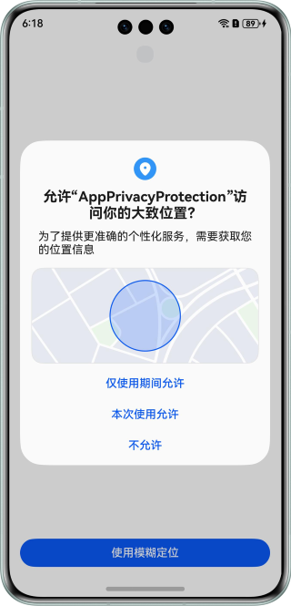
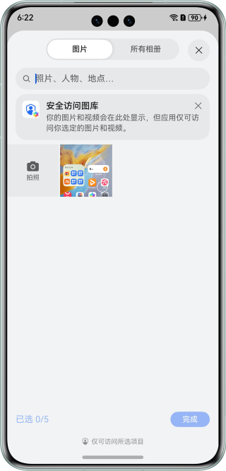
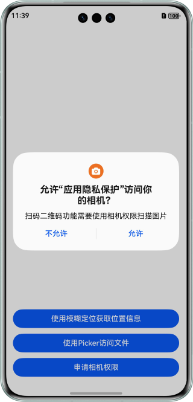

# 应用隐私保护实现

### 介绍

本示例实现了应用模糊定位、选择图库文件、敏感权限申请等功能。

### 效果预览

| 模糊定位权限申请                                  | 使用Picker获取图片                              | 相机权限申请                                    |
|-------------------------------------------|-------------------------------------------|-------------------------------------------|
|  |  |  |

### 目录结构

```
├──entry/src/main/ets/
│  ├──entryability
│  │  └──EntryAbility.ets                 // Ability的生命周期回调内容
│  ├──pages
│  │  ├──ApproximatelyLocationDemo.ets    // 模糊定位示例
│  │  ├──Index.ets                        // 应用入口页
│  │  └──PickerDemo.ets                   // 文件选择器示例
│  └──utils   
│     └──Logger.ets                       // 日志工具类
└──entry/src/main/resources               // 应用静态资源目录
```

### 具体实现

* 使用geoLocationManager模块的[getCurrentLocation](https://developer.huawei.com/consumer/cn/doc/harmonyos-references/js-apis-geolocationmanager#geolocationmanagergetcurrentlocation)方法获取位置信息，参考：[获取设备的位置信息开发指导](https://developer.huawei.com/consumer/cn/doc/harmonyos-guides/location-guidelines)。
* 获取用户图片通过PhotoViewPicker来实现，参考：[选择用户文件](https://developer.huawei.com/consumer/cn/doc/harmonyos-guides/select-user-file)。

### 相关权限

允许应用获取设备模糊位置信息：ohos.permission.APPROXIMATELY_LOCATION

允许应用使用相机：ohos.permission.CAMERA


### 依赖

不涉及。

### 约束与限制

1. 本示例仅支持标准系统上运行，支持设备：华为手机。

2. HarmonyOS系统：HarmonyOS 5.0.5 Release及以上。

3. DevEco Studio版本：DevEco Studio 5.0.5 Release及以上。

4. HarmonyOS SDK版本：HarmonyOS 5.0.5 Release SDK及以上。

### 下载

如需单独下载本工程，执行如下命令：
```
git init
git config core.sparsecheckout true
echo AppPrivacyProtection/ > .git/info/sparse-checkout
git remote add origin https://gitee.com/harmonyos_samples/BestPracticeSnippets.git
git pull origin master
```


