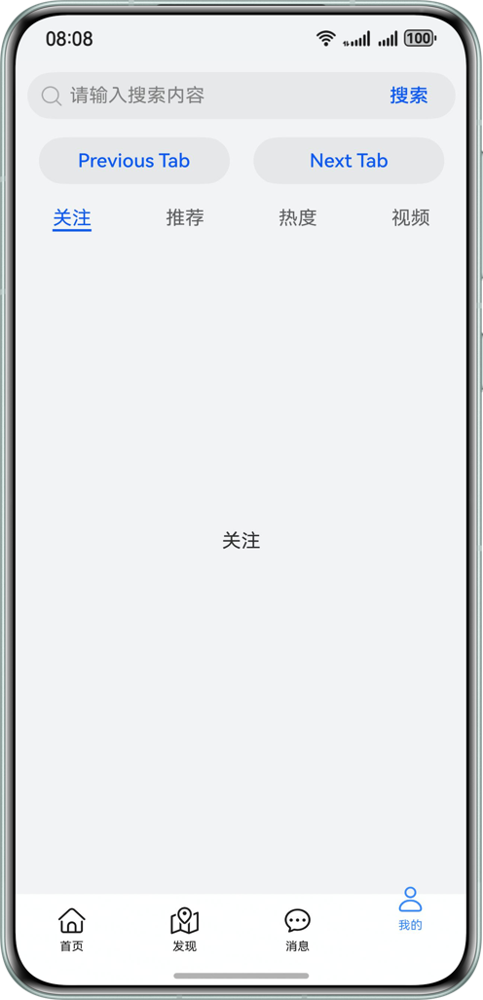

# Tabs开发实践案例-补充案例
### 简介    
 本示例主要Tabs组件常用的场景实践示例的补充内容，补充了TabsBar显示效果相关的子场景，包含TabBar背景模糊效果、页签超出TabBar区域显示、TabBar边缘渐隐、TabBar偏移、切换指定页签等场景。

### 效果预览
| TabBar背景模糊效果                        | 页签超出TabBar区域显示，TabBar边缘渐隐  | TabBar偏移   | 切换指定页签 |                         
|--------------------------------------------|--------------------------------------------|--------------------------------------|-------------------------------------|
|  |  |  |  |
### 工程目录
```
├──entry/src/main/ets                    // 代码区
│  ├──common
│  │  └──constant
│  │     └──Constants.ets                // 常量类
│  ├──entryability  
│  │  └──EntryAbility.ets                // 程序入口类
│  ├──entrybackupability
│  │  └──EntryBackupAbility.ets
│  ├──pages
│  │  └──Index.ets                       // 入口页
│  └──view
│     ├──InTabComponent.ets              // 设置TabBar偏移量及透明度
│     ├──OutTabComponent.ets             // 页签超出TabBar区域显示
│     ├──SearchBarComponent.ets          // 搜索框
│     └──SwitchTabComponent.ets          // 切换至指定页签
└──entry/src/main/resources              // 应用资源目录
```
### 具体实现
- TabBar背景模糊效果  
  通过设置Tabs组件的barOverlap属性，可以实现TabBar变模糊并叠加在TabContent之上，并且配合barBackgroundBlurStyle属性实现毛玻璃效果。
- 页签超出TabBar区域显示   
  通过barModifier设置tabBar的clip属性，实现页签超出tabBar区域显示效果。
- TabBar边缘渐隐  
  通过配置fadingEdge(true)实现TabBar边缘渐隐。
- TabBar偏移  
  通过TabsController的setTabBarTranslate()、setTabBarOpacity()方法可以设置TabBar偏移量及透明度。
- 切换指定页签   
  Tabs组件除了自带的滑动切换和点击切换功能外，还提供了两种可编程方式来切换页签。第一种是通过调用TabsController的changeIndex()方法，切换到指定的index；第二种是定义一个由@State修饰的变量currentIndex，并将其绑定到Tabs，通过修改currentIndex的值来触发页签切换。

### 相关权限
无

### 约束与限制
1. 本示例仅支持标准系统上运行，支持设备：华为手机。

2. HarmonyOS系统：HarmonyOS 5.0.5 Release及以上。

3. DevEco Studio版本：DevEco Studio 5.0.5 Release及以上。

4. HarmonyOS SDK版本：HarmonyOS 5.0.5 Release SDK及以上。

### 下载

如需单独下载本工程，执行如下命令：
```
git init
git config core.sparsecheckout true
echo PureTabsExt/ > .git/info/sparse-checkout
git remote add origin https://gitee.com/harmonyos_samples/BestPracticeSnippets.git
git pull origin master
```
