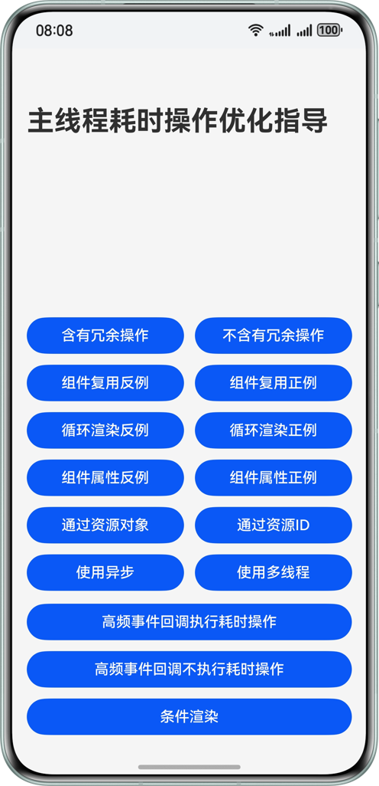

# **主线程耗时操作优化指导**
## 介绍
在应用开发实践中，有效避免主线程执行冗余与易耗时操作是至关重要的策略。此举能有效降低主线程负载，提升UI的响应速度。面对高频回调接口在短时间内密集触发的场景，需要避免接口内的耗时操作，尽量保证主线程不被长时间占用，从而防止阻塞UI渲染，引发界面卡顿或掉帧现象。
本实例介绍开发过程中常见的冗余操作，常见的高频回调场景以及其他主线程优化思路。

## 预览效果


## 工程目录
``` 
├──entry/src/main/ets                                   // 代码区
│  ├──common
│  │  └──Item.ets                                       // 公共区
│  ├──entryability
│  │  └──EntryAbility.ets                               // 程序入口类
│  ├──entrybackupability
│  │  └──EntryBackupAbility.ets
│  ├──pages                              
│  │  └──Index.ets                                      // 首页
│  └──views
│     ├──ConditionalRendering.ets                       // 条件渲染页
│     ├──GetStrOfId.ets                                 // ID资源获取页
│     ├──GetStrOfResource.ets                           // 资源获取页
│     ├──NegativeOfGrid.ets                             // 组件复用反例
│     ├──NegativeOfLazyForEach.ets                      // 循环渲染反例
│     ├──NegativeOfOnScroll.ets                         // 高频事件回调执行耗时操作页
│     ├──NegativeOfProperty.ets                         // 组件属性反例页
│     ├──NoRedundantOperation.ets                       // 不含有冗余操作页
│     ├──PositiveOfGrid.ets                             // 组件复用正例页
│     ├──PositiveOfLazyForEach.ets                      // 循环渲染正例页
│     ├──PositiveOfOnScroll.ets                         // 高频事件回调不执行耗时操作页
│     ├──PositiveOfProperty.ets                         // 组件属性正例页
│     ├──RedundantOperation.ets                         // 含有冗余操作页
│     ├──UseAsync.ets                                   // 使用异步页
│     ├──UseTaskPool.ets                                // 使用多线程页
│     └──WaterFlowDataSource.ets                        // 瀑布流懒加载数据源页
└──entry/src/main/resources                             // 应用资源目录
``` 
## 使用说明
* 点击含有冗余操作按钮，进入二级页面。
* 点击不含有冗余操作按钮，进入二级页面。
* 点击组件复用反例按钮，进入二级页面，上下滑动，观察页面存在掉帧的现象。
* 点击组件复用正例按钮，进入二级页面，上下滑动，页面滑动流畅。
* 点击循环渲染反例按钮，进入二级页面，上下滑动，观察页面存在掉帧的现象。
* 点击循环渲染正例按钮，进入二级页面，上下滑动，页面滑动流畅。
* 点击组件属性反例按钮，进入二级页面，点击按钮，观察页面变化。
* 点击组件属性正例按钮，进入二级页面，点击按钮，观察页面变化。
* 点击通过资源对象按钮，进入二级页面。
* 点击通过资源ID按钮，进入二级页面。
* 点击使用异步按钮，进入二级页面，上下滑动，页面滑动流畅。
* 点击使用多线程按钮，进入二级页面，上下滑动，页面滑动流畅。
* 点击高频事件回调执行耗时操作按钮，进入二级页面。
* 点击高频事件回调不执行耗时操作按钮，进入二级页面。
* 点击条件渲染按钮，进入二级页面，点击按钮，观察页面变化。
## 相关权限
不涉及

## 约束与限制
* 本示例仅支持标准系统上运行，支持设备：华为手机。

* HarmonyOS系统：HarmonyOS 5.0.5 Release及以上。

* DevEco Studio版本：DevEco Studio 5.0.5 Release及以上。

* HarmonyOS SDK版本：HarmonyOS 5.0.5 Release SDK及以上。

## 下载

如需单独下载本工程，执行如下命令：
```
git init
git config core.sparsecheckout true
echo AvoidTimeComsume/ > .git/info/sparse-checkout
git remote add origin https://gitee.com/harmonyos_samples/BestPracticeSnippets.git
git pull origin master
```