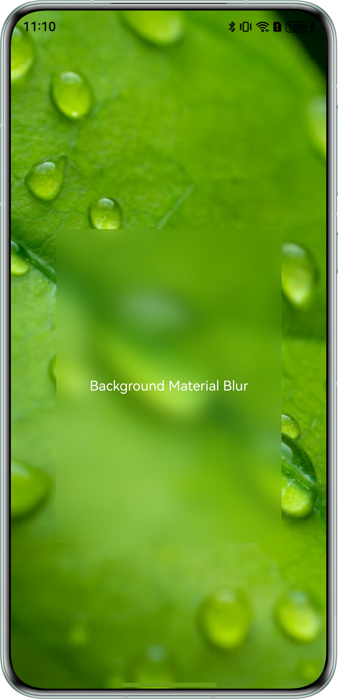
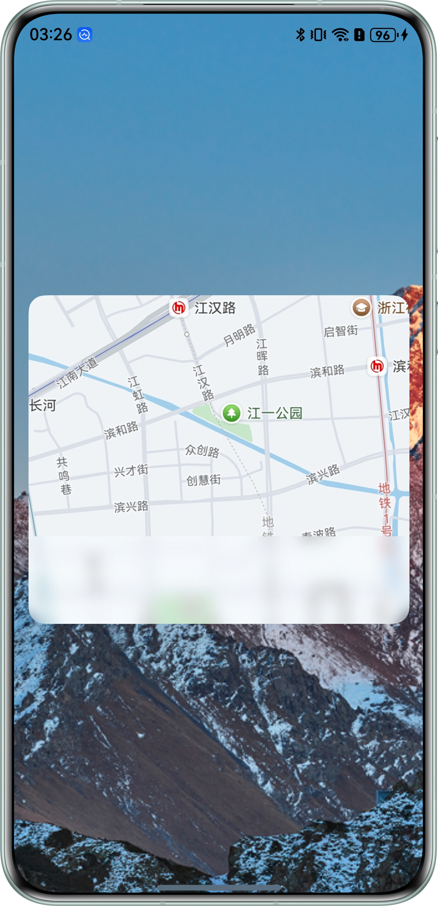
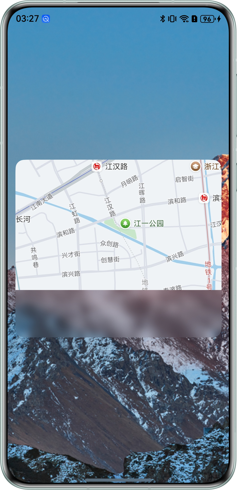

# Efficient use of background blur in development practice

### Overview

This example demonstrates the use of two color extraction methods and two blending modes in background blur.

### Preview

|                          AdaptiveColorMode                          |                          ColorPickerMode                          |
|:-------------------------------------------------------------------:|:-----------------------------------------------------------------:|
|  |  |

|                         FastMode                          |                         OffscreenMode                          |
|:---------------------------------------------------------:|:--------------------------------------------------------------:|
|  |  |

### How to Use

1. Click the **AdaptiveColorMode** button on the main page to display the effect of using AdaptiveColor for color extraction.

2. Click the **ColorPickerMode** button on the main page to display the effect of using ColorPicker for color extraction.

3. Click the **FastMode** button on the main page to display the effect of using the FAST mode with mixed mode in a blurred background scene.

4. Click the **OffscreenMode** button on the main page to display the effect of using the OFFSCREEN mode with mixed mode in a blurred background scene.

### Project Directory
```
├──entry/src/main/ets
│  ├──entryability
│  │  └──EntryAbility.ets                   // Entry ability lifecycle callbacks
│  ├──entrybackupability
│  │  └──EntryBackupAbility.ets
│  └──pages
│     ├──MainPage.ets                       // View layer - parent page
│     ├──MotionBlur.ets                     // View layer - motion blur page
│     └──StaticBlur.ets                     // View layer - static blur page
└──entry/src/main/resources                 // Static resources
├──entry/src/main/ets
│  ├──entryability
│  │  └──EntryAbility.ets                   // Entry ability lifecycle callbacks
│  ├──entrybackupability
│  │  └──EntryBackupAbility.ets             // Entry ability that provides backup and restore capabilities for the application
│  └──pages
│     ├──AdaptiveColorMode.ets              // View Layer - Use AdaptiveColor for Color Effect Page
│     ├──ColorPickerMode.ets                // View Layer - Use ColorPicker to extract color effects page
│     ├──FastMode.ets                       // View Layer - FAST Mode Effect Page Using Mixed Mode
│     ├──MainPage.ets                       // View layer - main page
│     └──OffscreenMode.ets                  // View Layer - OFFSCREEN Mode Effect Page Using Mixed Mode
└──entry/src/main/resources                 // Application static resource directory
```

### How to Implement

1. AdaptiveColor color extraction, directly set the adaptiveColor parameter value of the backgroundEffect interface to AdaptiveColor.AVERAGE.
2. To extract colors from ColorPick, you need to first input image resources, create pixMap, create ColorPicker based on pixMap, call the getAverageColor() method of ColorPicker to obtain colors, and when calling the background blur interface, replace the value of the color parameter of the blur interface with the obtained color.
3. In a blurred background scene, use the Fast mode of the blend mode and directly call the BlendMode interface. Set the BlendAppleType parameter value of this interface to BlendAppleType.FAST.
4. Use the mixed mode Offscreen mode in a blurred background scene, directly call the BlendMode interface, and set the BlendAppleType parameter value of the interface to BlendAppleType.oFFSCREEN.

### Required Permissions

N/A

### Dependencies

N/A

### Constraints

1. This sample is supported only on Huawei phones running the standard system.

2. The HarmonyOS version must be HarmonyOS NEXT Release or later.

3. The DevEco Studio version must be DevEco Studio NEXT Release or later.

4. The HarmonyOS SDK version must be HarmonyOS NEXT Release SDK or later.
