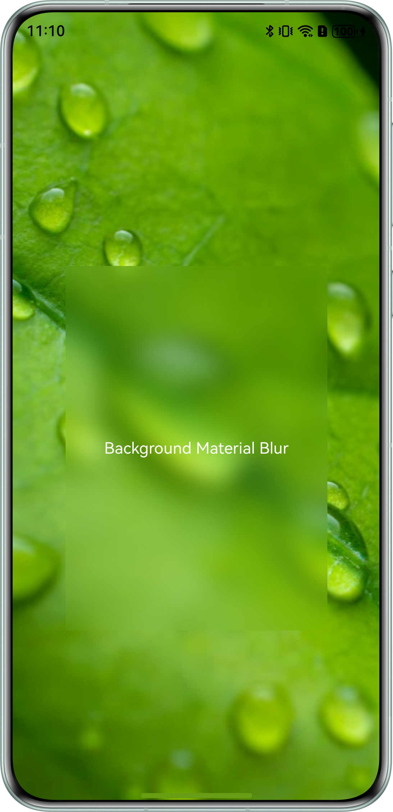
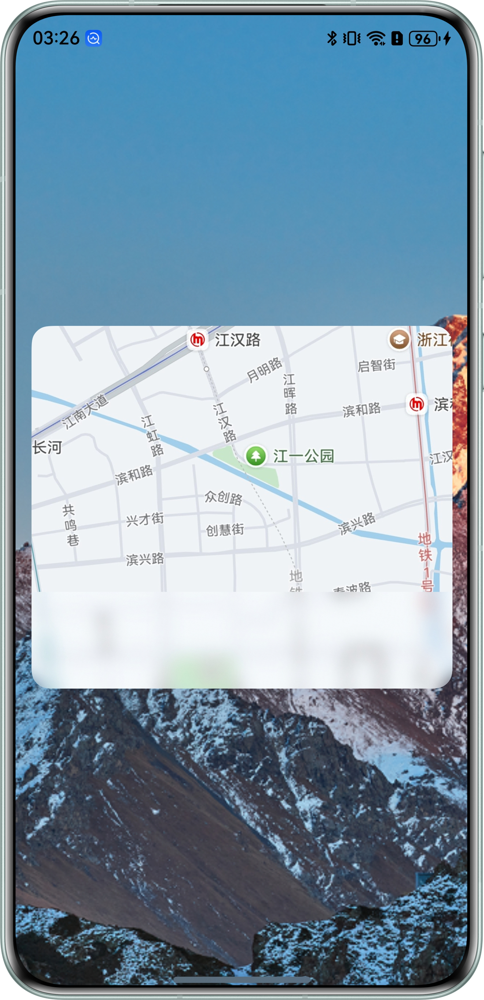
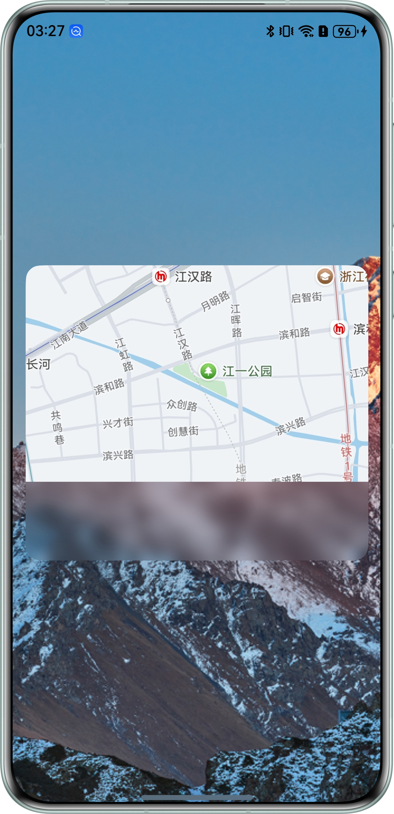

# 高效使用背景模糊开发实践

### 简介

本示例展示了背景模糊中两种取色方式和两种混合模式的使用方式。

### 效果预览

|                          AdaptiveColorMode                          |                          ColorPickerMode                          |
|:-------------------------------------------------------------------:|:-----------------------------------------------------------------:|
|  |  |

|                         FastMode                          |                         OffscreenMode                          |
|:---------------------------------------------------------:|:--------------------------------------------------------------:|
|  |  |

### 使用说明

1、主页面点击"AdaptiveColorMode"按钮，显示使用AdaptiveColor取色的效果。

2、主页面点击"ColorPickerMode"按钮，显示使用ColorPicker取色的效果。

3、主页面点击"FastMode"按钮，显示在背景模糊场景下使用混合模式的FAST模式的效果。

4、主页面点击"OffscreenMode"按钮，显示在背景模糊场景下使用混合模式的OFFSCREEN模式的效果。

### 工程目录
```
├──entry/src/main/ets
│  ├──entryability
│  │  └──EntryAbility.ets                   // Ability的生命周期回调内容
│  ├──entrybackupability
│  │  └──EntryBackupAbility.ets             // 应用数据备份和恢复
│  └──pages
│     ├──AdaptiveColorMode.ets              // 视图层-使用AdaptiveColor取色效果页面
│     ├──ColorPickerMode.ets                // 视图层-使用ColorPicker取色效果页面
│     ├──FastMode.ets                       // 视图层-使用混合模式的FAST模式效果页面
│     ├──MainPage.ets                       // 视图层-主页面
│     └──OffscreenMode.ets                  // 视图层-使用混合模式的OFFSCREEN模式效果页面
└──entry/src/main/resources                 // 应用静态资源目录
```

### 具体实现

1. AdaptiveColor取色，直接设置backgroundEffect接口的adaptiveColor参数值为AdaptiveColor.AVERAGE。
2. ColorPick取色，需要先传入图片资源，创建pixMap，根据pixMap创建ColorPicker，调用ColorPicker的getAverageColor()方法获取颜色，调用背景模糊接口时，模糊接口的color参数的值替换成获取到的颜色。
3. 在背景模糊场景下使用混合模式的Fast模式，直接调用BlendMode接口，设置该接口的BlendApplyType参数值为BlendApplyType.FAST。
4. 在背景模糊场景下使用混合模式的Offscreen模式，直接调用BlendMode接口，设置该接口的BlendApplyType参数值为BlendApplyType.OFFSCREEN。

### 相关权限

不涉及。

### 依赖

不涉及。

### 约束与限制

1.本示例仅支持标准系统上运行，支持设备：华为手机。

2.HarmonyOS系统：HarmonyOS 5.0.5 Release及以上。

3.DevEco Studio版本：DevEco Studio 5.0.5 Release及以上。

4.HarmonyOS SDK版本：HarmonyOS 5.0.5 Release SDK及以上。

### 下载

如需单独下载本工程，执行如下命令：
```
git clone --filter=blob:none --no-checkout https://gitee.com/harmonyos_samples/BestPracticeSnippets.git
cd BestPracticeSnippets
git sparse-checkout init --cone
git sparse-checkout set BackgroundBlur
git checkout
```
