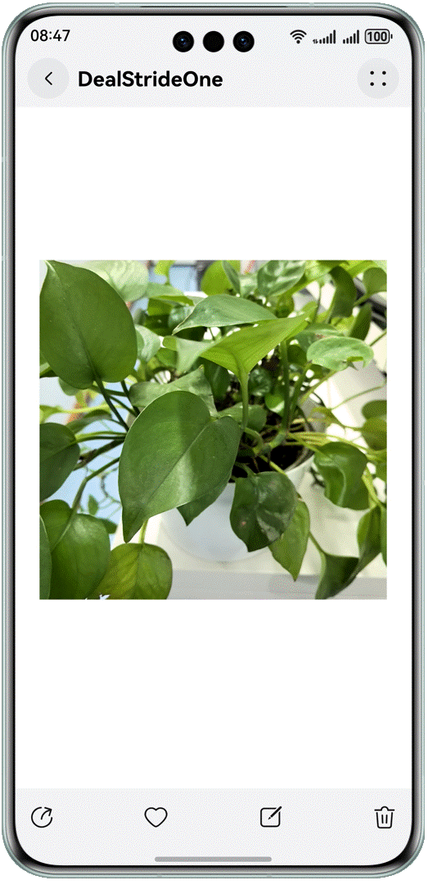

# Solving Camera Preview Artifacts Based on Stride

## Overview
If the camera service is used only for preview stream display, use the **XComponent**. If each image frame needs to be obtained for secondary processing (for example, obtaining each frame for QR code identification or facial recognition), use the **imageArrival** event in **ImageReceiver** to listen for preview stream data of each frame and parse the image. If you use **width*height** to read and parse the image without processing stride, camera preview issues such as artifacts may occur.
After obtaining the preview stream buffer of each frame, if the image is stacked and preview artifacts occur, check and parse each frame. If the stride of the preview image is inconsistent with the width, you need to process invalid pixels.

## Effect

| Positive Example 1                                                     | Positive Example 2                                                     |
|----------------------------------------------------------|----------------------------------------------------------|
|  |  |

## How to Use
1. Tap the **Negative example: unprocessed stride** button to redirect to the child page **NoDealStride**. The camera preview stream is displayed on the child page, and an artifact appears.

1. Tap **Process stride: solution 1** on the parent page to redirect to the child page **DealStrideOne**. The camera preview stream is displayed on the child page, and no artifact appears.

2. Tap **Process stride: solution 2** on the parent page to redirect to the child page **DealStrideTwo**. The camera preview stream is displayed on the child page, and no artifact appears.

### Project Directory

```
├──entry/src/main/ets/
│  ├──common
│  │  ├──CommonConstants.ets              // Common constants
│  │  └──Constants.ets                    // Service constants
│  ├──entryability
│  │  └──EntryAbility.ets                 // Entry ability lifecycle callbacks
│  ├──entrybackupability
│  │  └──EntryBackipAbility.ets           // Custom application data conversion and migration template
│  ├──pages
│  │  ├──Index.ets                        // Application entry
│  │  ├──PageOne.ets                      // Preview stream display (positive example 1)
│  │  ├──PageThree.ets                    // Preview stream display (negative example)
│  │  └──PageTwo.ets                      // Preview stream display (positive example 2)
│  └──utils   
│     ├──CameraServiceOne.ets             // Camera service (positive example 1)
│     ├──CameraServiceThree.ets           // Camera service (negative example)
│     ├──CameraServiceTwo.ets             // Camera service (positive example 2)
│     └──Logger.ets                       // Log utility
└──entry/src/main/resources               // Static resources
```

## How to Implement
Take a frequent use scenario as an example. An application needs to define a preview stream image with the resolution of 1080 × 1080 and the return value of the **stride** on the related platform is **1088**. In this case, you should process invalid pixels, parse the correct pixel data and send it to the **Image** component for display, to avoid preview artifacts.
1. The application registers the **imageArrival** callback through **image.ImageReceiver** to obtain the **image.Image** instance of each frame, and directly creates a **pixelMap** by defining a preview stream with the resolution of 1080 × 1080. In this case, the obtained **stride** is **1088**, the buffer after stride processing needs to be passed to **Image** for display, and the preview stream is properly displayed.
2. There are two stride processing methods. For details, see solution 1 and solution 2.
### Solution 1
Use the width, height, and stride values to process the camera preview stream data.
There are two cases:
- When the stride and width are the same, the result is not affected when the buffer is read by width.
- When the stride is different from the width, remove the stride from the preview stream data (that is, the data in **component.byteBuffer**) returned by the camera.
  In this case, you can copy new **dstArr** for processing, create the **pixelMap** based on the width and height and the processed **dstArr** buffer, and store the **pixelMap** in the global variable **stridePixel** and sent it to **Image** for display.
  The following shows the key sample code:
```typescript
function onImageArrival(receiver: image.ImageReceiver): void {
  receiver.on('imageArrival', () => {
    receiver.readNextImage((err: BusinessError, nextImage: image.Image) => {
      if (err || nextImage === undefined) {
        Logger.error(TAG, `requestPermissionsFromUser call Failed! error: ${err.code}`);
        return;
      }
      nextImage.getComponent(image.ComponentType.JPEG, async (err, component: image.Component) => {
        let width = 1080; // Application create preview stream resolution corresponding to the width
        let height = 1080; // Application create preview stream resolution corresponding to the height
        let stride = component.rowStride; // Get stride by using component.rowStride
        Logger.info(TAG, `receiver getComponent width:${width} height:${height} stride:${stride}`);
        // Positive example: Case 1.stride and width are equal. Reading buffer by width does not affect the result.
        if (stride === width) {
          let pixelMap = await image.createPixelMap(component.byteBuffer, {
            size: { height: height, width: width },
            srcPixelFormat: image.PixelMapFormat.NV21,
          })
          AppStorage.setOrCreate('stridePixel', pixelMap);
        } else {
          // Positive example: Case 2.When width and stride are not equal,
          // At this time, the camera returned preview stream data component.byteBuffer to remove stride, 
          // copy the new dstArr data, data processing to other do not support stride interface processing.
          const dstBufferSize = width * height * 1.5; // Create a dstBufferSize space of width * height * 1.5. This is NV21 data format.
          const dstArr = new Uint8Array(dstBufferSize); // Store the buffer after the stride is removed.
          // For each line of data read, the camera supports an even width and height profile, which does not involve rounding.
          for (let j = 0; j < height * 1.5; j++) { // Loop each row of dstArr data.
            // Copy the first width bytes of each line of data from component.byteBuffer into dstArr (remove invalid pixels and get exactly an eight-byte array space of width*height per line).
            const srcBuf = new Uint8Array(component.byteBuffer, j * stride, width); // The buffer returned by component.byteBuffer traverses each line, starting at the top, with width bytes cut off each line.
            dstArr.set(srcBuf, j * width); // Store the width*height data in dstArr.
          }
          let pixelMap = await image.createPixelMap(dstArr.buffer, { // The processed dstArr array buffer creates pixelMap directly by width and height, and stores it in the global variable stridePixel and passes it to Image for display.
            size: { height: height, width: width },
            srcPixelFormat: image.PixelMapFormat.NV21,
          })
          AppStorage.setOrCreate('stridePixel', pixelMap);
        }
        nextImage.release();
      })
    });
  })
}
```

### Solution 2
Use the width, height, and stride values to process the camera preview stream data.
There are two cases:
- When the stride and width are the same, the result is not affected when the buffer is read by width.
- When the stride and width are different, if the application wants to use **byteBuffer** preview stream data to create a **pixelMap** for direct display, you can create a **pixelMap** based on stride*height.
  Then, call the **cropSync** method of the PixelMap to crop redundant pixels to correctly process the stride and solve the artifact issue during preview.
  The following shows the key sample code:
```typescript
function onImageArrival(receiver: image.ImageReceiver): void {
  receiver.on('imageArrival', () => {
    receiver.readNextImage((err: BusinessError, nextImage: image.Image) => {
      if (err || nextImage === undefined) {
        Logger.error(TAG, `requestPermissionsFromUser call Failed! error: ${err.code}`);
        return;
      }
      if (nextImage) {
        nextImage.getComponent(image.ComponentType.JPEG, async (err, component: image.Component) => {
          let width = 1080; // Application create preview stream resolution corresponding to the width
          let height = 1080; // Application create preview stream resolution corresponding to the height
          let stride = component.rowStride; // Get stride by using component.rowStride
          Logger.info(TAG, `receiver getComponent width:${width} height:${height} stride:${stride}`);
          // stride and width are equal. Reading buffer by width does not affect the result
          if (stride === width) {
            let pixelMap = await image.createPixelMap(component.byteBuffer, {
              size: { height: height, width: width },
              srcPixelFormat: image.PixelMapFormat.NV21,
            })
            AppStorage.setOrCreate('stridePixel', pixelMap);
          } else {
            let pixelMap = await image.createPixelMap(component.byteBuffer, {
              // Positive example: 1. width transmission stride when creating PixelMap.
              size: { height: height, width: stride },
              srcPixelFormat: 8,
            })
            // 2. then call the cropSync method of PixelMap to crop out the excess pixels.
            pixelMap.cropSync({
              size: { width: width, height: height },
              x: 0,
              y: 0
            }) // Crop the image according to the size entered, starting with (0,0), crop the area of width*height bytes.
            let pixelBefore: PixelMap | undefined = AppStorage.get('stridePixel');
            await pixelBefore?.release();
            AppStorage.setOrCreate('stridePixel', pixelMap);
          }
          nextImage.release();
        })
      }
    });
  })
}
```
### Required Permissions

**ohos.permission.CAMERA**: allows an application to use the camera.

### Dependencies

N/A

### Constraints

1. This sample is supported only on Huawei phones with standard systems.

2. The HarmonyOS version must be HarmonyOS 5.0.0 Release or later.

3. The DevEco Studio version must be DevEco Studio 5.0.0 Release or later.

4. The HarmonyOS SDK version must be HarmonyOS 5.0.0 Release SDK or later.