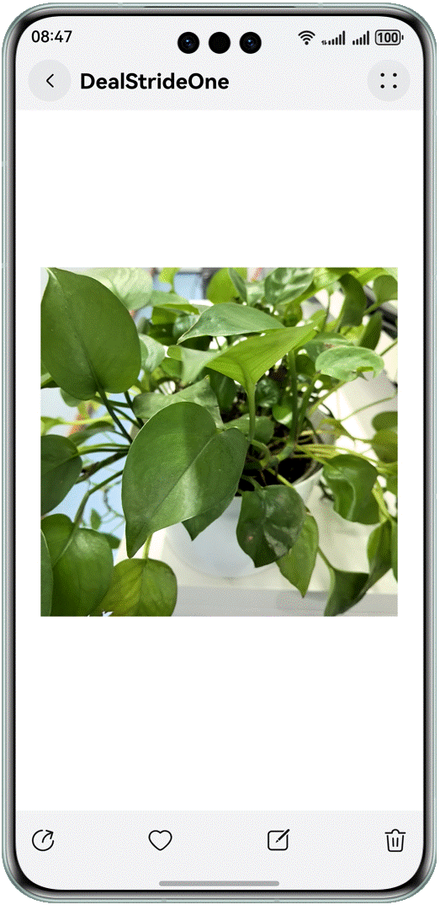
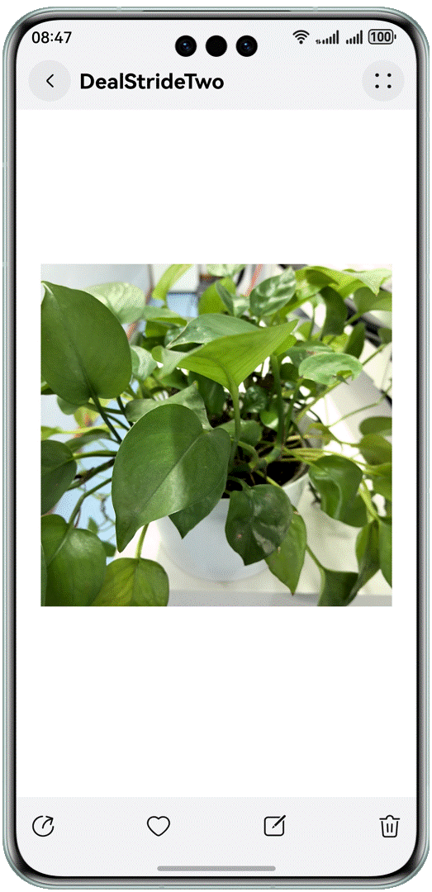

# 处理stride解决相机预览花屏问题

## 介绍
开发者在使用相机服务时，如果仅用于预览流展示，通常使用XComponent组件实现，如果需要获取每帧图像做二次处理（例如获取每帧图像完成二维码识别或人脸识别场景），可以通过ImageReceiver中imageArrival事件监听预览流每帧数据，解析图像内容。在解析图像内容时，如果未考虑stride，直接通过使用width*height读取图像内容去解析图像，会导致相机预览异常，从而出现相机预览花屏的现象。  
当开发者获取预览流每帧图像buffer后，若发现图片内容出现花屏堆叠状，出现“相机预览花屏”现象，此时需要排查解析每帧图像，当预览流图像stride与width不一致时，需要对stride进行无效像素处理。

## 效果

| 正例一                                                      | 正例二                                                      |
|----------------------------------------------------------|----------------------------------------------------------|
|  |  |

## 使用说明
1、父页面点击"反例：未处理stride"按钮，跳转子页面NoDealStride，子页面的预览界面展示相机预览流，出现花屏现象。

1、父页面点击"处理stride：方案一"按钮，跳转子页面DealStrideOne，子页面的预览界面展示相机预览流，无明显花屏现象。

2、父页面点击"处理stride：方案二"按钮，跳转子页面DealStrideTwo，子页面的预览界面展示相机预览流，无明显花屏现象。

### 目录结构

```
├──entry/src/main/ets/
│  ├──common
│  │  ├──CommonConstants.ets              // 通用常量
│  │  └──Constants.ets                    // 业务涉及的常量
│  ├──entryability
│  │  └──EntryAbility.ets                 // Ability的生命周期回调内容
│  ├──entrybackupability
│  │  └──EntryBackipAbility.ets           // 自定义应用数据转换和迁移模板类
│  ├──pages
│  │  ├──Index.ets                        // 应用入口页
│  │  ├──PageOne.ets                      // 预览流展示页（正例方案一）
│  │  ├──PageThree.ets                    // 反例预览流展示页（反例）
│  │  └──PageTwo.ets                      // 预览流展示页（正例方案二）
│  └──utils   
│     ├──CameraServiceOne.ets             // 相机服务类（正例方案一）
│     ├──CameraServiceThree.ets           // 相机服务类（反例）
│     ├──CameraServiceTwo.ets             // 相机服务类（正例方案二）
│     └──Logger.ets                       // 日志工具类
└──entry/src/main/resources               // 应用静态资源目录
```

## 具体实现
以一种高频的用户使用场景为例，应用需要定义一个1080*1080分辨率的预览流图像，此时的stride在相关平台的返回值为1088，此时需要对stride进行处理，处理无效像素后解析出正确的像素数据，传给Image组件送显，避免出现预览流花屏。
1. 应用通过image.ImageReceiver注册imageArrival图像回调方法，获取每帧图像数据实例image.Image，应用通过定义一个width为1080*height为1080分辨率的预览流直接创建pixelMap，此时获取到的stride的值为1088，需将处理stride后的buffer传给Image送显，预览流正常展示。  
2. 处理stride有两种方式，详见方案一二。
### 方案一
开发者使用width，height，stride三个值，处理相机预览流数据。  
分两种情况：
- 当stride和width相等时，按宽读取buffer不影响结果；
- 当stride和width不等时，将相机返回的预览流数据即component.byteBuffer中的数据去除掉stride，
此时将component.byteBuffer中的数据去除掉stride，拷贝得到新的dstArr数据进行数据处理，将处理后的dstArr数组buffer，通过width和height直接创建pixelMap, 并存储到全局变量stridePixel中，传给Image送显。  
以下为关键示例代码：  
```typescript
function onImageArrival(receiver: image.ImageReceiver): void {
  receiver.on('imageArrival', () => {
    receiver.readNextImage((err: BusinessError, nextImage: image.Image) => {
      if (err || nextImage === undefined) {
        Logger.error(TAG, `requestPermissionsFromUser call Failed! error: ${err.code}`);
        return;
      }
      nextImage.getComponent(image.ComponentType.JPEG, async (err, component: image.Component) => {
        let width = 1080; // Application create preview stream resolution corresponding to the width
        let height = 1080; // Application create preview stream resolution corresponding to the height
        let stride = component.rowStride; // Get stride by using component.rowStride
        Logger.info(TAG, `receiver getComponent width:${width} height:${height} stride:${stride}`);
        // Positive example: Case 1.stride and width are equal. Reading buffer by width does not affect the result.
        if (stride === width) {
          let pixelMap = await image.createPixelMap(component.byteBuffer, {
            size: { height: height, width: width },
            srcPixelFormat: image.PixelMapFormat.NV21,
          })
          AppStorage.setOrCreate('stridePixel', pixelMap);
        } else {
          // Positive example: Case 2.When width and stride are not equal，
          // At this time, the camera returned preview stream data component.byteBuffer to remove stride, 
          // copy the new dstArr data, data processing to other do not support stride interface processing.
          const dstBufferSize = width * height * 1.5; // Create a dstBufferSize space of width * height * 1.5. This is NV21 data format.
          const dstArr = new Uint8Array(dstBufferSize); // Store the buffer after the stride is removed.
          // For each line of data read, the camera supports an even width and height profile, which does not involve rounding.
          for (let j = 0; j < height * 1.5; j++) { // Loop each row of dstArr data.
            // Copy the first width bytes of each line of data from component.byteBuffer into dstArr (remove invalid pixels and get exactly an eight-byte array space of width*height per line).
            const srcBuf = new Uint8Array(component.byteBuffer, j * stride, width); // The buffer returned by component.byteBuffer traverses each line, starting at the top, with width bytes cut off each line.
            dstArr.set(srcBuf, j * width); // Store the width*height data in dstArr.
          }
          let pixelMap = await image.createPixelMap(dstArr.buffer, { // The processed dstArr array buffer creates pixelMap directly by width and height, and stores it in the global variable stridePixel and passes it to Image for display.
            size: { height: height, width: width },
            srcPixelFormat: image.PixelMapFormat.NV21,
          })
          AppStorage.setOrCreate('stridePixel', pixelMap);
        }
        nextImage.release();
      })
    });
  })
}
```
  
### 方案二
开发者使用width，height，stride三个值，处理相机预览流数据。  
分两种情况：  
- 当stride和width相等时，与正例一情况一致，此处不再赘述。
- 当stride和width不等时，如果应用想使用byteBuffer预览流数据创建pixelMap直接显示，可以根据stride*height字节的大小先创建pixelMap，然后调用
PixelMap的cropSync方法裁剪掉多余的像素，从而正确处理stride，解决预览流花屏问题。  
以下为关键示例代码：
```typescript
function onImageArrival(receiver: image.ImageReceiver): void {
  receiver.on('imageArrival', () => {
    receiver.readNextImage((err: BusinessError, nextImage: image.Image) => {
      if (err || nextImage === undefined) {
        Logger.error(TAG, `requestPermissionsFromUser call Failed! error: ${err.code}`);
        return;
      }
      if (nextImage) {
        nextImage.getComponent(image.ComponentType.JPEG, async (err, component: image.Component) => {
          let width = 1080; // Application create preview stream resolution corresponding to the width
          let height = 1080; // Application create preview stream resolution corresponding to the height
          let stride = component.rowStride; // Get stride by using component.rowStride
          Logger.info(TAG, `receiver getComponent width:${width} height:${height} stride:${stride}`);
          // stride and width are equal. Reading buffer by width does not affect the result
          if (stride === width) {
            let pixelMap = await image.createPixelMap(component.byteBuffer, {
              size: { height: height, width: width },
              srcPixelFormat: image.PixelMapFormat.NV21,
            })
            AppStorage.setOrCreate('stridePixel', pixelMap);
          } else {
            let pixelMap = await image.createPixelMap(component.byteBuffer, {
              // Positive example: 1. width transmission stride when creating PixelMap.
              size: { height: height, width: stride },
              srcPixelFormat: 8,
            })
            // 2. then call the cropSync method of PixelMap to crop out the excess pixels.
            pixelMap.cropSync({
              size: { width: width, height: height },
              x: 0,
              y: 0
            }) // Crop the image according to the size entered, starting with (0,0), crop the area of width*height bytes.
            let pixelBefore: PixelMap | undefined = AppStorage.get('stridePixel');
            await pixelBefore?.release();
            AppStorage.setOrCreate('stridePixel', pixelMap);
          }
          nextImage.release();
        })
      }
    });
  })
}
```
### 相关权限

允许应用使用相机：ohos.permission.CAMERA

### 依赖

不涉及。

### 约束与限制

1.本示例仅支持标准系统上运行，支持设备：华为手机。

2.HarmonyOS系统：HarmonyOS 5.0.0 Release及以上。

3.DevEco Studio版本：DevEco Studio 5.0.0 Release及以上。

4.HarmonyOS SDK版本：HarmonyOS 5.0.0 Release SDK及以上。