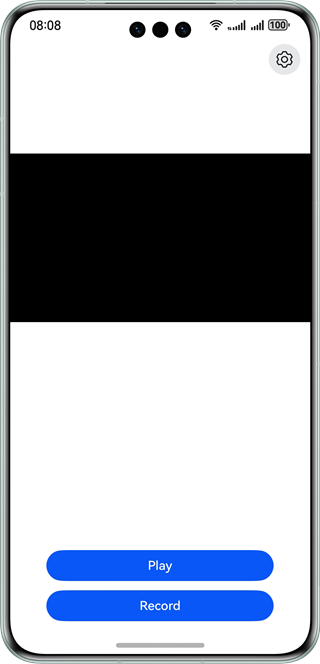

# AVCodec Based Video Codec

### Overview

This sample demonstrates video playback and recording implemented on AVCodec.

- The main process of video playback is as follows: demuxing, decoding, displaying, and playing video files.
- The main process of video recording is as follows: camera capture, encoding, and muxing into MP4 files.

### Atomic Capability Specifications Supported for Playback

| Media | Muxing Format | Stream Format                                         |
|-------|:--------------|:------------------------------------------------------|
| Video | mp4           | Video stream: H.264/H.265; audio stream: Audio Vivid  |
| Video | mkv           | Video stream: H.264/H.265; audio stream: AAC/MP3/OPUS |
| Video | mpeg-ts       | Video stream: H.264; audio stream: Audio Vivid        |

### Atomic Capability Specifications Supported for Recording

| Muxing Format | Video Codec Type |
|---------------|------------------|
| mp4           | H.264/H.265      |

This sample supports only video recording. It does not integrate the audio capability.

### Preview

| Home page                                                     | App usage example                                             |
|---------------------------------------------------------------|---------------------------------------------------------------|
|  |  |

### How to Use

1. A message is displayed, asking you whether to allow AVCodecVideo to use the camera. Touch **Allow**.

#### Recording

1. Touch **Record**.

2. Confirm the recording is allowed to be saved to the **gallery**.

3. Touch **Stop** to finish recording.

#### Playback

1. Place the recorded video file in **gallery**, or click **Start** to record another video file (without audio).

2. Touch **Play** and select a file to play.

### Project Directory

```       
├──entry/src/main/cpp                 // Native layer
│  ├──capbilities                     // Capability interfaces and implementation
│  │  ├──include                      // Capability interfaces
│  │  ├──AudioDecoder.cpp             // Audio decoder implementation
│  │  ├──Demuxer.cpp                  // Demuxer implementation
│  │  ├──Muxer.cpp                    // Muxer implementation
│  │  ├──VideoDecoder.cpp             // Video decoder implementation
│  │  └──VideoEncoder.cpp             // Video encoder implementation
│  ├──common                          // Common modules
│  │  ├──dfx                          // Logs
│  │  ├──SampleCallback.cpp           // Codec callback implementation  
│  │  ├──SampleCallback.h             // Codec callback definition
│  │  └──SampleInfo.h                 // Common classes for function implementation 
│  ├──render                          // Interfaces and implementation of the display module
│  │  ├──include                      // Display module interfaces
│  │  ├──EglCore.cpp                  // Display parameter settings
│  │  ├──PluginManager.cpp            // Display module management implementation
│  │  └──PluginRender.cpp             // Display logic implementation
│  ├──sample                          // Native layer
│  │  ├──player                       // Player interfaces and implementation at the native layer
│  │  │  ├──Player.cpp                // Player implementation at the native layer
│  │  │  ├──Player.h                  // Player interfaces at the native layer
│  │  │  ├──PlayerNative.cpp          // Player entry at the native layer
│  │  │  └──PlayerNative.h         
│  │  └──recorder                     // Recorder interface and implementation at the native layer
│  │     ├──Recorder.cpp              // Recorder implementation at the native layer
│  │     ├──Recorder.h                // Recorder interfaces at the native layer
│  │     ├──RecorderNative.cpp        // Recorder entry at the native layer
│  │     └──RecorderNative.h       
│  ├──types                           // Interfaces exposed by the native layer
│  │  ├──libplayer                    // Interfaces exposed by the player to the UI layer
│  │  └──librecorder                  // Interfaces exposed by the recorder to the UI layer
│  └──CMakeLists.txt                  // Compilation entry      
├──ets                                // UI layer
│  ├──common                          // Common modules
│  │  ├──utils                        // Common utility class
│  │  │  ├──CameraCheck.ets           // Check whether camera parameters are supported
│  │  │  ├──DateTimeUtils.ets         // Used to obtain the current time
│  │  │  └──Logger.ets                // Log utility
│  │  └──CommonConstants.ets          // Common constants
│  ├──entryability                    // App entry
│  │  └──EntryAbility.ets            
│  ├──entrybackupability            
│  │  └──EntryBackupAbility.ets
│  ├──model            
│  │  └──CameraDataModel.ets          // Camera parameter data class  
│  └──pages                           // Pages contained in the EntryAbility
│     ├──Index.ets                    // Home page/Playback page
│     └──Recorder.ets                 // Recording page
├──resources                          // Static resources
│  ├──base                            // Resource files in this directory are assigned unique IDs.
│  │  ├──element                      // Fonts and colors
│  │  ├──media                        // Images
│  │  └──profile                      // Home page of the app entry
│  ├──en_US                           // Resources in this directory are preferentially matched when the device language is English (US).
│  └──zh_CN                           // Resources in this directory are preferentially matched when the device language is simplified Chinese.
└──module.json5                       // Module configuration information
```

### How to Implement

#### Recording

##### UI Layer

1. On the **Index** page at the UI layer, touching **Record** triggers the BindSheet, confirming to save the recording
   file to the gallery.
2. After the file path is selected, the encoder calls **initNative** at the ArkTS layer by using the FD of the file and
   the preset recording parameters. After the initialization is complete, the encoder calls *
   *OH_NativeWindow_GetSurfaceId** to obtain the surface ID of the NativeWindow and return it to the UI layer through a
   callback.
3. After obtaining the surface ID from the encoder, the UI layer invokes the page route, carrying the surface ID, to
   redirect to the recording page.
4. During the construction of the **XComponent** on the recording page, the **onLoad()** method is called to obtain the
   surface ID of the **XComponent**. Then **createDualChannelPreview()** is called to create a production-consumption
   model where the camera produces, and both the **XComponent** and the encoder's surface consume.

##### Native Layer

1. On the recording page, the encoder starts to encode the camera preview stream at the UI layer.
2. Each time the encoder successfully encodes a frame, the callback function **OnNewOutputBuffer()** in *
   *sample_callback.cpp** is invoked once, and the AVCodec framework provides an **OH_AVBuffer**.
3. In the output callback, you need to manually store the frame buffer and index in the output queue and instruct the
   output thread to unlock.
4. The output thread stores the frame information in the previous step as bufferInfo and pops out of the queue.
5. The output thread uses bufferInfo obtained in the previous step to call **WriteSample** to mux the frame into the MP4
   format.
6. The output thread calls **FreeOutputBuffer** to return the buffer of this frame to the AVCodec framework, achieving
   buffer cycling.

#### Playback

##### UI Layer

1. On the **Index** page at the UI layer, touching **Play** triggers a click event and the **selectFile()** method. This
   method invokes the file selection module of the gallery and obtains the file path selected by the user.
2. After the file path is selected, **play()** is invoked to open a file in the file path, obtain the file size, and
   change the button status to unavailable. Then the UI layer invokes **playNative()** exposed by the ArkTS layer.
3. The UI layer calls **PlayerNative::Play()** based on the **playNative** field. The callback function for ending the
   playback is registered in this method.
4. When the playback ends, **napi_call_function()** in the callback is invoked to instruct the UI layer to change the
   button status to available.

##### ArkTS Layer

1. Call **Export()** of **PluginManager()** in **Init()** of **PlayerNative.cpp** and register the callback function *
   *OnSurfaceCreatedCB()**. When a new **XComponent** appears on the page, convert it and assign it to **pluginWindow_**
   in the singleton class **PluginManager**.

##### Native Layer

1. The working principles are as follows.
    - After the decoder is started, **OnNeedInputBuffer** is invoked each time the decoder obtains a frame, and the
      AVCodec framework provides an **OH_AVBuffer**.
    - In the input callback, you need to manually store the frame buffer and index in the input queue and instruct the
      input thread to unlock.
    - The input thread stores the frame information in the previous step as bufferInfo and pops out of the queue.
    - The input thread uses bufferInfo obtained in the previous step to call **ReadSample** to demux the frame.
    - The input thread uses the demuxed bufferInfo to call **PushInputData** of the decoder. When the buffer is no
      longer needed, the input thread returns the buffer to the framework, achieving buffer cycling.
    - After **PushInputData** is called, the decoder starts frame decoding. Each time a frame is decoded, the output
      callback function is invoked. You need to manually store the frame buffer and index to the output queue.
    - The output thread stores the frame information in the previous step as bufferInfo and pops out of the queue.
    - After calling **FreeOutputData**, the output thread displays the frame and releases the buffer. The released
      buffer is returned to the framework, achieving buffer cycling.
2. In the decoder configuration, the input parameter **OHNativeWindow*** of **OH_VideoDecoder_SetSurface** is *
   *pluginWindow_** in **PluginManager**.
3. In the decoder configuration, **SetCallback** is used. The input and output callbacks in **sample_callback.cpp** must
   store the callback frame buffer and index to a user-defined container, named **sample_info.h**, for subsequent
   operations.
4. **Start()** in **Player.cpp** is used to start the input thread and output thread.

### Required Permissions

**ohos.permission.CAMERA**: allows an app to use the camera.

### Dependencies

N/A

### Constraints

1. The sample app is supported only on Huawei phones running the standard system.

2. The HarmonyOS version must be HarmonyOS NEXT Beta1 or later.

3. The DevEco Studio version must be DevEco Studio NEXT Beta1 or later.

4. The HarmonyOS SDK version must be HarmonyOS NEXT Beta1 or later.   
