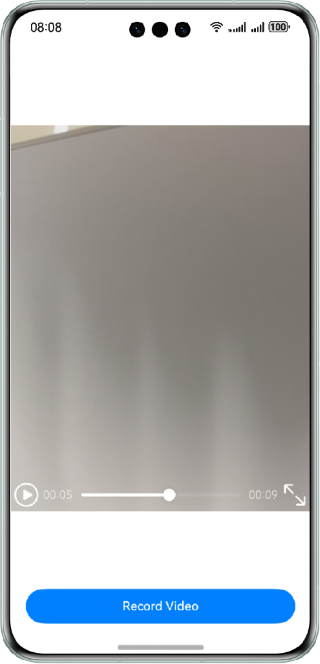

# Video Recording Using Camera Kit and AVRecorder

### Overview

This sample demonstrates the use of Camera Kit to customize a camera and use the camera to record videos through AVRecorder. This sample demonstrates a custom camera through Camera Kit and records video with AVRecorder.

### Preview

| Requesting permissions page            | Recording page                        | Recording                                    | Home page                            |
|----------------------------------------|---------------------------------------|----------------------------------------------|--------------------------------------|
|  |  |  |  |

### How to Use

1. Request the permissions.
2. Touch **Record video**. The system checks the permissions. If all the required permissions have been granted, the recording page is displayed. Otherwise, you need to grant the permissions as prompted and touch **Record video** again.
3. Touch the start button to start recording the video.
4. Touch the stop button to finish recording. The home page is displayed. The recorded video is displayed above the **Record video** button, and the video can be manually played.


### Project Directory
```
├───entry/src/main/ets
│   ├───common
│   │   └───CommonConstants.ets            // Constant
│   ├───entryability                        
│   │   └───EntryAbility.ets               // Lifecycle callback content of an ability
│   ├───pages    
│   │   ├───Index.ets                      // Home page
│   │   └───Record.ets                     // Record page
│   └───utils                               
│       ├───FileUtil.ets                   // File Utility Class
│       ├───Logger.ets                     // Log Utility Class
│       └───RouterParams.ets               // Route Parameter Class
└───entry/src/main/resources                        
```

### How to Implement

1. Use **cameraInput** to obtain the data collected by the camera and create a camera input.
2. Create a **previewOutput** object to obtain the preview output stream, connect to the **XComponent** through the surface ID, and send the stream to the **XComponent** for display.
3. Create a **VideoOutput** object by using the surface ID of the AVRecorder and output the stream to a file.

### Required Permissions

- **ohos.permission.CAMERA**: allows an app to use the camera.
- **ohos.permission.MICROPHONE**: allows an app to use the microphone.
- **ohos.permission.WRITE_MEDIA**: allows an app to read media files from and write media files into the user's external storage.
- **ohos.permission.READ_MEDIA**: allows an app to read media files from the user's external storage.
- **ohos.permission.MEDIA_LOCATION**: allows an app to access geographical locations in the user's media file.

### Constraints

1. The sample app is supported only on Huawei phones running the standard system.

2. The HarmonyOS version must be HarmonyOS 5.1.0 Release or later.

3. The DevEco Studio version must be DevEco Studio 5.1.0 Release or later.

4. The HarmonyOS SDK version must be HarmonyOS 5.1.0 Release SDK or later.

### Download

To download this project separately, execute the following command:
```
git clone --filter=blob:none --no-checkout https://gitee.com/harmonyos_samples/BestPracticeSnippets.git
cd BestPracticeSnippets
git sparse-checkout init --cone
git sparse-checkout set HDRVivid/AVRecorder
git checkout
```
