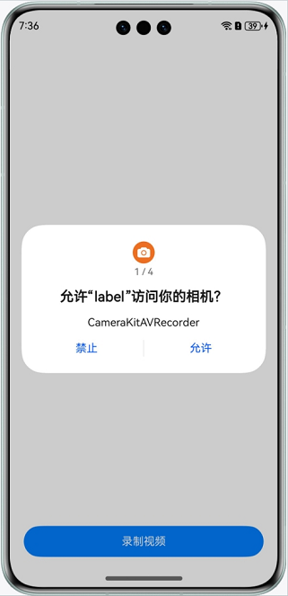
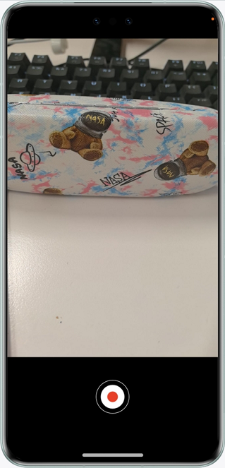
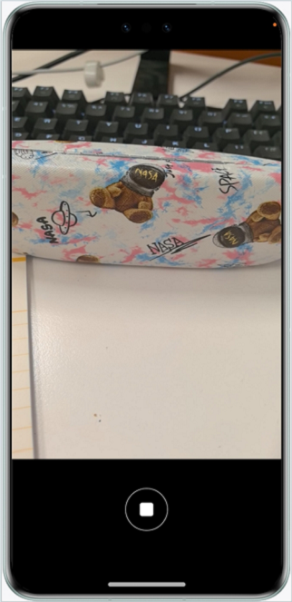
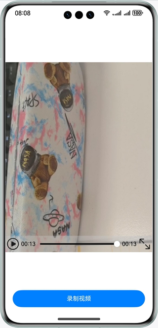

# 基于CameraKit通过AVRecorder录像

### 介绍

本示例通过CameraKit自定义相机，并通过AVRecorder进行录像。

### 效果图预览

|               获取权限              |             录制页                  |                录制中                      |              主页                  |
|-----------------------------------|------------------------------------|-------------------------------------------|-----------------------------------|
||  |  |  |

**使用说明**

1. 获取权限。
2. 点击“录制视频”按钮，判断授权权限，若权限均已授权，则跳转录制页面，否则需按提示开启所有权限后重新点击“录制视频”按钮。
3. 点击开始录制按钮，开始录制视频。
4. 点击停止录制按钮，停止录制视频，并返回首页，在“录制视频”按钮上方显示录制的视频，视频可手动播放。

### 实现思路

1. 通过cameraInput,获取相机采集数据，创建相机输入。
2. 创建previewOutput，获取预览输出流，通过XComponent的surfaceId连接，送显XComponent。
3. 通过AVRecorder的surfaceId创建录像输出流VideoOutput输出到文件中。

### 相关权限

- 允许应用使用相机：ohos.permission.CAMERA。
- 允许应用使用麦克风：ohos.permission.MICROPHONE。
- 允许应用访问用户媒体文件中的地理位置信息：ohos.permission.MEDIA_LOCATION。

### 约束与限制

1. 本示例仅支持标准系统上运行，支持设备：华为手机。

2. HarmonyOS系统：HarmonyOS NEXT Developer Beta1及以上。

3. DevEco Studio版本：DevEco Studio NEXT Developer Beta1及以上。

4. HarmonyOS SDK版本：HarmonyOS NEXT Developer Beta1 SDK及以上。

