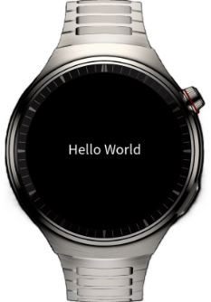

# 轻量级智能穿戴应用开发

## 介绍
本示例为轻量级智能穿戴应用开发同源代码块。

## 预览效果


## 工程目录

```
├──entry/src/main/js
│  └──MainAbility
│     ├──cryptoFramework
│     │  ├──cryptoFramework.css             // @ohos.security.cryptoFramework (加解密算法库框架)页面样式
│     │  ├──cryptoFramework.hml             // @ohos.security.cryptoFramework (加解密算法库框架)页面
│     │  └──cryptoFramework.js              // @ohos.security.cryptoFramework (加解密算法库框架)页面交互功能
│     ├──detail
│     │  ├──detail.css                      // 页面路由页面样式
│     │  ├──detail.hml                      // 页面路由页面
│     │  └──detail.js                       // 页面路由页面交互功能
│     ├──details
│     │  ├──details.css                     // 页面路由页面样式
│     │  ├──details.hml                     // 页面路由页面
│     │  └──details.js                      // 页面路由页面交互功能
│     ├──event
│     │  ├──event.css                       // 交互事件页面样式
│     │  ├──event.hml                       // 交互事件页面
│     │  └──event.js                        // 交互事件页面交互功能
│     ├──exit
│     │  ├──exit.css                        // 应用退出页面样式
│     │  ├──exit.hml                        // 应用退出页面
│     │  └──exit.js                         // 应用退出页面交互功能
│     ├──i18n
│     │  ├──en-US.json                      // 英文文件
│     │  └──zh-CN.json                      // 中文文件
│     ├──initpage
│     │  ├──initpage.css                    // 工程目录介绍页面样式
│     │  ├──initpage.hml                    // 工程目录介绍页面
│     │  └──initpage.js                     // 工程目录介绍页面交互功能
│     ├──pages/index
│     │  ├──index.css                       // 百分比使用页面样式
│     │  ├──index.hml                       // 百分比使用页面
│     │  └──index.js                        // 百分比使用页面交互功能
│     ├──screenLock
│     │  ├──screenLock.css                  // @ohos.screenLock (锁屏管理)页面样式
│     │  ├──screenLock.hml                  // @ohos.screenLock (锁屏管理)页面
│     │  └──screenLock.js                   // @ohos.screenLock (锁屏管理)页面交互功能
│     ├──security
│     │  ├──DES.js                          // DES-CBC算法密钥
│     │  ├──DesCBC64.js                     // 查询密钥是否存在和删除密钥
│     │  ├──HMAC.js                         // 生成HMAC密钥/密文
│     │  ├──KeyAlias.js                     // 导入密钥和导出密钥
│     │  ├──RSA.js                          // 生成RSA算法密钥和使用RSA算法进行加密/解密
│     │  ├──security.css                    // 安全接口的使用页面样式
│     │  ├──security.hml                    // 安全接口的使用页面
│     │  └──security.js                     // 安全接口的使用页面交互功能
│     ├──style1
│     │  ├──style1.css                      // 实现应用页面样式
│     │  ├──style1.hml                      // 实现应用页面
│     │  └──style1.js                       // 实现应用页面交互功能
│     ├──style2
│     │  ├──style2.css                      // 行内样式页面样式
│     │  ├──style2.hml                      // 行内样式页面
│     │  └──style2.js                       // 行内样式页面交互功能
│     ├──style3
│     │  ├──style3.css                      // 选择器样式页面样式
│     │  ├──style3.hml                      // 选择器样式页面
│     │  └──style3.js                       // 选择器样式页面交互功能
│     ├──style4
│     │  ├──style4.css                      // 动态绑定样式
│     │  ├──style4.hml                      // 动态绑定页面
│     │  └──style4.js                       // 动态绑定样式页面的交互功能
│     └──app.js                             // 应用与页面的生命周期
└──entry/src/main/resources                 // 应用资源目录
```

## 相关权限
不涉及。

## 依赖

不涉及。

## 约束与限制

1. 本示例仅支持标准系统上运行，支持设备：华为手表。
2. HarmonyOS系统：HarmonyOS 5.0.5 Release及以上。
3. DevEco Studio版本：DevEco Studio 5.0.5 Release及以上。
4. HarmonyOS SDK版本：HarmonyOS 5.0.5 Release SDK及以上。

## 下载

如需单独下载本工程，执行如下命令：
```
git clone --filter=blob:none --no-checkout https://gitee.com/harmonyos_samples/BestPracticeSnippets.git
cd BestPracticeSnippets
git sparse-checkout init --cone
git sparse-checkout set LiteWearable
git checkout
```